# 🧠 NEO Cognitive Architecture
**Multi-Paradigm Cognitive Processing Framework**

---

## Overview

NEO's cognitive architecture implements a sophisticated multi-paradigm approach to artificial intelligence, combining symbolic reasoning, neural networks, and biological-inspired models to create a comprehensive cognitive framework that mimics human-like thinking patterns.

---

## 🏗️ Cognitive Architecture Overview

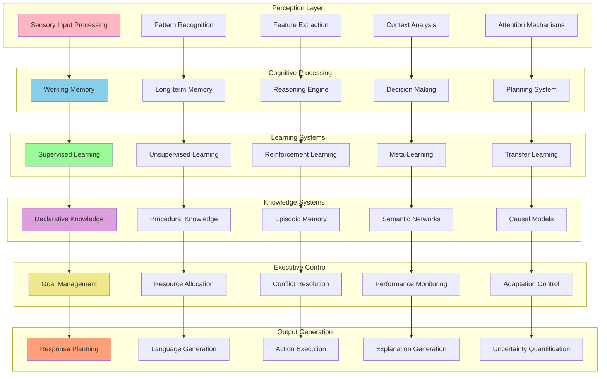

---

## 🧮 Symbolic Reasoning Engine

### Logic-Based Reasoning Framework

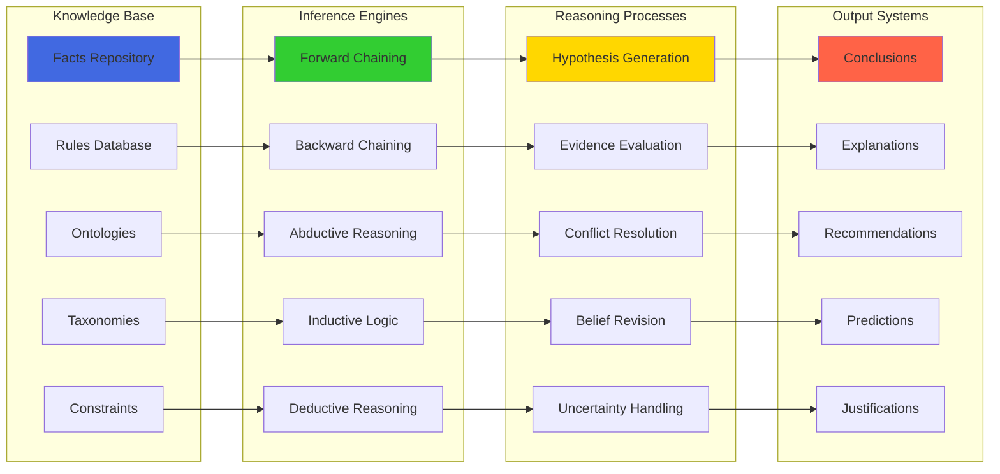

### Automated Theorem Proving

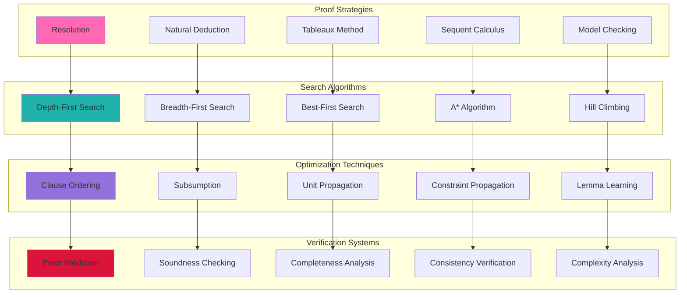

---

## 🔗 Neuro-Symbolic Integration

### Hybrid Architecture Design

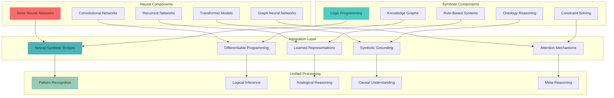

### Differentiable Neural-Symbolic Reasoning

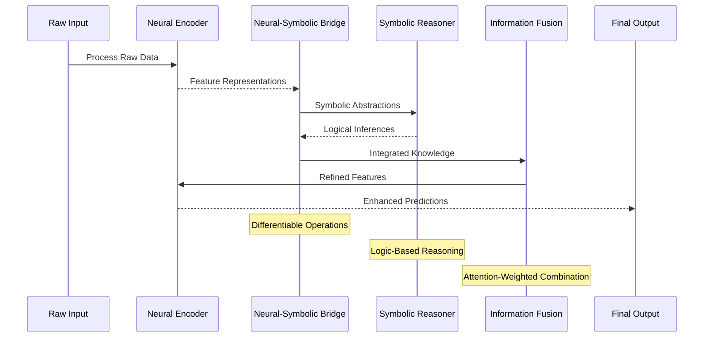

---

## 🧠 Memory Systems Architecture

### Multi-Modal Memory Framework

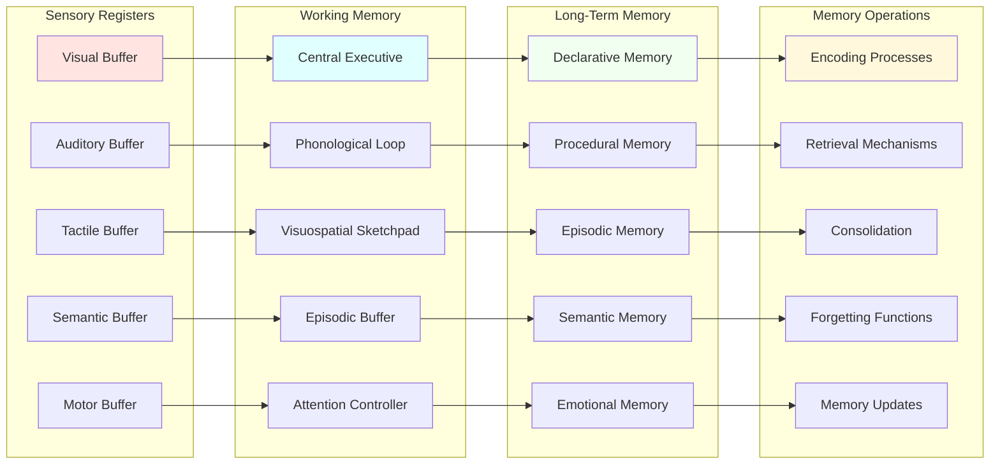

### Associative Memory Network

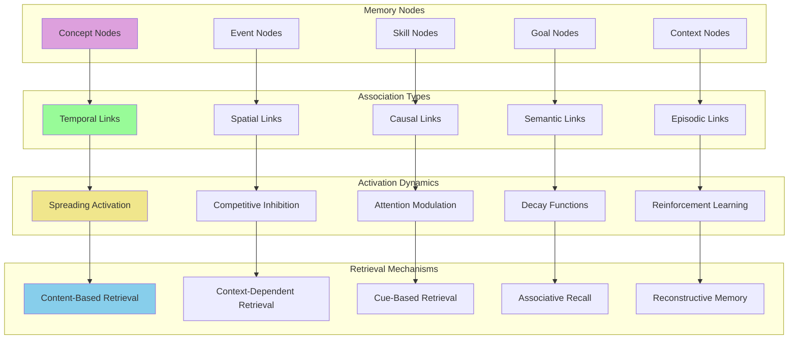

---

## 🎯 Executive Control System

### Goal-Oriented Planning Architecture

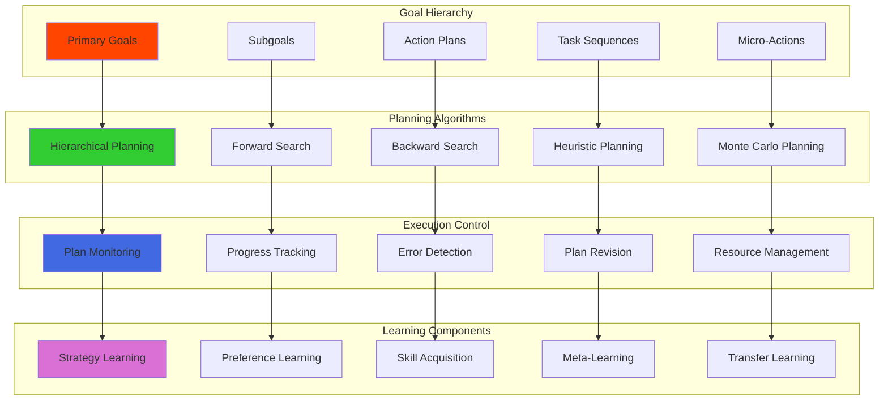

### Attention and Resource Allocation

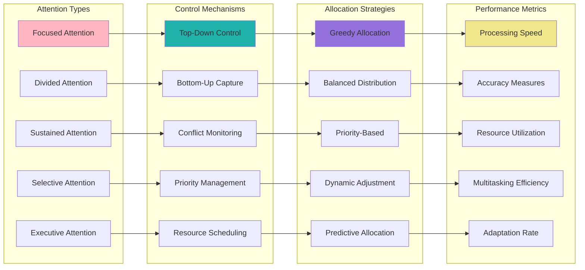

---

## 🔄 Learning and Adaptation Systems

### Meta-Learning Architecture

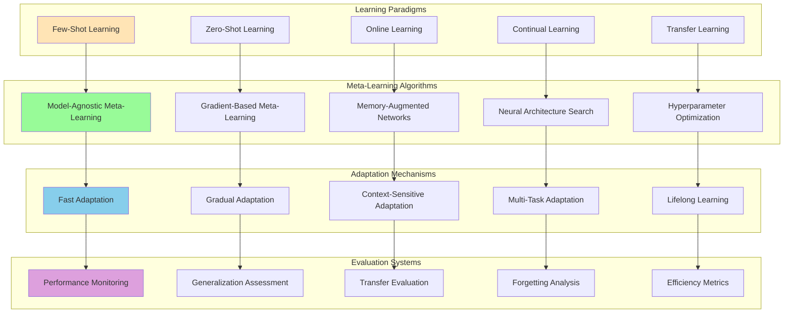

### Continual Learning Framework

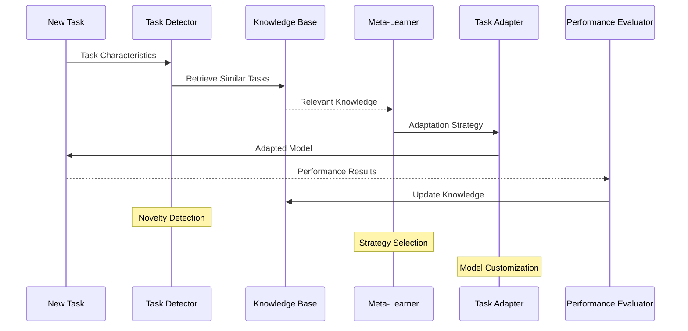

---

## 🌐 Distributed Cognitive Processing

### Multi-Agent Cognitive System

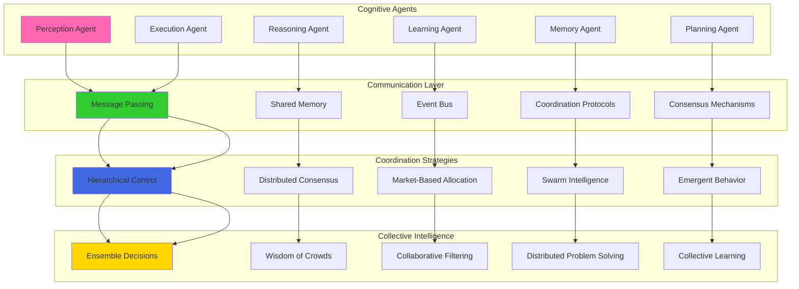

---

## 📊 Cognitive Performance Metrics

### Intelligence Assessment Framework

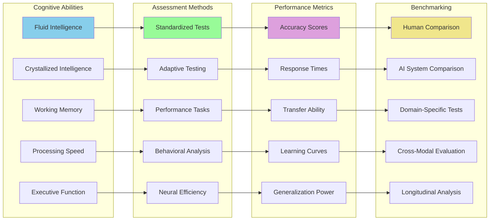

---

## 🔧 Cognitive Architecture Configuration

### System Parameters

```yaml
# NEO Cognitive Architecture Configuration
cognitive_architecture:
  version: "3.0"
  implementation: "production"
  
  perception_layer:
    sensory_processing:
      visual:
        resolution: "high_definition"
        color_space: "rgb_hsl_lab"
        feature_extractors: ["edge_detection", "texture_analysis", "object_recognition"]
      auditory:
        sampling_rate: "44100_hz"
        frequency_range: "20hz_20khz"
        feature_extractors: ["mfcc", "spectral_analysis", "pitch_detection"]
      textual:
        languages: ["en", "es", "fr", "de", "zh", "ja"]
        encodings: ["utf8", "unicode"]
        preprocessing: ["tokenization", "pos_tagging", "named_entity_recognition"]
        
    attention_mechanisms:
      visual_attention:
        saliency_maps: "enabled"
        object_tracking: "multi_object"
        gaze_prediction: "enabled"
      linguistic_attention:
        self_attention: "transformer_based"
        cross_attention: "multimodal"
        hierarchical_attention: "enabled"
        
  reasoning_engine:
    symbolic_reasoning:
      logic_systems: ["first_order_logic", "description_logic", "temporal_logic"]
      inference_engines: ["forward_chaining", "backward_chaining", "abductive"]
      knowledge_representation: ["rdf", "owl", "prolog"]
      
    neural_reasoning:
      architectures: ["transformer", "graph_neural_networks", "recursive_networks"]
      attention_heads: 16
      hidden_dimensions: 768
      dropout_rate: 0.1
      
    hybrid_integration:
      neuro_symbolic_bridges: "differentiable_programming"
      symbolic_grounding: "learned_embeddings"
      neural_symbolic_fusion: "attention_weighted"
      
  memory_systems:
    working_memory:
      capacity: "7_plus_minus_2"
      decay_rate: "exponential"
      refresh_mechanism: "rehearsal_based"
      
    long_term_memory:
      episodic_memory:
        storage_format: "event_sequences"
        indexing: "temporal_spatial_semantic"
        retrieval: "context_dependent"
      semantic_memory:
        representation: "knowledge_graphs"
        update_mechanism: "incremental_learning"
        consistency_checking: "automated"
      procedural_memory:
        skill_representation: "hierarchical_procedures"
        learning_algorithm: "reinforcement_learning"
        transfer_mechanism: "analogy_based"
        
  learning_systems:
    supervised_learning:
      algorithms: ["deep_neural_networks", "support_vector_machines", "random_forests"]
      optimization: ["adam", "rmsprop", "sgd_with_momentum"]
      regularization: ["dropout", "batch_normalization", "weight_decay"]
      
    unsupervised_learning:
      algorithms: ["autoencoders", "variational_autoencoders", "generative_adversarial_networks"]
      clustering: ["k_means", "hierarchical", "dbscan"]
      dimensionality_reduction: ["pca", "t_sne", "umap"]
      
    reinforcement_learning:
      algorithms: ["q_learning", "policy_gradient", "actor_critic"]
      exploration_strategies: ["epsilon_greedy", "upper_confidence_bound", "thompson_sampling"]
      experience_replay: "prioritized_experience_replay"
      
    meta_learning:
      algorithms: ["maml", "reptile", "prototypical_networks"]
      adaptation_steps: 5
      meta_learning_rate: 0.001
      task_distribution: "multi_domain"
      
  executive_control:
    goal_management:
      hierarchy_levels: 5
      goal_types: ["achievement", "maintenance", "avoidance"]
      priority_scheduling: "dynamic_priority_queue"
      
    resource_allocation:
      allocation_strategy: "priority_based_with_fairness"
      monitoring_frequency: "real_time"
      adaptation_mechanism: "reinforcement_learning_based"
      
    conflict_resolution:
      conflict_detection: "automated"
      resolution_strategies: ["negotiation", "voting", "expert_system"]
      escalation_procedures: "hierarchical"
      
  performance_optimization:
    computational_efficiency:
      parallel_processing: "enabled"
      distributed_computing: "kubernetes_cluster"
      gpu_acceleration: "cuda_enabled"
      
    memory_optimization:
      garbage_collection: "generational"
      memory_pooling: "enabled"
      compression: "adaptive"
      
    latency_optimization:
      caching_strategies: ["lru", "lfu", "adaptive"]
      precomputation: "predictive"
      lazy_loading: "context_aware"

monitoring:
  performance_metrics:
    cognitive_load: "real_time_monitoring"
    processing_speed: "millisecond_precision"
    accuracy_tracking: "task_specific"
    learning_progress: "continuous_assessment"
    
  health_monitoring:
    system_health: "automated_checks"
    performance_degradation: "anomaly_detection"
    resource_utilization: "optimized_monitoring"
    error_tracking: "comprehensive_logging"
    
  adaptation_tracking:
    learning_curves: "multi_task_tracking"
    transfer_learning: "cross_domain_evaluation"
    forgetting_analysis: "catastrophic_forgetting_prevention"
    meta_learning_progress: "few_shot_performance_tracking"
```

---

## 📋 Cognitive Architecture Implementation Plan

### Phase 1: Foundation (Months 1-3)
- [ ] Implement basic perception layer with multi-modal processing
- [ ] Deploy core symbolic reasoning engine
- [ ] Set up working memory and basic long-term memory systems
- [ ] Establish fundamental learning algorithms
- [ ] Create basic executive control mechanisms

### Phase 2: Integration (Months 4-6)
- [ ] Implement neuro-symbolic integration layer
- [ ] Deploy advanced memory systems with associative networks
- [ ] Add meta-learning capabilities
- [ ] Enhance executive control with goal management
- [ ] Integrate attention mechanisms across all modules

### Phase 3: Advanced Capabilities (Months 7-9)
- [ ] Deploy distributed cognitive processing
- [ ] Implement continual learning framework
- [ ] Add advanced reasoning capabilities
- [ ] Create sophisticated adaptation mechanisms
- [ ] Establish comprehensive performance monitoring

### Phase 4: Optimization and Scaling (Months 10-12)
- [ ] Optimize computational efficiency
- [ ] Scale to distributed environments
- [ ] Fine-tune cognitive parameters
- [ ] Implement advanced benchmarking
- [ ] Deploy production-ready cognitive architecture

---

*This cognitive architecture provides a comprehensive framework for implementing human-like intelligence in the NEO system, combining the best aspects of symbolic reasoning, neural processing, and biological inspiration to create a truly intelligent system.*
