# 🧠 NEO Neural Network Architectures
**Deep Learning Models and Network Topologies**

---

## Multi-Paradigm Neural Architecture Overview

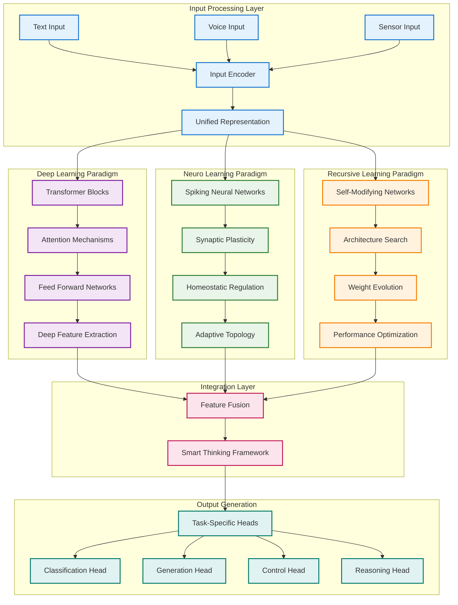

---

## Deep Learning Architecture Components

### Transformer-Based Processing

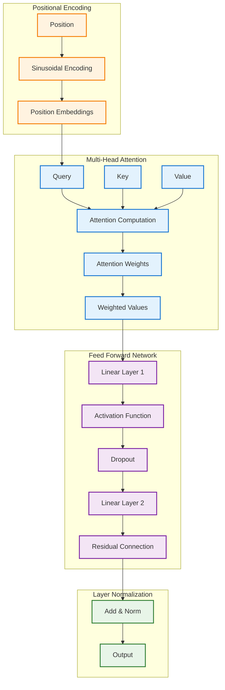

### Convolutional Neural Network Stack

```mermaid
graph LR
    subgraph "Feature Extraction"
        A[Input Image] --> B[Conv2D Layer 1]
        B --> C[BatchNorm]
        C --> D[ReLU Activation]
        D --> E[MaxPool2D]
    end

    subgraph "Deep Feature Learning"
        E --> F[Conv2D Layer 2]
        F --> G[BatchNorm]
        G --> H[ReLU Activation]
        H --> I[Conv2D Layer 3]
        I --> J[BatchNorm]
        J --> K[ReLU Activation]
        K --> L[MaxPool2D]
    end

    subgraph "High-Level Features"
        L --> M[Conv2D Layer 4]
        M --> N[BatchNorm]
        N --> O[ReLU Activation]
        O --> P[Global Average Pool]
    end

    subgraph "Classification"
        P --> Q[Fully Connected]
        Q --> R[Dropout]
        R --> S[Output Layer]
    end

    classDef extraction fill:#e3f2fd,stroke:#1976d2,stroke-width:2px
    classDef deep fill:#f3e5f5,stroke:#7b1fa2,stroke-width:2px
    classDef highlevel fill:#e8f5e8,stroke:#2e7d32,stroke-width:2px
    classDef classification fill:#fff3e0,stroke:#f57c00,stroke-width:2px

    class A,B,C,D,E extraction
    class F,G,H,I,J,K,L deep
    class M,N,O,P highlevel
    class Q,R,S classification
```

---

## Neuro-Learning Architecture

### Spiking Neural Network Model

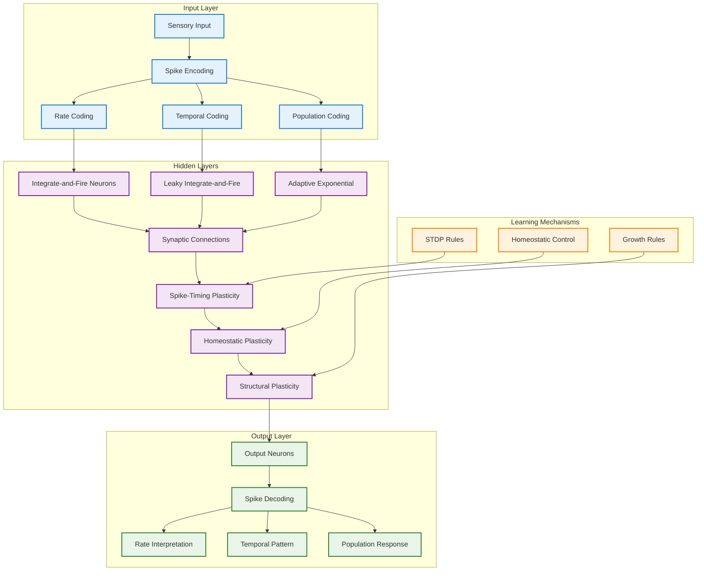

### Biological Plasticity Mechanisms

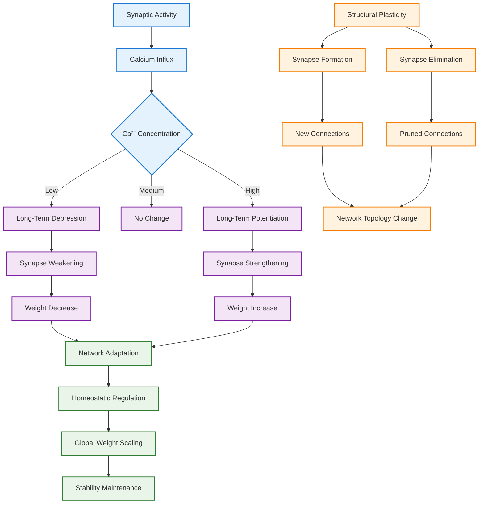

---

## Recursive Learning Architecture

### Self-Modifying Network Structure

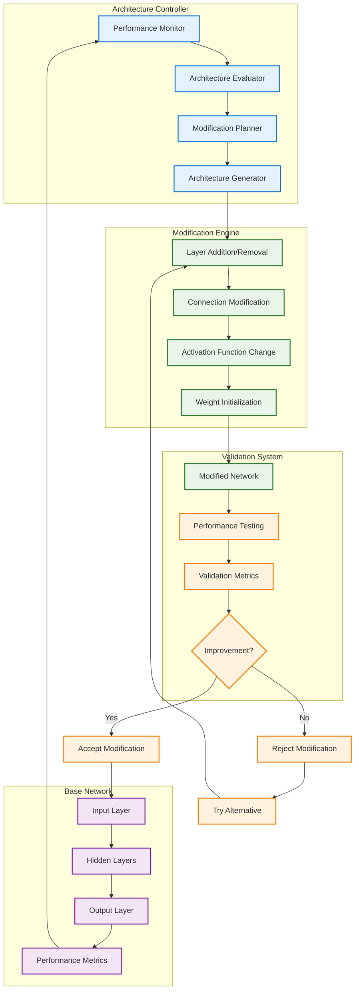

### Neural Architecture Search (NAS)

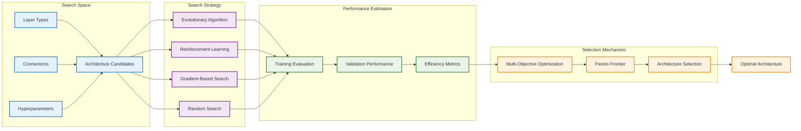

---

## Memory-Augmented Networks

### Neural Turing Machine Architecture

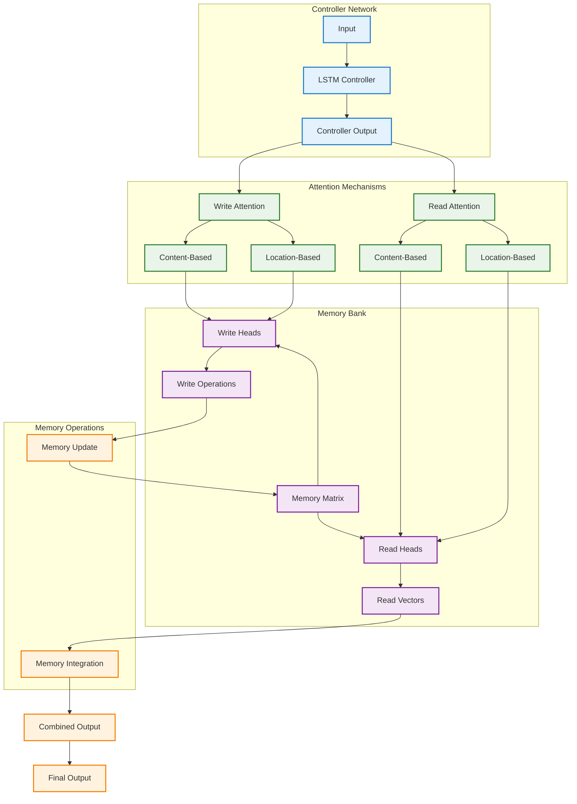

### Differentiable Neural Computer (DNC)

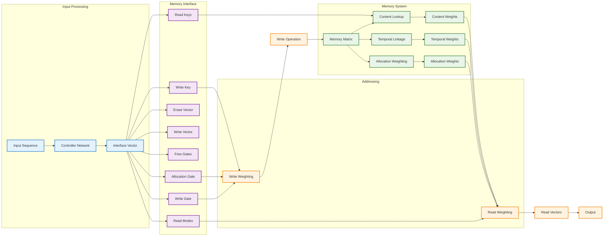

---

## Attention Mechanisms

### Multi-Head Self-Attention

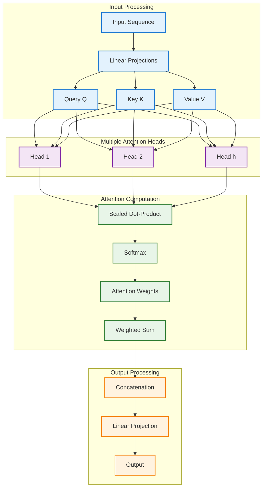

### Cross-Modal Attention

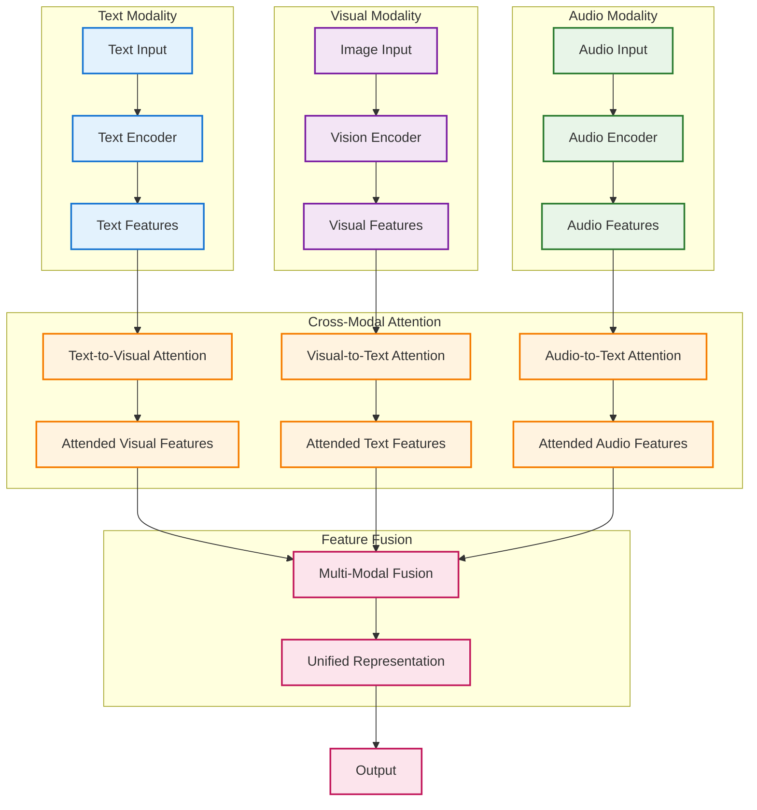

---

## Generative Models

### Variational Autoencoder (VAE)

```mermaid
graph LR
    subgraph "Encoder"
        A[Input x] --> B[Encoder Network]
        B --> C[μ (Mean)]
        B --> D[σ (Std Dev)]
    end

    subgraph "Latent Space"
        C --> E[Sampling]
        D --> E
        F[ε ~ N(0,1)] --> E
        E --> G[Latent Vector z]
    end

    subgraph "Decoder"
        G --> H[Decoder Network]
        H --> I[Reconstructed x']
    end

    subgraph "Loss Computation"
        A --> J[Reconstruction Loss]
        I --> J
        C --> K[KL Divergence]
        D --> K
        J --> L[Total Loss]
        K --> L
    end

    classDef encoder fill:#e3f2fd,stroke:#1976d2,stroke-width:2px
    classDef latent fill:#f3e5f5,stroke:#7b1fa2,stroke-width:2px
    classDef decoder fill:#e8f5e8,stroke:#2e7d32,stroke-width:2px
    classDef loss fill:#fff3e0,stroke:#f57c00,stroke-width:2px

    class A,B,C,D encoder
    class E,F,G latent
    class H,I decoder
    class J,K,L loss
```

### Generative Adversarial Network (GAN)

```mermaid
graph TB
    subgraph "Generator"
        A[Random Noise z] --> B[Generator Network G]
        B --> C[Fake Data x_fake]
    end

    subgraph "Discriminator"
        C --> D[Discriminator Network D]
        E[Real Data x_real] --> D
        D --> F[Probability Real/Fake]
    end

    subgraph "Training Process"
        F --> G[Discriminator Loss]
        F --> H[Generator Loss]
        
        G --> I[Update Discriminator]
        H --> J[Update Generator]
        
        I --> K[Adversarial Training]
        J --> K
    end

    subgraph "Objective Functions"
        L[min_G max_D V(D,G)] --> M[Nash Equilibrium]
        M --> N[Optimal Solution]
    end

    classDef generator fill:#e3f2fd,stroke:#1976d2,stroke-width:2px
    classDef discriminator fill:#f3e5f5,stroke:#7b1fa2,stroke-width:2px
    classDef training fill:#e8f5e8,stroke:#2e7d32,stroke-width:2px
    classDef objective fill:#fff3e0,stroke:#f57c00,stroke-width:2px

    class A,B,C generator
    class D,E,F discriminator
    class G,H,I,J,K training
    class L,M,N objective
```

---

## Specialized Network Architectures

### Graph Neural Networks (GNN)

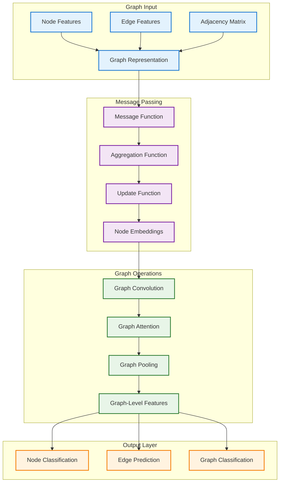

### Capsule Networks

```mermaid
graph LR
    subgraph "Primary Capsules"
        A[Convolutional Features] --> B[Capsule Formation]
        B --> C[8D Capsules]
    end

    subgraph "Routing Algorithm"
        C --> D[Dynamic Routing]
        D --> E[Coupling Coefficients]
        E --> F[Weighted Sum]
        F --> G[Squashing Function]
    end

    subgraph "Higher-Level Capsules"
        G --> H[16D Capsules]
        H --> I[Part-Whole Relationships]
        I --> J[Instantiation Parameters]
    end

    subgraph "Output"
        J --> K[Classification]
        J --> L[Reconstruction]
    end

    classDef primary fill:#e3f2fd,stroke:#1976d2,stroke-width:2px
    classDef routing fill:#f3e5f5,stroke:#7b1fa2,stroke-width:2px
    classDef higher fill:#e8f5e8,stroke:#2e7d32,stroke-width:2px
    classDef output fill:#fff3e0,stroke:#f57c00,stroke-width:2px

    class A,B,C primary
    class D,E,F,G routing
    class H,I,J higher
    class K,L output
```

---

## Network Training Strategies

### Progressive Growing Training

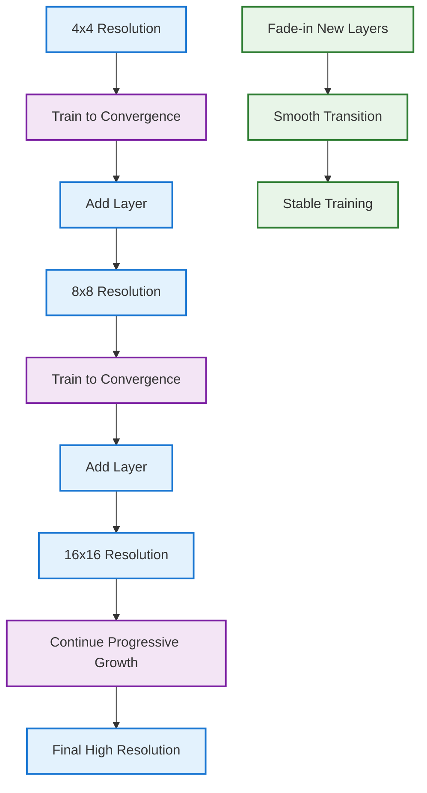

### Transfer Learning Architecture

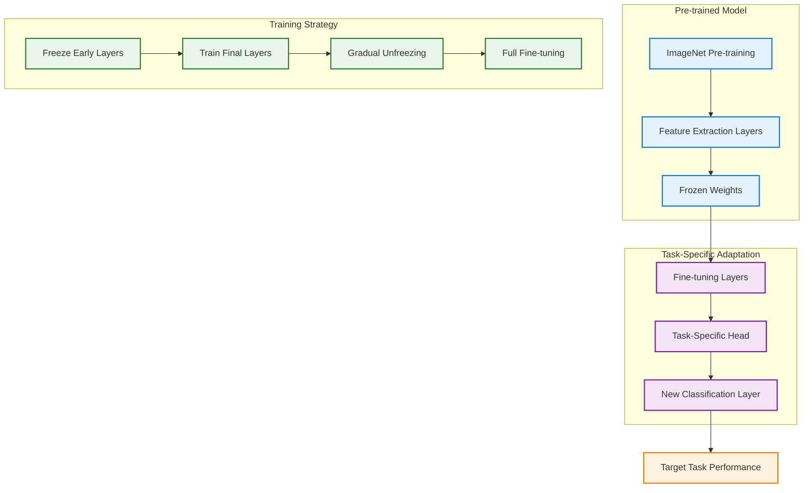

---

*These neural network architectures represent the foundation of NEO's deep learning capabilities, enabling sophisticated pattern recognition, generation, and reasoning across multiple modalities and paradigms.*
