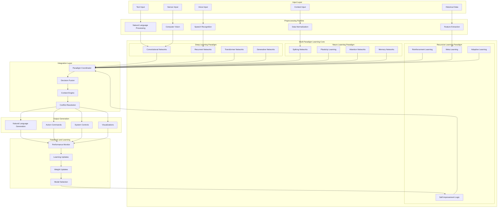
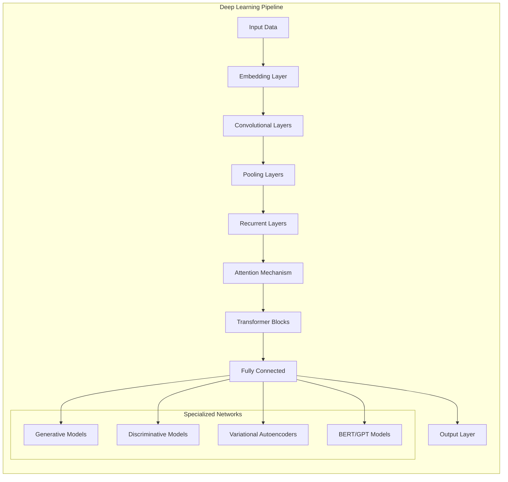
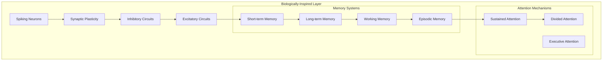
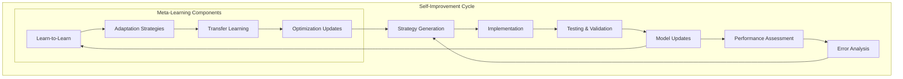
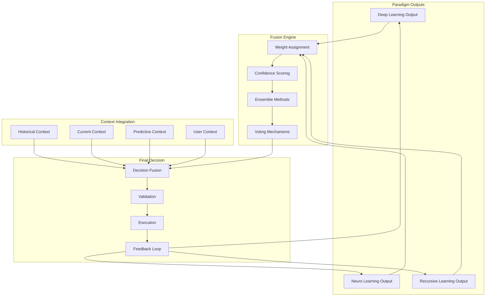
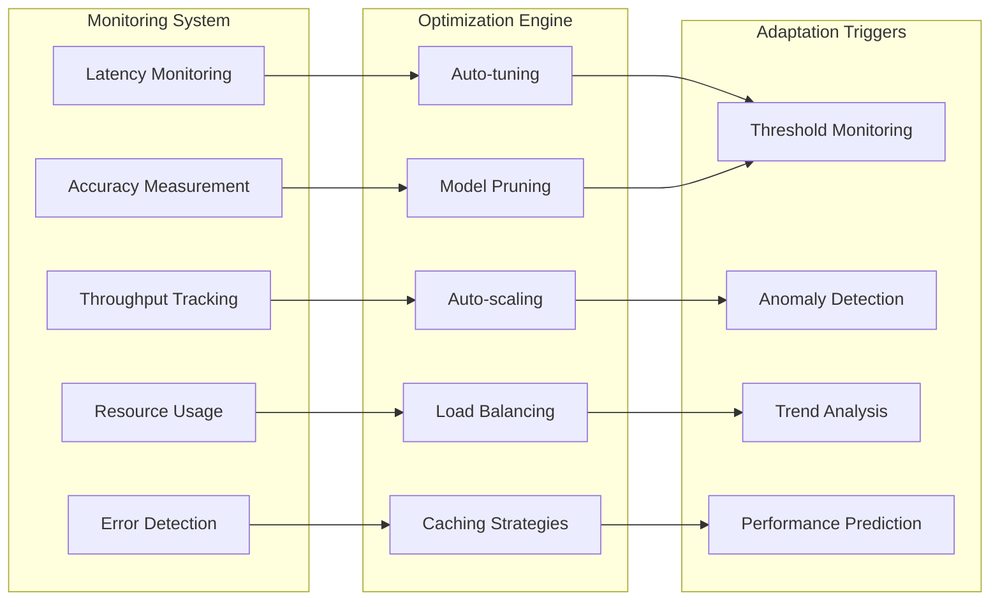

# AI Engine Architecture
**Multi-Paradigm Learning System Design**

---

## Overview

This diagram illustrates the comprehensive architecture of NEO's AI Engine, showcasing the integration of three distinct learning paradigms: deep learning, neuro learning, and recursive learning within a unified framework.

---

## Core AI Engine Architecture

---

## Learning Paradigm Details

### Deep Learning Architecture

### Neuro Learning Architecture

### Recursive Learning Architecture

---

## Decision Fusion and Coordination

---

## Performance Monitoring and Optimization

---

## Technical Specifications

### Core Components
- **Processing Units**: Multi-core CPU, GPU acceleration, TPU support
- **Memory Architecture**: Hierarchical memory with caching layers
- **Storage Systems**: High-speed SSD with distributed storage capability
- **Network Interfaces**: High-bandwidth networking for distributed processing

### Performance Characteristics
- **Response Time**: < 100ms for standard queries
- **Throughput**: 1000+ concurrent operations
- **Scalability**: Horizontal and vertical scaling support
- **Availability**: 99.9% uptime with fault tolerance

### Security Features
- **Encryption**: End-to-end encryption for all data flows
- **Access Control**: Multi-level authentication and authorization
- **Audit Trails**: Comprehensive logging and monitoring
- **Threat Detection**: Real-time security monitoring

---

This architecture enables NEO to achieve unprecedented performance in artificial intelligence applications through the synergistic combination of multiple learning paradigms, advanced decision fusion, and continuous self-improvement mechanisms.
