# 📊 NEO System Monitoring and Performance
**Comprehensive Monitoring Architecture and Performance Analytics**

---

## Overview

NEO's monitoring and performance system provides real-time visibility into all aspects of the intelligent system, enabling proactive maintenance, optimization, and ensuring optimal performance across all components and services.

---

## 🏗️ Monitoring Architecture Overview

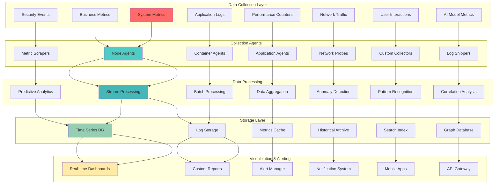

---

## 📈 Performance Metrics Framework

### System Performance Indicators

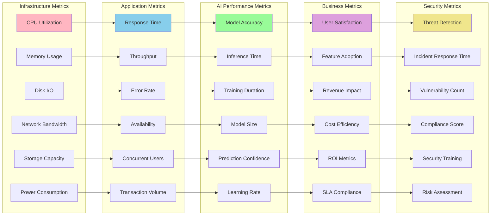

### Real-time Performance Dashboard

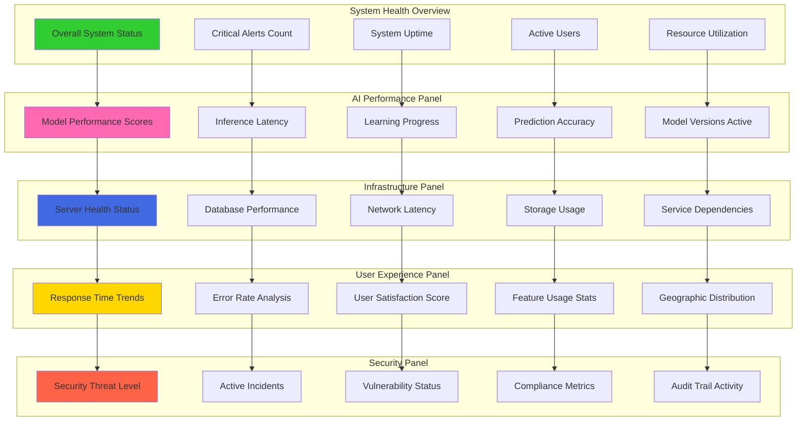

---

## 🚨 Alerting and Incident Management

### Alert Classification and Escalation

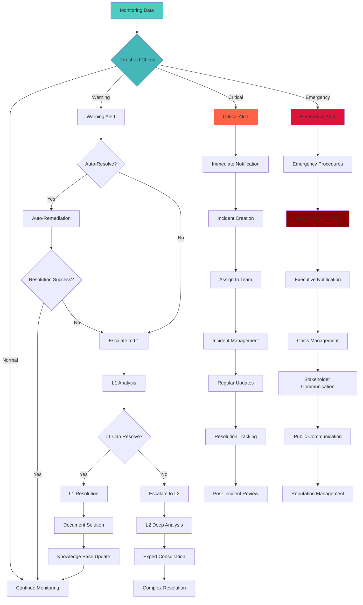

### Incident Response Workflow

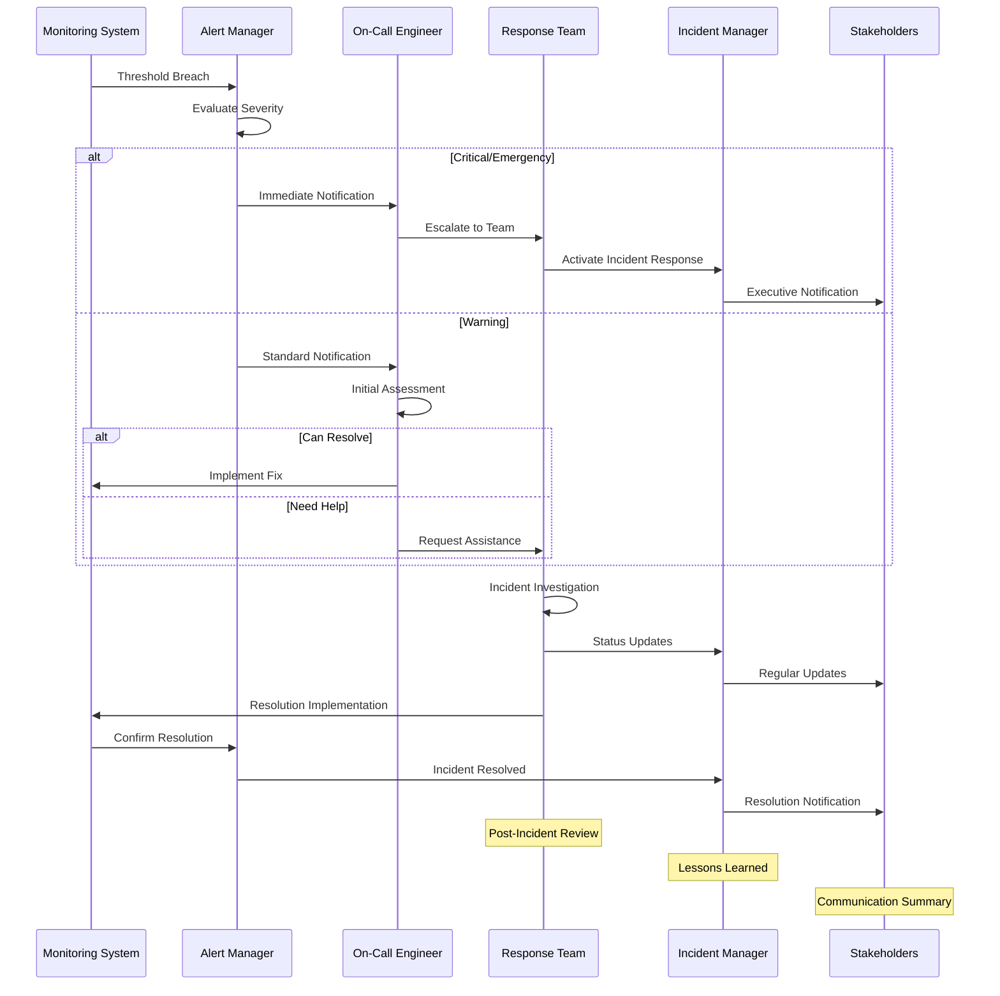

---

## 📊 Performance Analytics and Optimization

### Performance Trend Analysis

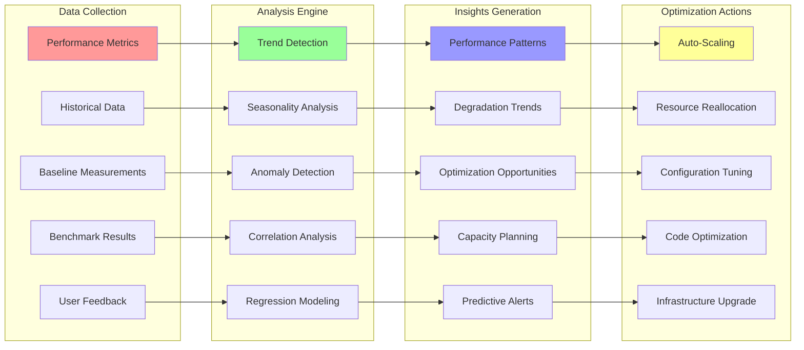

### Capacity Planning Model

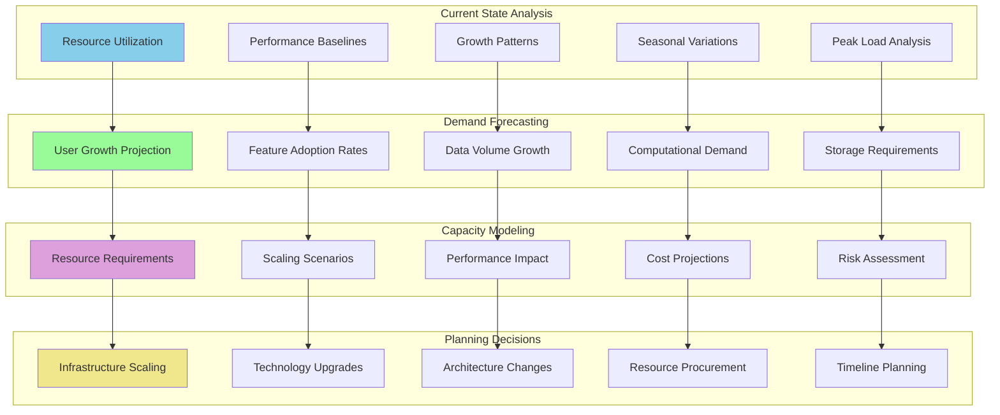

---

## 🔍 AI Model Performance Monitoring

### Model Performance Tracking

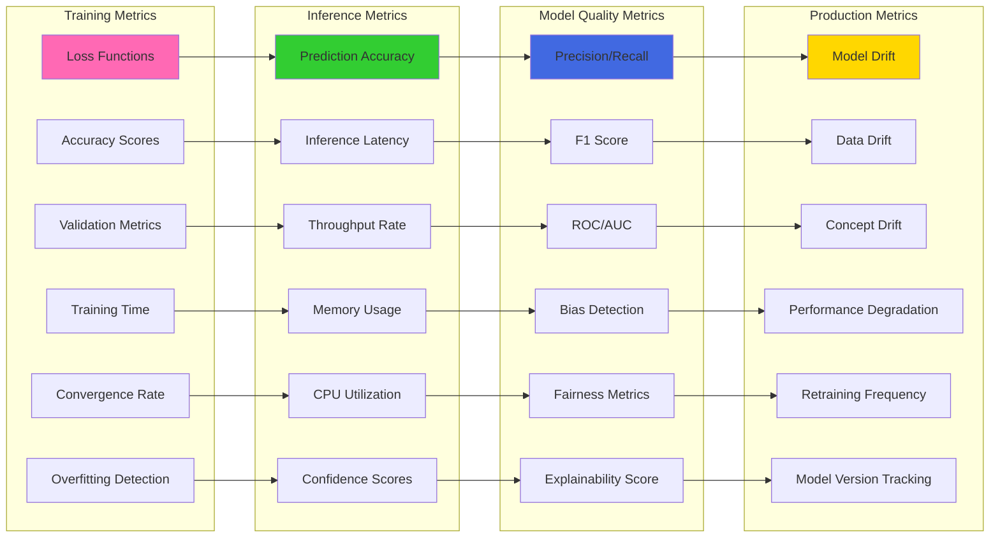

### Model Lifecycle Monitoring

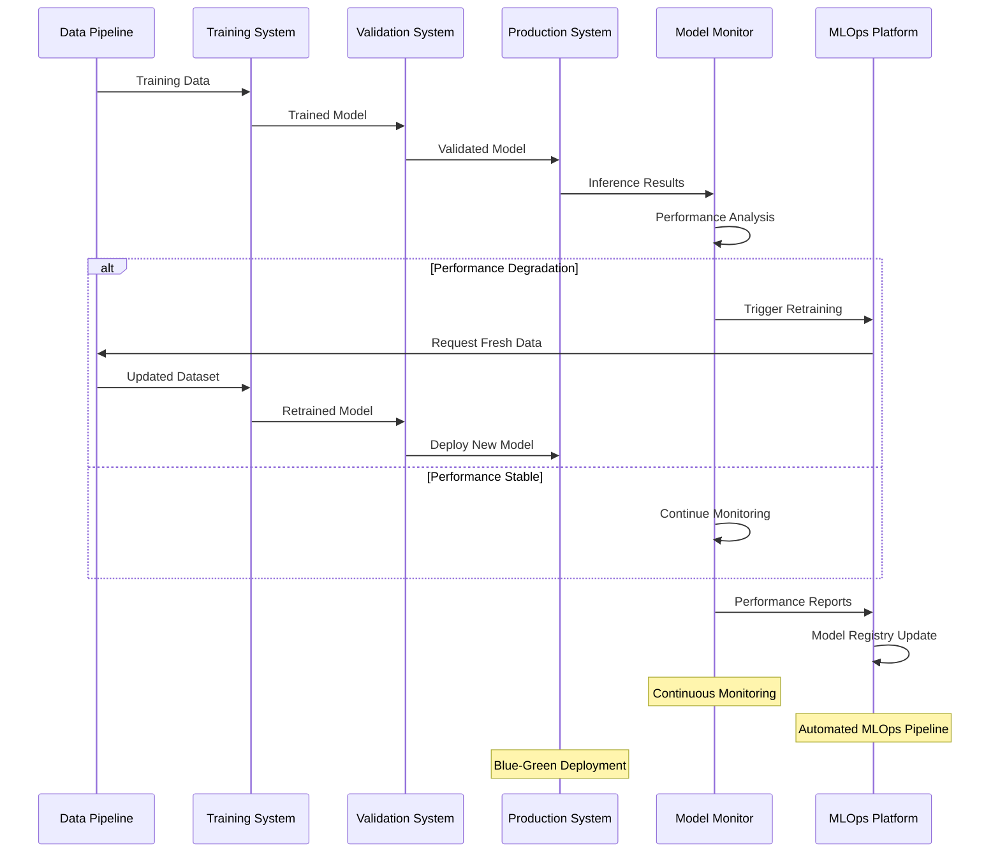

---

## 🌐 Distributed System Monitoring

### Microservices Monitoring Architecture

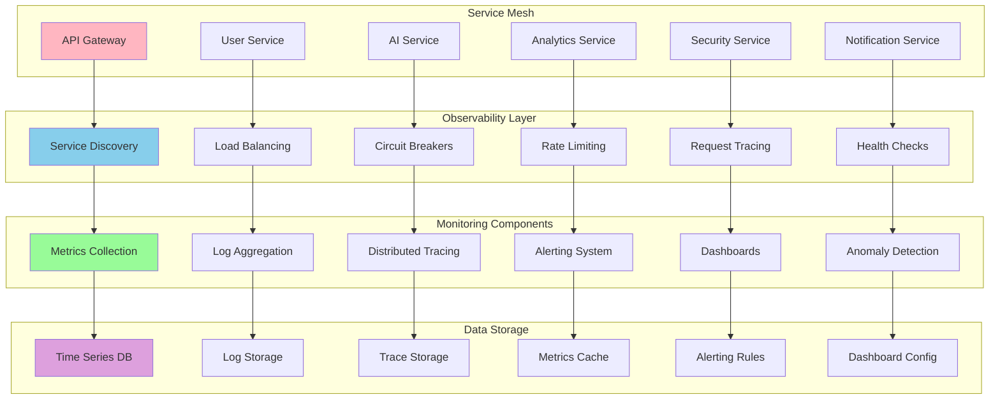

### Cross-Service Dependency Tracking

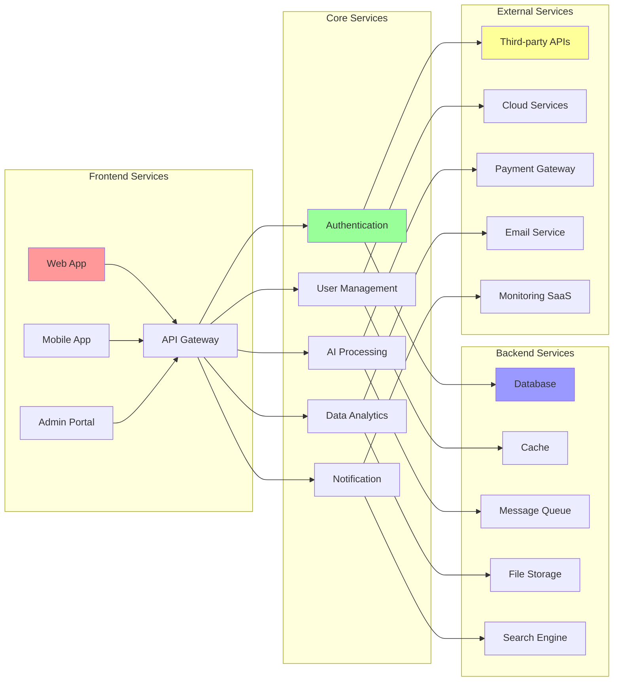

---

## 📱 User Experience Monitoring

### Real User Monitoring (RUM)

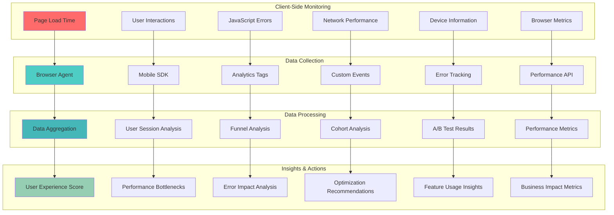

### User Journey Analytics

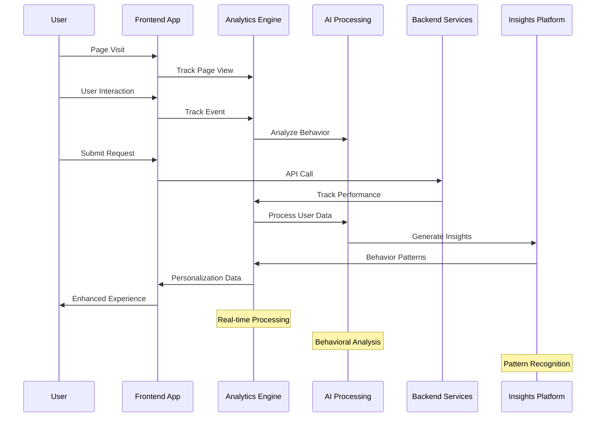

---

## 🔧 Monitoring System Configuration

### Comprehensive Monitoring Setup

```yaml
# NEO Monitoring System Configuration
monitoring_system:
  version: "3.0"
  deployment: "production"
  
  data_collection:
    system_metrics:
      collection_interval: "10s"
      retention_period: "90d"
      metrics:
        - "cpu_usage"
        - "memory_usage"
        - "disk_io"
        - "network_traffic"
        - "process_count"
        
    application_metrics:
      collection_interval: "5s"
      retention_period: "30d"
      metrics:
        - "response_time"
        - "throughput"
        - "error_rate"
        - "active_users"
        - "transaction_volume"
        
    ai_metrics:
      collection_interval: "1s"
      retention_period: "365d"
      metrics:
        - "model_accuracy"
        - "inference_time"
        - "prediction_confidence"
        - "model_drift"
        - "data_quality"
        
  alerting:
    alert_rules:
      critical_alerts:
        - name: "system_down"
          condition: "availability < 95%"
          severity: "critical"
          escalation: "immediate"
          
        - name: "high_error_rate"
          condition: "error_rate > 5%"
          severity: "critical"
          escalation: "15_minutes"
          
        - name: "ai_model_drift"
          condition: "model_accuracy < 0.8"
          severity: "warning"
          escalation: "1_hour"
          
    notification_channels:
      email:
        enabled: true
        recipients: ["ops-team@neo.com", "ai-team@neo.com"]
        
      slack:
        enabled: true
        webhook_url: "https://hooks.slack.com/neo-alerts"
        channels: ["#ops-alerts", "#ai-alerts"]
        
      pagerduty:
        enabled: true
        integration_key: "pagerduty_integration_key"
        escalation_policy: "ops_escalation"
        
      sms:
        enabled: true
        provider: "twilio"
        numbers: ["+1234567890", "+1234567891"]
        
  dashboards:
    system_overview:
      layout: "grid"
      panels:
        - title: "System Health"
          type: "status"
          query: "up{job='neo-system'}"
          
        - title: "Response Time"
          type: "graph"
          query: "histogram_quantile(0.95, rate(http_request_duration_seconds_bucket[5m]))"
          
        - title: "Error Rate"
          type: "singlestat"
          query: "rate(http_requests_total{status=~'5..'}[5m])"
          
        - title: "AI Model Performance"
          type: "graph"
          query: "ai_model_accuracy"
          
    ai_performance:
      layout: "row"
      panels:
        - title: "Model Accuracy Trends"
          type: "graph"
          query: "ai_model_accuracy"
          timeframe: "24h"
          
        - title: "Inference Latency"
          type: "heatmap"
          query: "ai_inference_duration_seconds"
          
        - title: "Prediction Distribution"
          type: "pie_chart"
          query: "ai_prediction_confidence_bucket"
          
  storage:
    time_series:
      engine: "prometheus"
      retention: "90d"
      storage_size: "500GB"
      
    logs:
      engine: "elasticsearch"
      retention: "30d"
      storage_size: "1TB"
      
    traces:
      engine: "jaeger"
      retention: "7d"
      sampling_rate: 0.1
      
  performance_optimization:
    auto_scaling:
      enabled: true
      cpu_threshold: 80
      memory_threshold: 85
      scale_up_cooldown: "5m"
      scale_down_cooldown: "15m"
      
    caching:
      enabled: true
      cache_size: "10GB"
      ttl_default: "5m"
      cache_hit_ratio_target: 0.9
      
    resource_optimization:
      enabled: true
      optimization_interval: "1h"
      target_utilization: 70
      
compliance:
  data_retention:
    personal_data: "comply_with_gdpr"
    system_logs: "audit_requirements"
    performance_data: "business_requirements"
    
  security:
    encryption_at_rest: true
    encryption_in_transit: true
    access_control: "rbac"
    audit_logging: "comprehensive"
    
  reporting:
    sla_reporting: "automated"
    performance_reports: "weekly"
    capacity_reports: "monthly"
    compliance_reports: "quarterly"
```

---

## 📋 Monitoring Implementation Roadmap

### Phase 1: Foundation (Months 1-2)
- [ ] Deploy basic system monitoring infrastructure
- [ ] Set up centralized logging and metrics collection
- [ ] Implement basic alerting and notification systems
- [ ] Create initial dashboards for system overview
- [ ] Establish baseline performance metrics

### Phase 2: Enhanced Monitoring (Months 3-4)
- [ ] Deploy application-specific monitoring
- [ ] Implement distributed tracing
- [ ] Add user experience monitoring
- [ ] Create advanced alerting rules
- [ ] Set up automated incident response

### Phase 3: AI-Specific Monitoring (Months 5-6)
- [ ] Deploy ML model performance monitoring
- [ ] Implement model drift detection
- [ ] Add AI explainability monitoring
- [ ] Create AI performance dashboards
- [ ] Set up automated model retraining triggers

### Phase 4: Advanced Analytics (Months 7-8)
- [ ] Deploy predictive analytics for capacity planning
- [ ] Implement anomaly detection across all metrics
- [ ] Add business intelligence dashboards
- [ ] Create automated optimization recommendations
- [ ] Establish comprehensive performance optimization

---

*This comprehensive monitoring system ensures NEO operates at peak performance with proactive issue detection, automated responses, and continuous optimization across all system components.*
