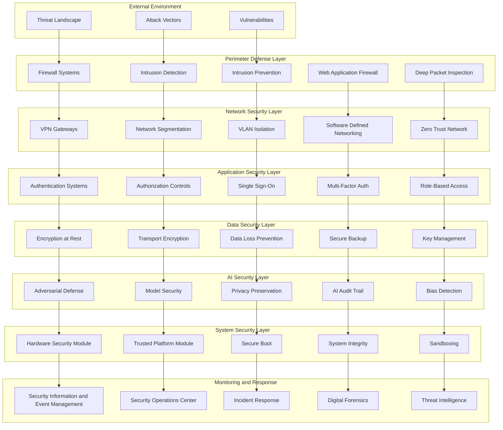
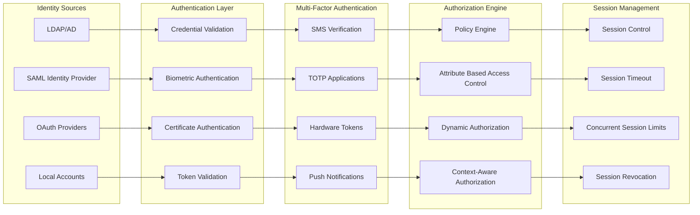
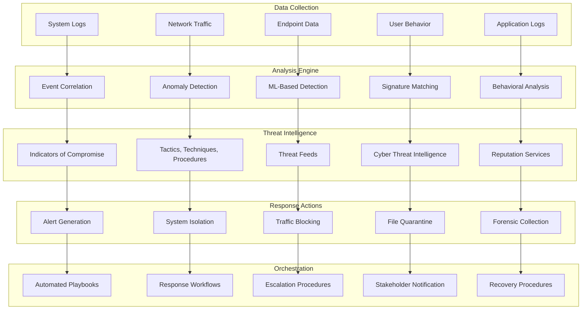
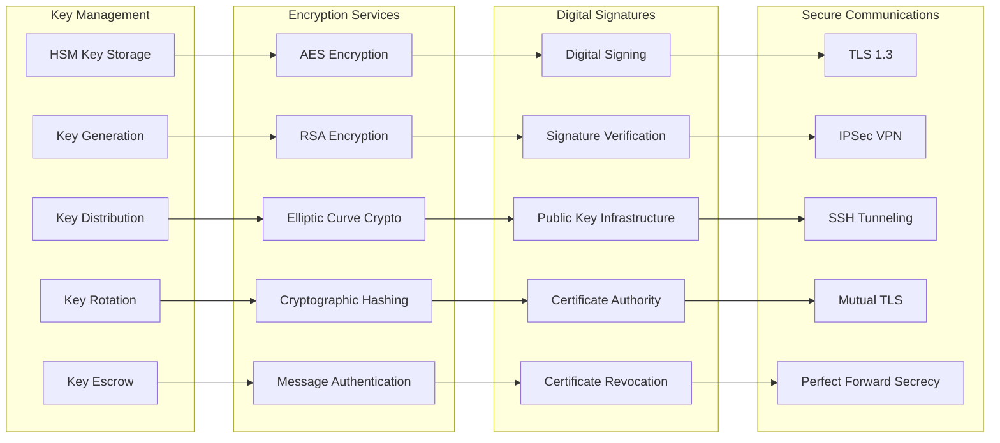
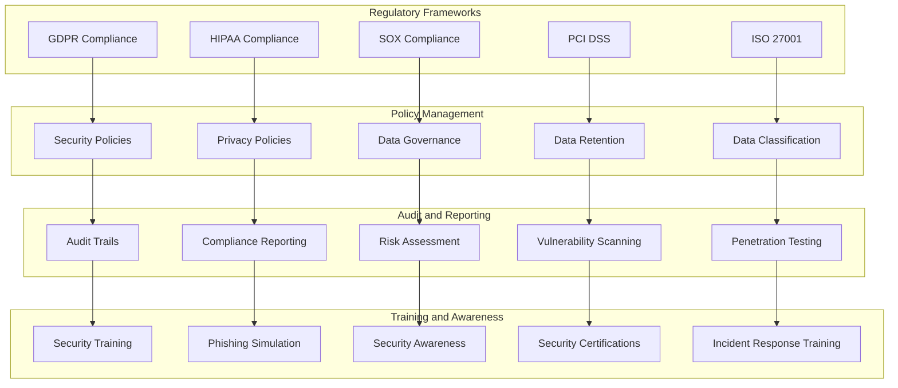

# Security Framework Architecture
**Comprehensive Defense-in-Depth Security Design**

---

## Overview

This diagram illustrates NEO's comprehensive security framework, implementing multiple layers of defense to protect against threats, ensure data integrity, and maintain system resilience.

---

## Multi-Layer Security Architecture

---

## Identity and Access Management

---

## Threat Detection and Response

---

## Cryptographic Architecture

---

## Compliance and Governance

---

## Technical Implementation

### Security Technologies
- **Next-Generation Firewall**: Application-aware traffic inspection
- **SIEM Platform**: Real-time security event correlation
- **Zero Trust Architecture**: Never trust, always verify approach
- **AI-Powered Detection**: Machine learning threat detection
- **Quantum-Resistant Cryptography**: Future-proof encryption methods

### Performance Specifications
- **Threat Detection**: < 1 second average detection time
- **Response Time**: < 5 minutes for automated responses
- **Encryption Performance**: Hardware-accelerated AES-256
- **Key Management**: FIPS 140-2 Level 3 compliant HSMs
- **Audit Capacity**: 1TB+ daily log processing

### Integration Points
- **API Security**: OAuth 2.0 with PKCE and JWT tokens
- **Database Security**: Transparent data encryption and field-level encryption
- **Cloud Security**: Multi-cloud security orchestration
- **Container Security**: Runtime protection and image scanning
- **DevSecOps**: Security integrated throughout development lifecycle

---

This comprehensive security framework ensures NEO maintains the highest levels of protection while enabling advanced AI capabilities and maintaining operational efficiency.
