# 🏗️ NEO System Architecture Overview
**High-Level System Architecture and Component Relationships**

---

## System Architecture Diagram

```mermaid
graph TB
    subgraph "User Interface Layer"
        UI[User Interface]
        Voice[Voice Interface]
        CLI[Command Line Interface]
        API[REST API]
        SDK[Python SDK]
    end

    subgraph "Interaction Processing Layer"
        NLP[Natural Language Processor]
        CmdParser[Command Parser]
        ContextMgr[Context Manager]
        SessionMgr[Session Manager]
    end

    subgraph "AI Engine Core"
        subgraph "Multi-Paradigm Learning"
            DeepL[Deep Learning]
            NeuroL[Neuro Learning]
            RecursiveL[Recursive Learning]
            CognitiveR[Cognitive Reasoning]
        end
        
        subgraph "Decision Making"
            STF[Smart Thinking Framework]
            DecisionEngine[Decision Engine]
            PlanningSystem[Planning System]
            ExecutionEngine[Execution Engine]
        end
        
        subgraph "Knowledge Management"
            KnowledgeGraph[Knowledge Graph]
            MemorySystem[Memory System]
            LearningEngine[Learning Engine]
            AdaptationEngine[Adaptation Engine]
        end
    end

    subgraph "Security Layer"
        ThreatDetection[Threat Detection]
        BehaviorAnalytics[Behavior Analytics]
        IncidentResponse[Incident Response]
        SecurityOrchestrator[Security Orchestrator]
        EncryptionEngine[Encryption Engine]
    end

    subgraph "System Intelligence"
        ProcessMgmt[Process Management]
        FileMgmt[File Management]
        NetworkMgmt[Network Management]
        ResourceOptimizer[Resource Optimizer]
        AutomationEngine[Automation Engine]
    end

    subgraph "Data Management Layer"
        DataStore[(Data Storage)]
        CacheLayer[Cache Layer]
        DatabaseMgmt[Database Management]
        BackupSystem[Backup System]
        DataPipeline[Data Pipeline]
    end

    subgraph "Integration Layer"
        CloudConnector[Cloud Connector]
        ThirdPartyAPI[Third-Party APIs]
        DeviceInterface[Device Interface]
        ServiceMesh[Service Mesh]
        EventBus[Event Bus]
    end

    subgraph "Infrastructure Layer"
        ContainerRuntime[Container Runtime]
        Orchestration[Orchestration]
        Monitoring[System Monitoring]
        Logging[Centralized Logging]
        MetricsCollector[Metrics Collector]
    end

    %% User Interface Connections
    UI --> NLP
    Voice --> NLP
    CLI --> CmdParser
    API --> CmdParser
    SDK --> API

    %% Processing Layer Connections
    NLP --> ContextMgr
    CmdParser --> ContextMgr
    ContextMgr --> SessionMgr
    SessionMgr --> STF

    %% AI Engine Internal Connections
    STF --> DecisionEngine
    DecisionEngine --> PlanningSystem
    PlanningSystem --> ExecutionEngine
    
    DeepL --> STF
    NeuroL --> STF
    RecursiveL --> STF
    CognitiveR --> STF

    KnowledgeGraph --> STF
    MemorySystem --> LearningEngine
    LearningEngine --> AdaptationEngine
    AdaptationEngine --> STF

    %% Security Layer Connections
    ThreatDetection --> SecurityOrchestrator
    BehaviorAnalytics --> ThreatDetection
    IncidentResponse --> SecurityOrchestrator
    EncryptionEngine --> SecurityOrchestrator

    %% System Intelligence Connections
    ExecutionEngine --> ProcessMgmt
    ExecutionEngine --> FileMgmt
    ExecutionEngine --> NetworkMgmt
    ResourceOptimizer --> AutomationEngine
    AutomationEngine --> ProcessMgmt

    %% Data Layer Connections
    DataStore --> DatabaseMgmt
    CacheLayer --> DataStore
    BackupSystem --> DataStore
    DataPipeline --> DataStore

    %% Integration Connections
    CloudConnector --> ThirdPartyAPI
    ServiceMesh --> EventBus
    DeviceInterface --> EventBus

    %% Infrastructure Connections
    ContainerRuntime --> Orchestration
    Monitoring --> MetricsCollector
    Logging --> MetricsCollector

    %% Cross-Layer Security
    SecurityOrchestrator -.-> ContextMgr
    SecurityOrchestrator -.-> ExecutionEngine
    SecurityOrchestrator -.-> DataStore
    EncryptionEngine -.-> DataStore
    EncryptionEngine -.-> API

    %% Cross-Layer Data Flow
    STF -.-> DataStore
    LearningEngine -.-> DataStore
    AutomationEngine -.-> DataStore
    
    %% Monitoring and Logging
    Monitoring -.-> STF
    Monitoring -.-> SecurityOrchestrator
    Monitoring -.-> AutomationEngine
    Logging -.-> STF
    Logging -.-> SecurityOrchestrator

    %% Styling
    classDef userInterface fill:#e1f5fe,stroke:#01579b,stroke-width:2px
    classDef aiEngine fill:#f3e5f5,stroke:#4a148c,stroke-width:2px
    classDef security fill:#ffebee,stroke:#b71c1c,stroke-width:2px
    classDef systemIntel fill:#e8f5e8,stroke:#1b5e20,stroke-width:2px
    classDef dataLayer fill:#fff3e0,stroke:#e65100,stroke-width:2px
    classDef integration fill:#f1f8e9,stroke:#33691e,stroke-width:2px
    classDef infrastructure fill:#fafafa,stroke:#424242,stroke-width:2px

    class UI,Voice,CLI,API,SDK userInterface
    class DeepL,NeuroL,RecursiveL,CognitiveR,STF,DecisionEngine,PlanningSystem,ExecutionEngine,KnowledgeGraph,MemorySystem,LearningEngine,AdaptationEngine aiEngine
    class ThreatDetection,BehaviorAnalytics,IncidentResponse,SecurityOrchestrator,EncryptionEngine security
    class ProcessMgmt,FileMgmt,NetworkMgmt,ResourceOptimizer,AutomationEngine systemIntel
    class DataStore,CacheLayer,DatabaseMgmt,BackupSystem,DataPipeline dataLayer
    class CloudConnector,ThirdPartyAPI,DeviceInterface,ServiceMesh,EventBus integration
    class ContainerRuntime,Orchestration,Monitoring,Logging,MetricsCollector infrastructure
```

---

## Architecture Components

### 🖥️ User Interface Layer
The presentation layer providing multiple interaction modalities for users.

#### Components:
- **User Interface**: Web-based graphical interface
- **Voice Interface**: Speech recognition and synthesis
- **Command Line Interface**: Terminal-based interaction
- **REST API**: Programmatic access interface
- **Python SDK**: Development kit for integration

#### Key Features:
- Multi-modal interaction support
- Context-aware interface adaptation
- Real-time feedback and visualization
- Accessibility compliance
- Cross-platform compatibility

### 🧠 AI Engine Core
The central intelligence system implementing multi-paradigm learning and cognitive reasoning.

#### Multi-Paradigm Learning:
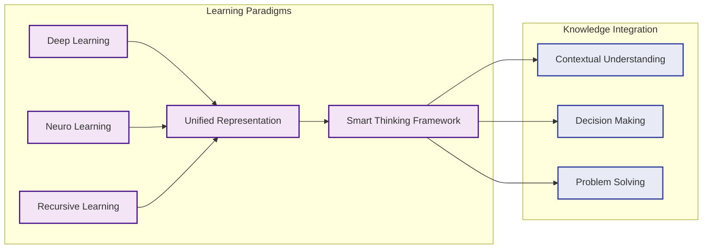

#### Decision Making Framework:
- **Smart Thinking Framework**: Core reasoning engine
- **Decision Engine**: Multi-criteria decision analysis
- **Planning System**: Goal-oriented action planning
- **Execution Engine**: Action implementation and monitoring

### 🔒 Security Layer
Comprehensive cybersecurity framework with AI-powered threat detection and response.

#### Security Components:
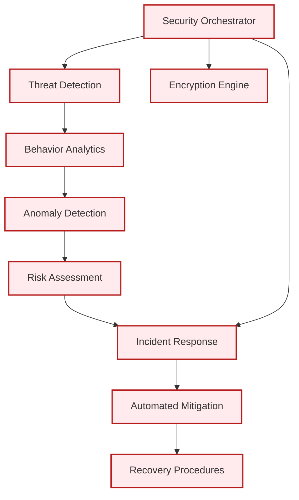

### ⚙️ System Intelligence
Intelligent system management and automation capabilities.

#### Management Domains:
- **Process Management**: System process control and optimization
- **File Management**: Intelligent file operations and organization
- **Network Management**: Network configuration and monitoring
- **Resource Optimizer**: Dynamic resource allocation
- **Automation Engine**: Workflow automation and orchestration

### 💾 Data Management Layer
Scalable data storage, processing, and management infrastructure.

#### Data Architecture:
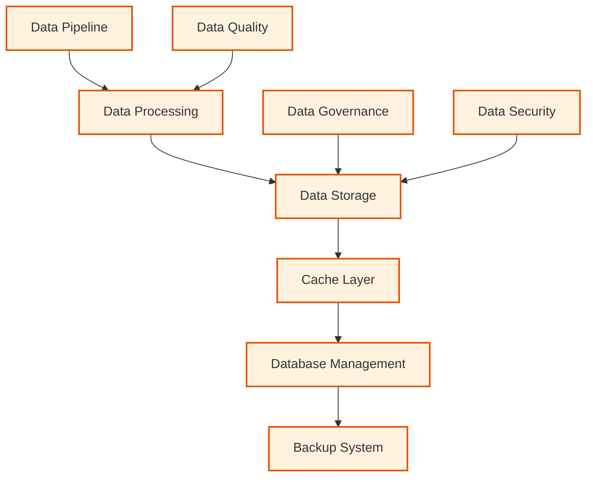

---

## System Flows

### 📝 User Command Processing Flow

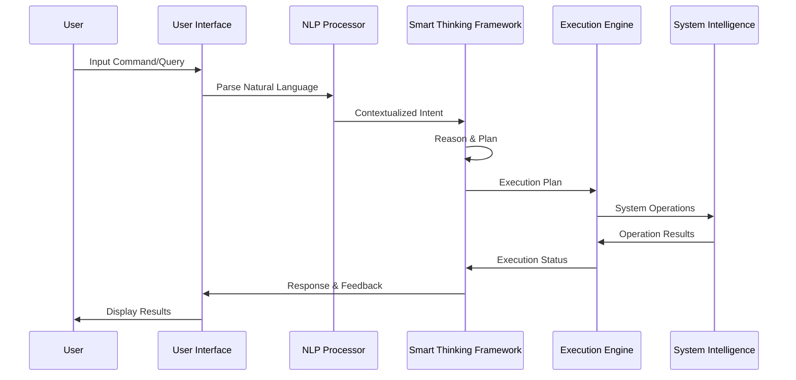

### 🧠 AI Learning Process Flow

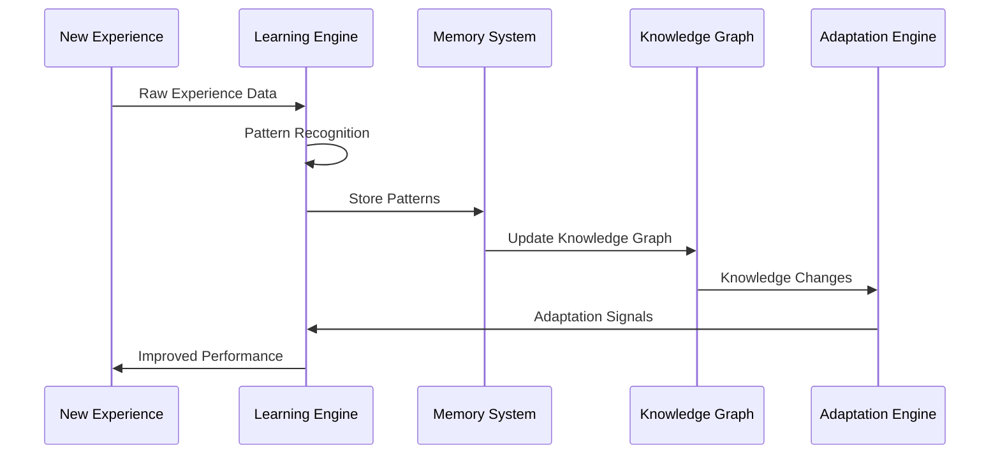

### 🔒 Security Response Flow

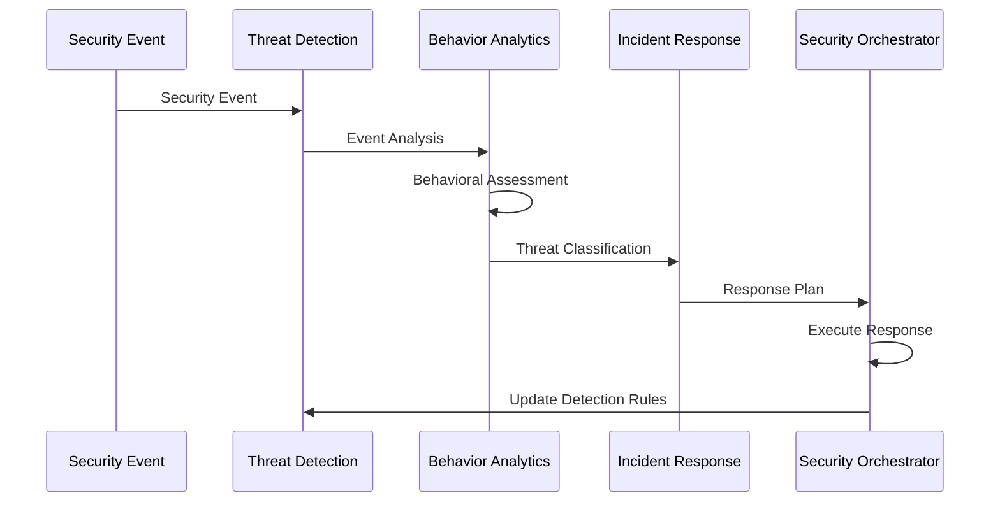

---

## Integration Points

### 🌐 External Integrations

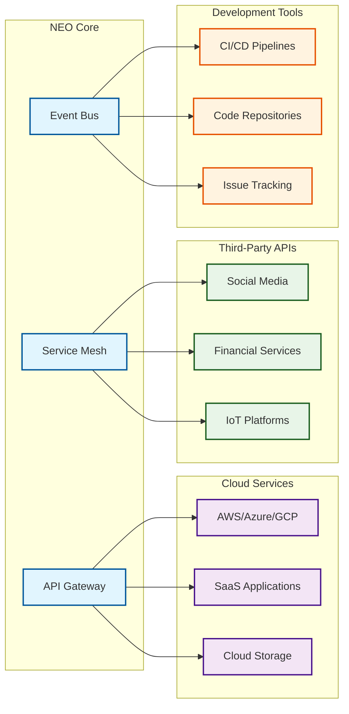

---

## Performance and Scalability

### 📊 System Performance Metrics

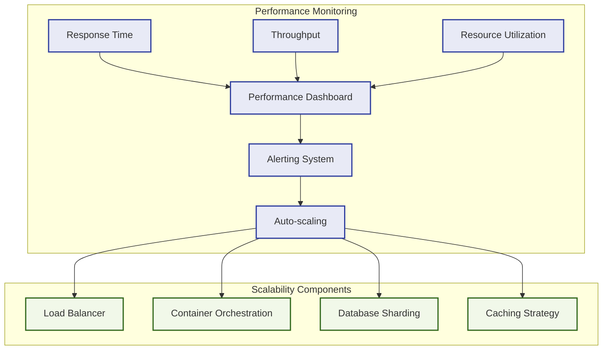

---

## Deployment Architecture

### 🚀 Container and Orchestration

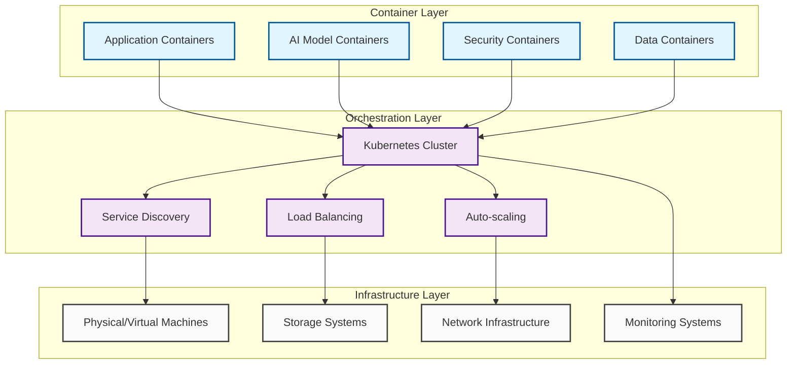

---

## Technology Stack

### 💻 Core Technologies

| Layer | Primary Technologies | Purpose |
|-------|---------------------|---------|
| **AI/ML** | TensorFlow, PyTorch, Scikit-learn | Machine learning and deep learning |
| **Backend** | Python, FastAPI, Node.js | Core application logic |
| **Database** | PostgreSQL, Redis, Neo4j | Data storage and caching |
| **Security** | JWT, OAuth2, TLS/SSL | Authentication and encryption |
| **Container** | Docker, Kubernetes | Containerization and orchestration |
| **Monitoring** | Prometheus, Grafana, ELK Stack | System monitoring and logging |
| **API** | REST, GraphQL, WebSocket | Communication protocols |
| **Frontend** | React, TypeScript, D3.js | User interface development |

---

## Quality Attributes

### 🎯 System Quality Characteristics

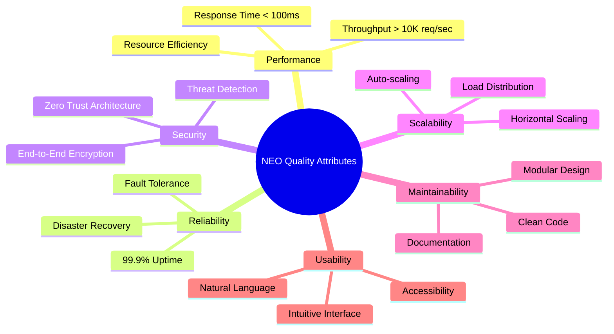

---

*This architecture overview provides the foundation for understanding NEO's comprehensive intelligent system design, emphasizing modularity, scalability, security, and intelligent automation capabilities.*
