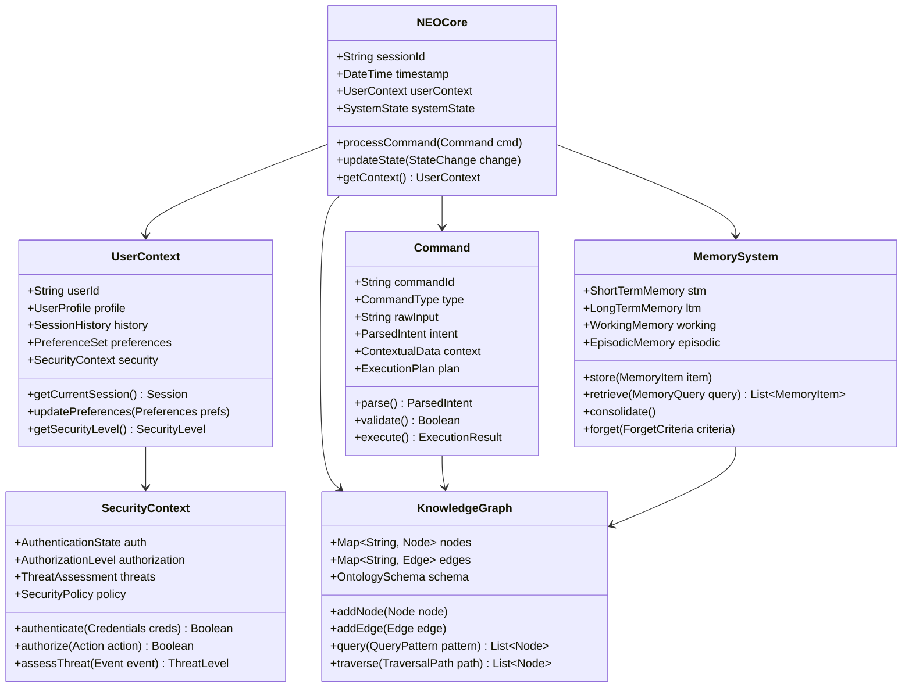
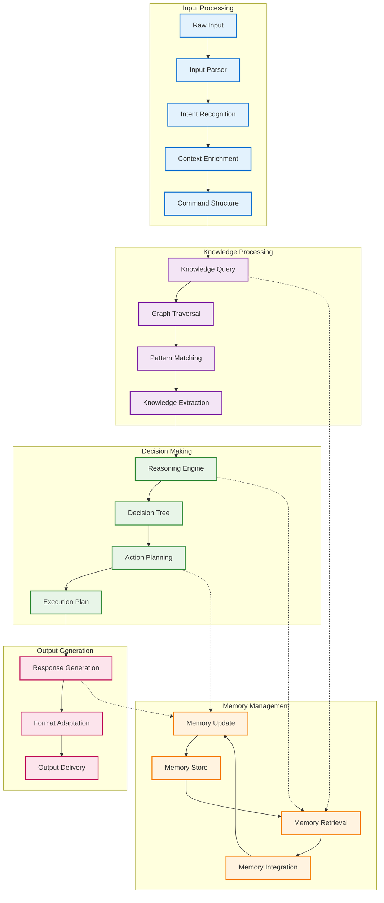
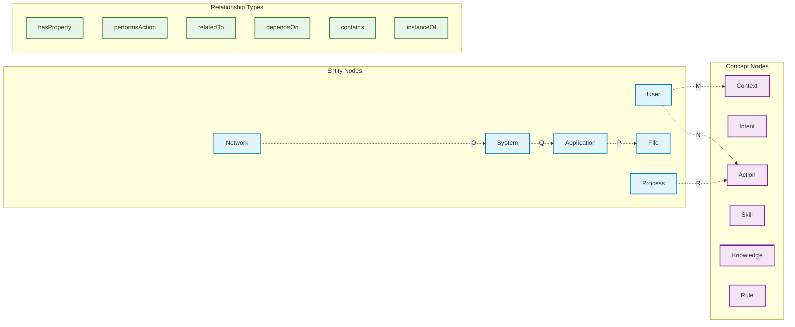
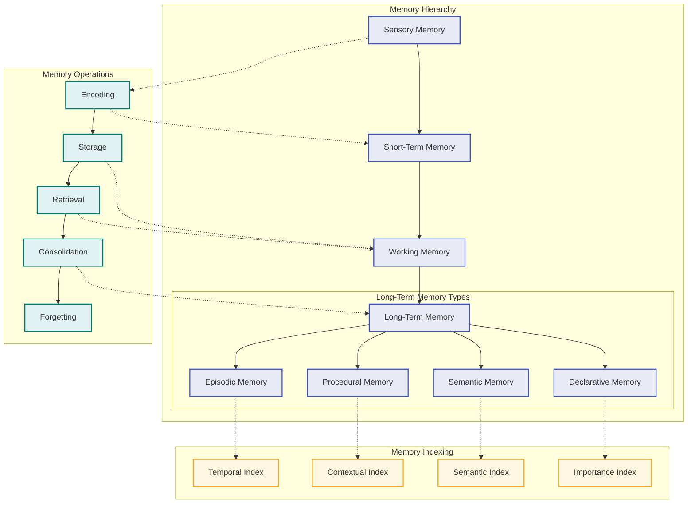
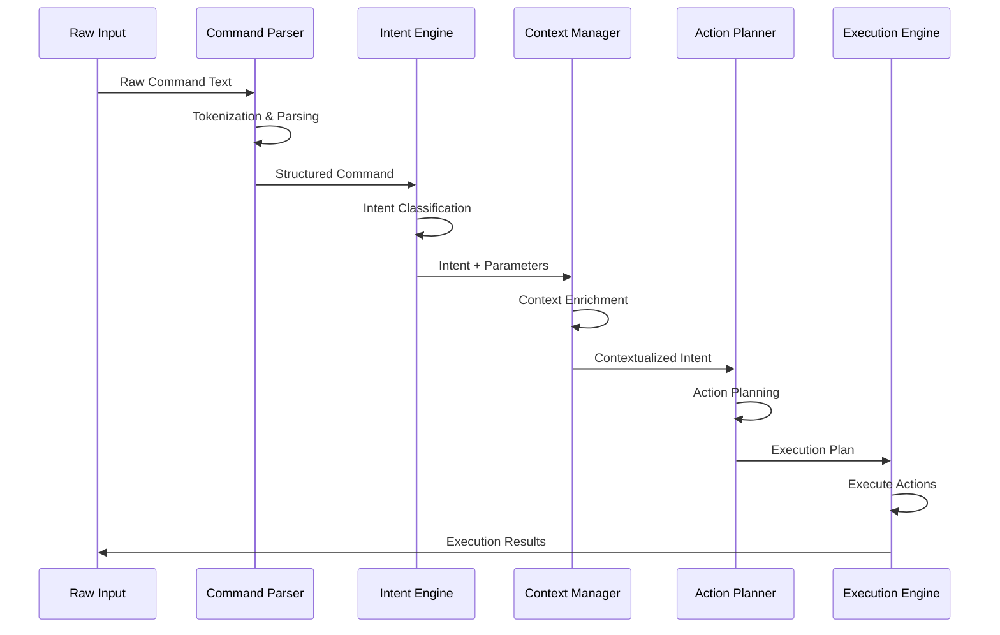
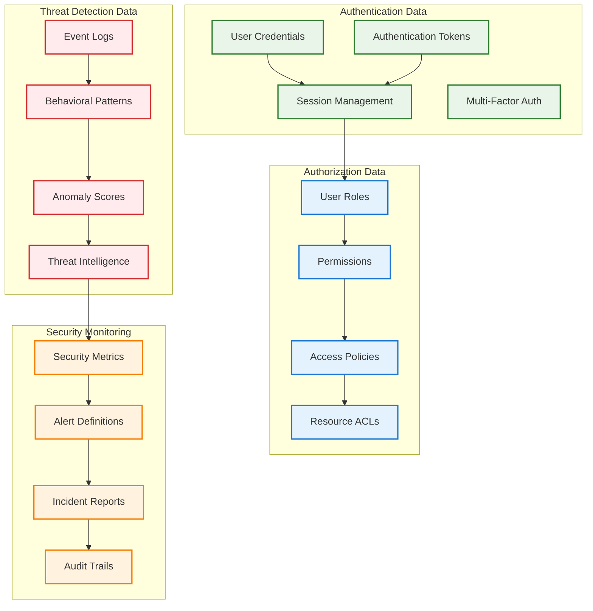
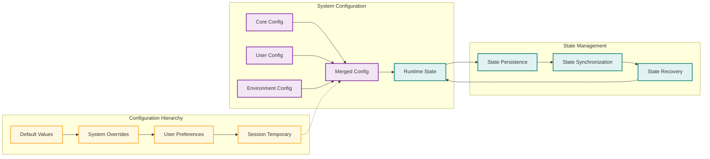

# 📊 NEO Core Data Structures
**Fundamental Data Representations and Storage Systems**

---

## Core Data Structure Overview



---

## Data Flow Architecture



---

## Knowledge Graph Structure

### Graph Node Types



### Knowledge Graph Schema

```python
# Knowledge Graph Data Structure
class KnowledgeNode:
    def __init__(self, node_id: str, node_type: str, properties: dict):
        self.id = node_id
        self.type = node_type
        self.properties = properties
        self.relationships = {}
        self.created_at = datetime.now()
        self.updated_at = datetime.now()
        self.confidence_score = 1.0

class KnowledgeEdge:
    def __init__(self, source_id: str, target_id: str, relationship_type: str):
        self.source_id = source_id
        self.target_id = target_id
        self.relationship_type = relationship_type
        self.properties = {}
        self.weight = 1.0
        self.confidence = 1.0
        self.created_at = datetime.now()

class KnowledgeGraph:
    def __init__(self):
        self.nodes: Dict[str, KnowledgeNode] = {}
        self.edges: Dict[str, KnowledgeEdge] = {}
        self.schema = KnowledgeSchema()
        self.indexes = {
            'type_index': {},
            'property_index': {},
            'relationship_index': {}
        }
```

---

## Memory System Architecture



### Memory Data Structures

```yaml
# Memory System Configuration
MemorySystem:
  ShortTermMemory:
    capacity: 7_plus_minus_2_items
    retention_time: 15_30_seconds
    decay_function: exponential
    interference_handling: proactive_retroactive
    
  WorkingMemory:
    components:
      - phonological_loop
      - visuospatial_sketchpad
      - central_executive
      - episodic_buffer
    capacity: 4_chunks
    manipulation_capability: true
    
  LongTermMemory:
    EpisodicMemory:
      structure: temporal_sequence
      indexing: time_context_emotion
      retrieval: cue_based
      capacity: unlimited
      
    SemanticMemory:
      structure: conceptual_network
      indexing: semantic_categories
      retrieval: associative
      organization: hierarchical
      
    ProceduralMemory:
      structure: condition_action_rules
      indexing: skill_context
      retrieval: automatic
      learning: practice_based

# Memory Item Structure
MemoryItem:
  id: unique_identifier
  content: memory_content
  type: episodic|semantic|procedural
  context:
    temporal: timestamp_information
    spatial: location_information
    emotional: emotional_context
    social: social_context
  encoding:
    strength: 0.0_to_1.0
    modality: visual|auditory|kinesthetic|semantic
    associations: related_memory_ids
  retrieval:
    access_count: number_of_retrievals
    last_accessed: timestamp
    cue_effectiveness: cue_success_rates
  importance:
    relevance_score: 0.0_to_1.0
    frequency_weight: access_frequency
    recency_weight: temporal_decay
    emotional_weight: emotional_significance
```

---

## Command Processing Structure



### Command Data Schema

```python
# Command Processing Data Structures
class RawCommand:
    def __init__(self, user_input: str, input_mode: str):
        self.raw_text = user_input
        self.input_mode = input_mode  # voice, text, gesture
        self.timestamp = datetime.now()
        self.session_id = generate_session_id()
        self.user_id = get_current_user()

class ParsedCommand:
    def __init__(self):
        self.command_type: CommandType = None
        self.action: str = ""
        self.parameters: Dict[str, Any] = {}
        self.modifiers: List[str] = []
        self.confidence: float = 0.0
        self.alternatives: List[ParsedCommand] = []

class Intent:
    def __init__(self):
        self.primary_intent: str = ""
        self.sub_intents: List[str] = []
        self.entities: Dict[str, Entity] = {}
        self.context_requirements: List[str] = []
        self.confidence_score: float = 0.0
        
class ExecutionPlan:
    def __init__(self):
        self.plan_id: str = generate_uuid()
        self.steps: List[ActionStep] = []
        self.dependencies: Dict[str, List[str]] = {}
        self.estimated_duration: int = 0
        self.resource_requirements: ResourceRequirements = None
        self.rollback_plan: RollbackPlan = None

class ActionStep:
    def __init__(self):
        self.step_id: str = generate_uuid()
        self.action_type: ActionType = None
        self.parameters: Dict[str, Any] = {}
        self.pre_conditions: List[Condition] = []
        self.post_conditions: List[Condition] = []
        self.timeout: int = 30
        self.retry_policy: RetryPolicy = None
```

---

## Security Data Structures



### Security Data Schema

```yaml
# Security Data Structures
SecurityContext:
  Authentication:
    user_id: unique_user_identifier
    session_token: jwt_or_session_token
    authentication_method: password|mfa|biometric|sso
    authentication_time: timestamp
    expiration_time: timestamp
    refresh_token: refresh_token_if_applicable
    
  Authorization:
    roles: list_of_user_roles
    permissions: granular_permission_set
    resource_access: resource_specific_permissions
    policy_version: current_policy_version
    last_authorization_check: timestamp
    
  ThreatAssessment:
    risk_score: 0_to_100_risk_level
    behavioral_anomalies: detected_anomalies
    threat_indicators: active_threat_indicators
    security_events: recent_security_events
    mitigation_actions: applied_mitigations

# Security Event Structure
SecurityEvent:
  event_id: unique_event_identifier
  event_type: authentication|authorization|threat|audit
  severity: low|medium|high|critical
  timestamp: event_occurrence_time
  source:
    ip_address: source_ip_address
    user_agent: client_user_agent
    geographic_location: geo_location_data
    device_fingerprint: device_identification
  details:
    action_attempted: specific_action_details
    resource_accessed: target_resource_information
    outcome: success|failure|blocked
    error_code: specific_error_information
  context:
    session_id: associated_session
    user_id: associated_user
    related_events: linked_event_ids
    investigation_status: open|investigating|resolved
```

---

## Configuration and State Management



### Configuration Schema

```json
{
  "system_config": {
    "core": {
      "version": "1.0.0",
      "environment": "production",
      "debug_mode": false,
      "log_level": "INFO",
      "max_concurrent_sessions": 1000
    },
    "ai_engine": {
      "learning_paradigms": {
        "deep_learning": {
          "enabled": true,
          "model_path": "/models/deep_learning",
          "inference_timeout": 5000
        },
        "neuro_learning": {
          "enabled": true,
          "plasticity_rate": 0.1,
          "adaptation_threshold": 0.8
        },
        "recursive_learning": {
          "enabled": true,
          "recursion_depth": 10,
          "convergence_threshold": 0.95
        }
      },
      "memory_system": {
        "short_term_capacity": 7,
        "working_memory_chunks": 4,
        "consolidation_interval": "1h",
        "forgetting_curve": "exponential"
      }
    },
    "security": {
      "authentication": {
        "method": "multi_factor",
        "session_timeout": "24h",
        "max_failed_attempts": 3,
        "lockout_duration": "15m"
      },
      "threat_detection": {
        "enabled": true,
        "sensitivity": "high",
        "response_mode": "automatic",
        "alert_threshold": 0.7
      }
    }
  },
  "user_preferences": {
    "interface": {
      "theme": "dark",
      "language": "en-US",
      "voice_enabled": true,
      "notifications": true
    },
    "ai_behavior": {
      "interaction_style": "professional",
      "verbosity_level": "medium",
      "learning_rate": "adaptive",
      "personalization_enabled": true
    },
    "privacy": {
      "data_collection": "essential_only",
      "analytics_enabled": false,
      "telemetry_enabled": true,
      "sharing_permissions": []
    }
  }
}
```

---

## Data Persistence Layer

```mermaid
graph TB
    subgraph "Application Data"
        A[User Data]
        B[Configuration Data]
        C[Session Data]
        D[System State]
    end

    subgraph "Knowledge Data"
        E[Knowledge Graph]
        F[Memory System]
        G[Learning Models]
        H[Rule Base]
    end

    subgraph "Security Data"
        I[Authentication Data]
        J[Authorization Data]
        K[Audit Logs]
        L[Security Events]
    end

    subgraph "Storage Systems"
        M[(PostgreSQL)]
        N[(Neo4j)]
        O[(Redis)]
        P[(InfluxDB)]
        Q[(Elasticsearch)]
    end

    A --> M
    B --> M
    C --> O
    D --> O

    E --> N
    F --> N
    G --> M
    H --> M

    I --> M
    J --> M
    K --> Q
    L --> P

    classDef appdata fill:#e3f2fd,stroke:#1976d2,stroke-width:2px
    classDef knowledge fill:#f3e5f5,stroke:#7b1fa2,stroke-width:2px
    classDef security fill:#ffebee,stroke:#d32f2f,stroke-width:2px
    classDef storage fill:#e8f5e8,stroke:#2e7d32,stroke-width:2px

    class A,B,C,D appdata
    class E,F,G,H knowledge
    class I,J,K,L security
    class M,N,O,P,Q storage
```



---

## API Data Structures

### REST API Schema

```yaml
# API Request/Response Structures
APIRequest:
  headers:
    authorization: Bearer_token_or_API_key
    content_type: application/json
    user_agent: client_identification
    request_id: unique_request_identifier
  
  body:
    action: command_or_action_type
    parameters: action_specific_parameters
    context: request_context_information
    metadata: additional_request_metadata

APIResponse:
  status:
    code: http_status_code
    message: human_readable_status
    success: boolean_success_indicator
    
  data:
    result: primary_response_data
    metadata: response_metadata
    pagination: pagination_information_if_applicable
    
  execution:
    duration: execution_time_milliseconds
    timestamp: response_timestamp
    request_id: original_request_identifier
    
  errors:
    error_code: specific_error_code
    error_message: detailed_error_description
    validation_errors: field_specific_errors
    troubleshooting: suggested_resolution_steps
```

---

*These core data structures form the foundation of NEO's intelligent system, providing robust, scalable, and secure data management across all system components and operations.*
