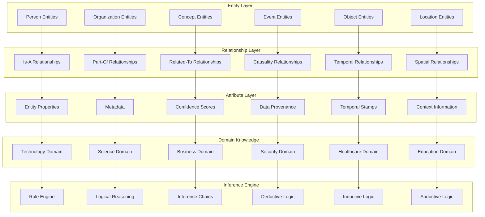
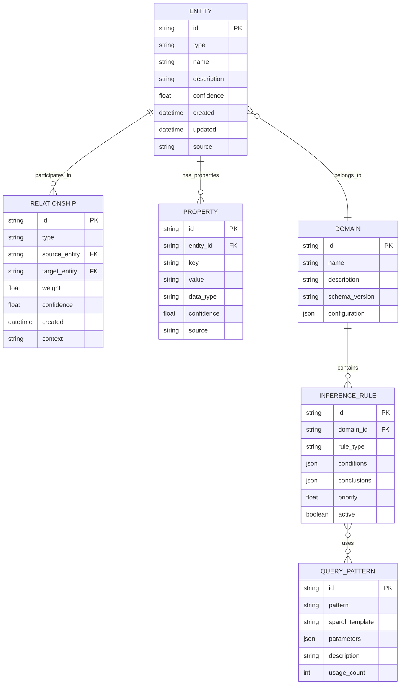
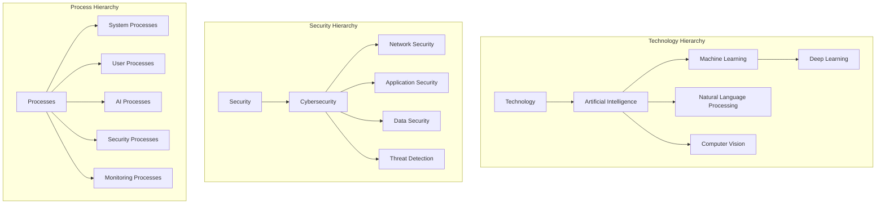
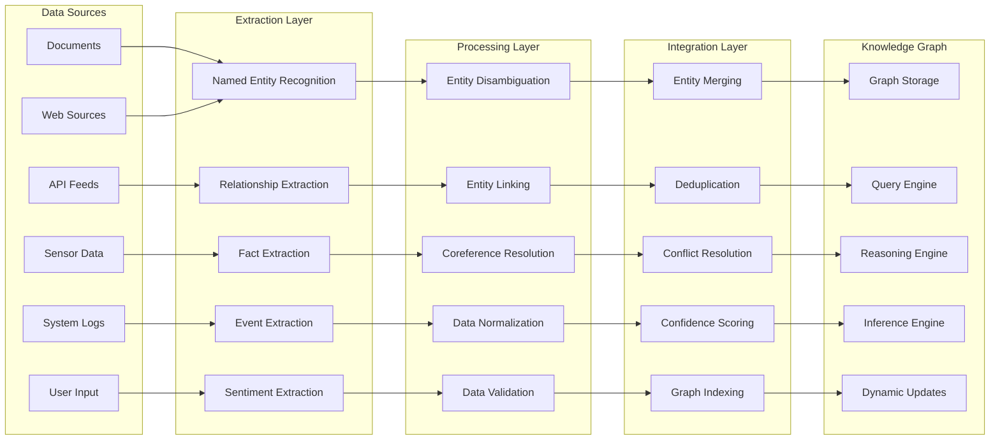
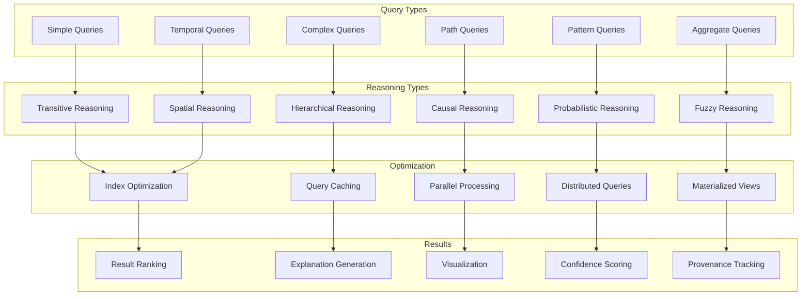
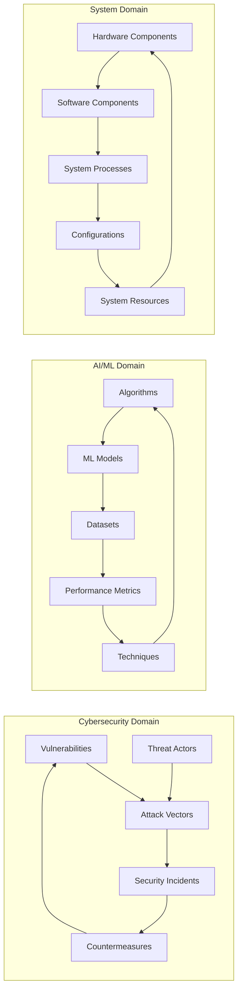
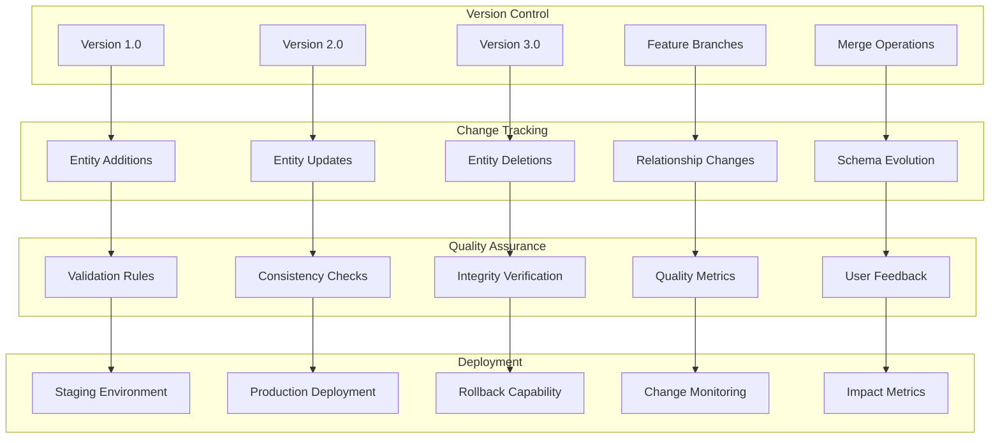

# Knowledge Graph Structure
**Semantic Knowledge Representation and Relationships**

---

## Overview

This diagram illustrates NEO's knowledge graph structure, showing how information is organized, connected, and accessed to enable intelligent reasoning and contextual understanding.

---

## Core Knowledge Graph Architecture

---

## Entity Relationship Model

---

## Semantic Hierarchies

---

## Knowledge Acquisition Pipeline

---

## Query and Reasoning Patterns

---

## Domain-Specific Knowledge Models

---

## Knowledge Evolution and Versioning

---

## Technical Implementation

### Storage Architecture
- **Graph Database**: Neo4j cluster for primary graph storage
- **Vector Database**: High-dimensional embeddings for semantic similarity
- **Document Store**: JSON documents for unstructured entity properties
- **Search Engine**: Elasticsearch for full-text search capabilities
- **Cache Layer**: Redis for frequently accessed graph patterns

### Performance Characteristics
- **Query Response**: < 100ms for simple queries, < 1s for complex reasoning
- **Storage Capacity**: Billions of entities and relationships
- **Concurrent Users**: 1000+ simultaneous query operations
- **Update Throughput**: 10,000+ entities/second ingestion rate
- **Availability**: 99.9% uptime with distributed architecture

### Integration Features
- **SPARQL Endpoint**: Standard semantic web query interface
- **REST API**: RESTful interface for application integration
- **GraphQL**: Flexible query interface for front-end applications
- **Streaming API**: Real-time knowledge updates via event streams
- **Batch Processing**: ETL pipelines for bulk knowledge ingestion

---

This knowledge graph structure enables NEO to maintain contextual understanding, perform intelligent reasoning, and provide accurate responses based on comprehensive semantic relationships and domain expertise.
