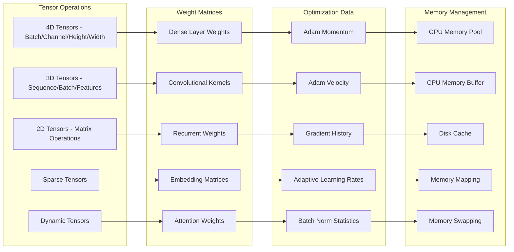
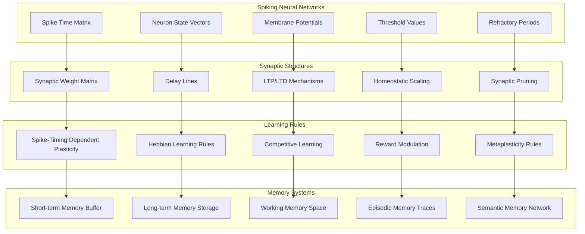
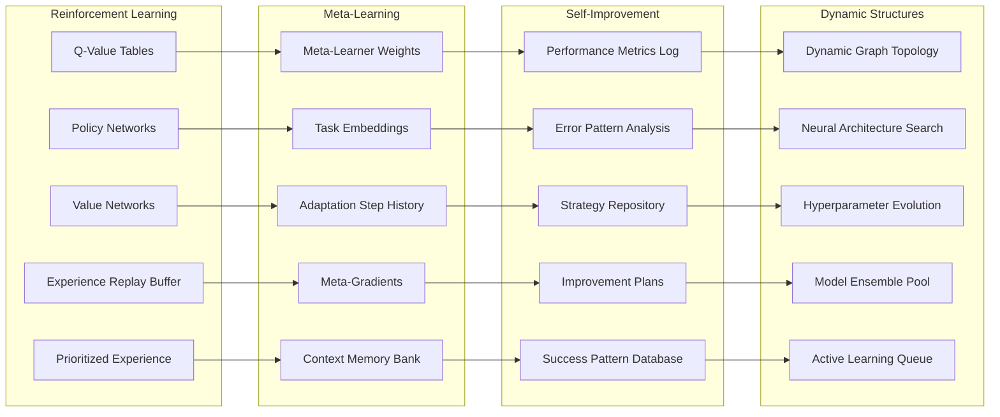
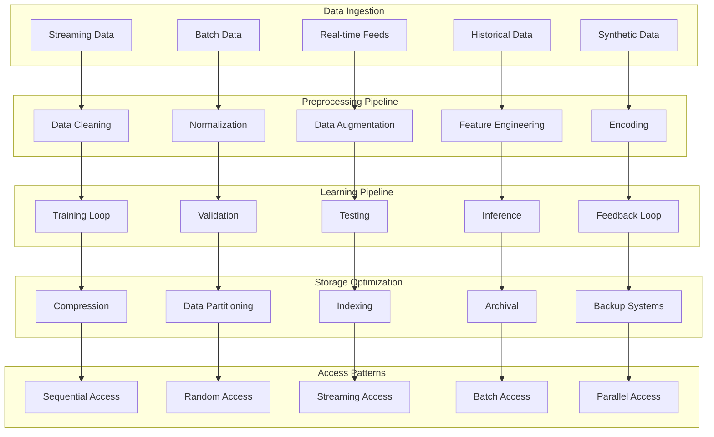
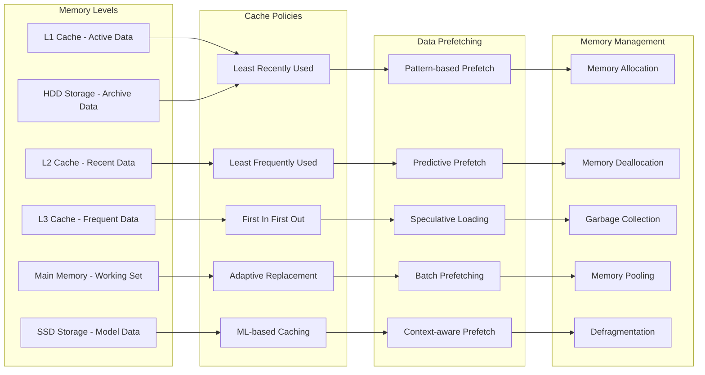
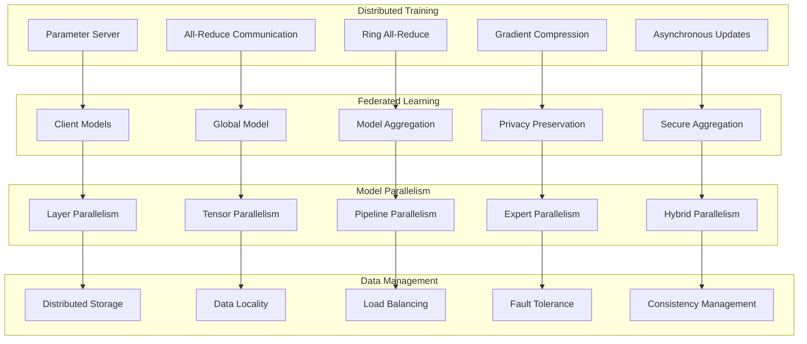

# Learning Data Structures
**Adaptive Data Models for Multi-Paradigm Learning Systems**

---

## Overview

This diagram illustrates the sophisticated data structures that enable NEO's multi-paradigm learning capabilities, supporting deep learning, neuro learning, and recursive learning with optimized storage and access patterns.

---

## Core Learning Data Architecture

```mermaid
graph TB
    subgraph "Input Data Layer"
        RAW[Raw Input Data]
        PREPROCESSED[Preprocessed Data]
        FEATURES[Feature Vectors]
        EMBEDDINGS[Embeddings]
        SEQUENCES[Sequential Data]
        STRUCTURED[Structured Data]
    end
    
    subgraph "Deep Learning Structures"
        TENSORS[Multi-dimensional Tensors]
        WEIGHTS[Neural Network Weights]
        GRADIENTS[Gradient Matrices]
        ACTIVATIONS[Activation Maps]
        ATTENTION[Attention Matrices]
        TRANSFORMER[Transformer Blocks]
    end
    
    subgraph "Neuro Learning Structures"
        SPIKES[Spike Trains]
        SYNAPSES[Synaptic Weights]
        PLASTICITY[Plasticity Matrices]
        MEMORY_TRACES[Memory Traces]
        NEURAL_STATES[Neural States]
        CONNECTIVITY[Connectivity Graphs]
    end
    
    subgraph "Recursive Learning Structures"
        POLICIES[Policy Networks]
        VALUE_FUNCTIONS[Value Functions]
        EXPERIENCE[Experience Replay]
        META_PARAMS[Meta-Parameters]
        ADAPTATION[Adaptation Histories]
        PERFORMANCE[Performance Metrics]
    end
    
    subgraph "Storage and Management"
        VERSIONING[Model Versioning]
        CHECKPOINTS[Checkpoints]
        COMPRESSION[Data Compression]
        SHARDING[Data Sharding]
        CACHING[Intelligent Caching]
        LIFECYCLE[Data Lifecycle]
    end
    
    RAW --> TENSORS
    PREPROCESSED --> WEIGHTS
    FEATURES --> SPIKES
    EMBEDDINGS --> POLICIES
    SEQUENCES --> GRADIENTS
    STRUCTURED --> SYNAPSES
    
    TENSORS --> VERSIONING
    WEIGHTS --> CHECKPOINTS
    SPIKES --> COMPRESSION
    POLICIES --> SHARDING
    GRADIENTS --> CACHING
    SYNAPSES --> LIFECYCLE
```

---

## Deep Learning Data Structures

---

## Neuro Learning Data Structures

---

## Recursive Learning Data Structures

---

## Data Flow and Processing Pipeline

---

## Memory Hierarchy and Caching

---

## Distributed Learning Structures

---

## Technical Implementation Details

### Storage Technologies
- **Primary Storage**: NVMe SSD arrays for high-speed model access
- **Archive Storage**: High-capacity HDDs for historical data
- **Memory Systems**: DDR4/DDR5 with error correction
- **GPU Memory**: High-bandwidth memory (HBM) for tensor operations
- **Distributed Storage**: HDFS/GlusterFS for scalable data storage

### Performance Characteristics
- **Memory Bandwidth**: 1TB/s aggregate memory bandwidth
- **Storage Throughput**: 100GB/s sequential read/write
- **Cache Hit Ratio**: >95% for frequently accessed data
- **Compression Ratio**: 3:1 average for model weights
- **Access Latency**: <1ms for cached data, <10ms for SSD

### Optimization Features
- **Automatic Mixed Precision**: FP16/FP32 optimization
- **Quantization**: INT8 quantization for inference
- **Pruning**: Structured and unstructured model pruning
- **Knowledge Distillation**: Compact model generation
- **Dynamic Batching**: Adaptive batch size optimization

---

These learning data structures enable NEO to efficiently manage complex multi-paradigm learning processes while maintaining high performance and scalability across diverse AI applications.
