# 🤖 NEO AI Decision Making Process
**Intelligent Decision Framework and Reasoning Workflows**

---

## Overview

NEO's AI decision-making system implements a sophisticated multi-layered approach that combines various reasoning paradigms, uncertainty handling, and adaptive learning to make intelligent decisions across diverse scenarios and contexts.

---

## 🧠 Core Decision Making Architecture

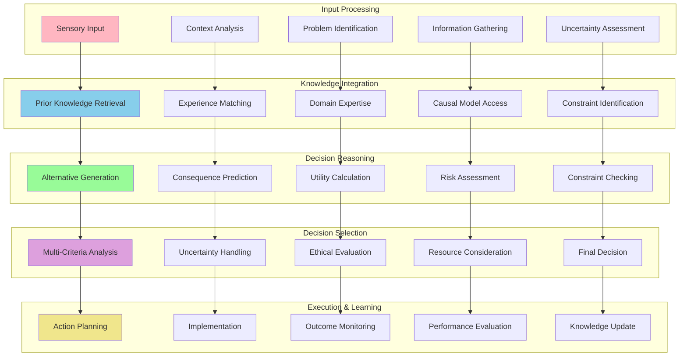

---

## 🔍 Problem Analysis and Understanding

### Problem Classification Flow

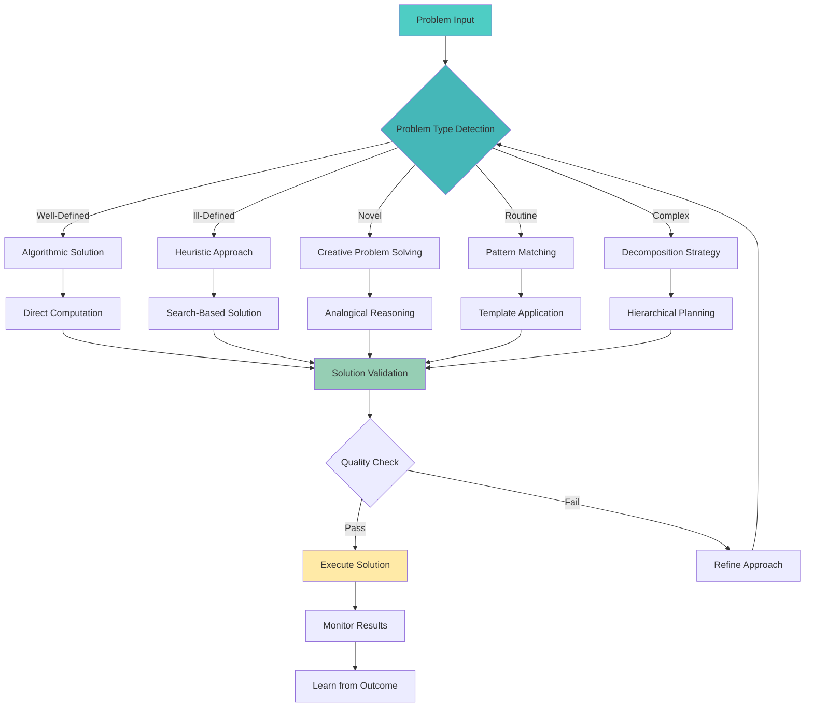

### Context Understanding Pipeline

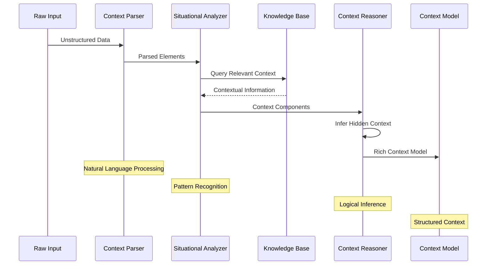

---

## ⚖️ Multi-Criteria Decision Analysis

### Decision Criteria Framework

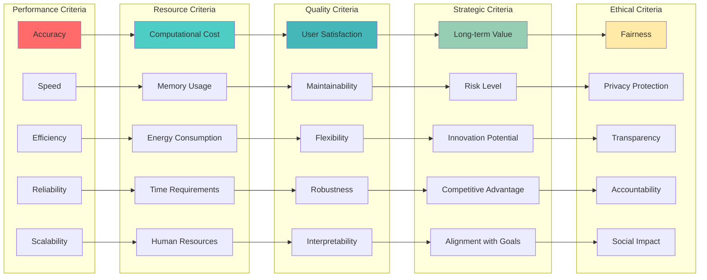

### Weighted Decision Matrix

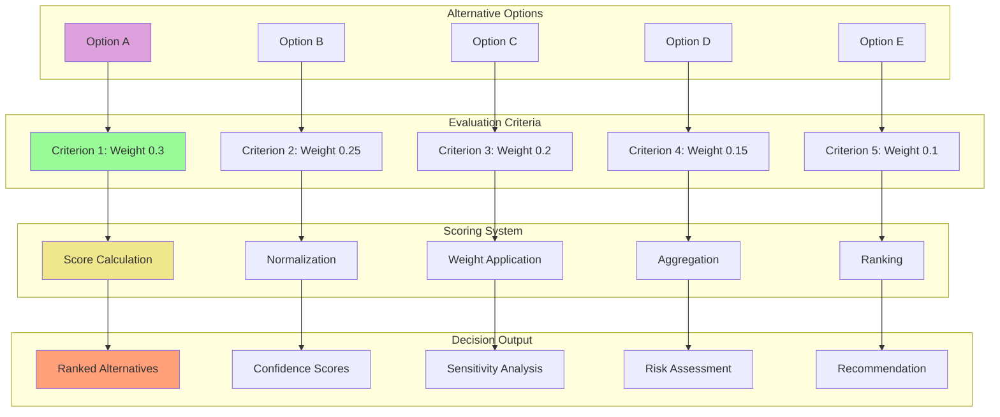

---

## 🎯 Uncertainty and Risk Management

### Uncertainty Quantification Flow

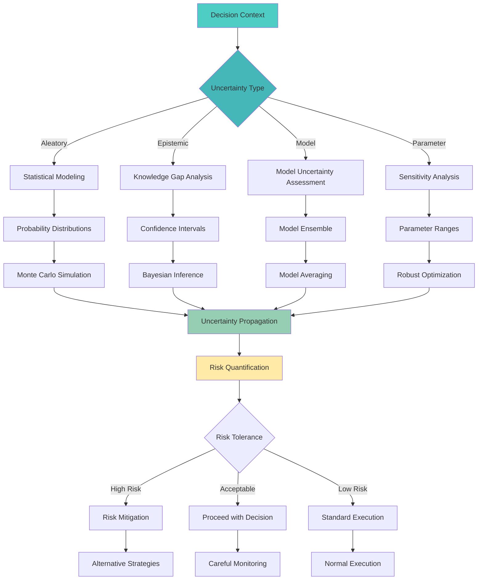

### Risk Assessment Matrix

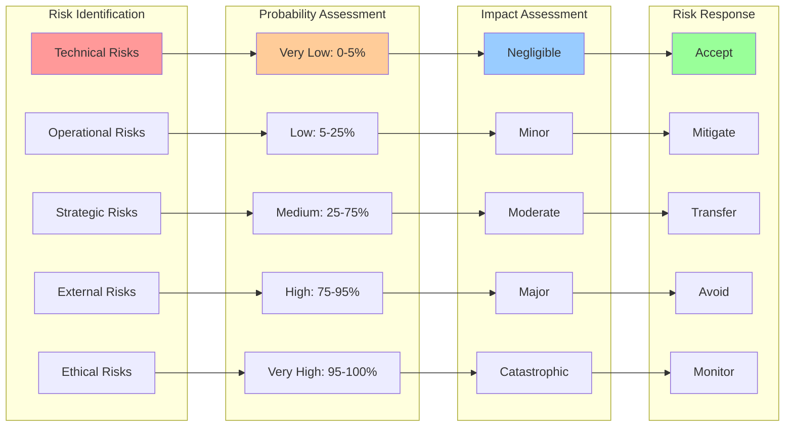

---

## 🧮 Reasoning Strategies

### Logical Reasoning Flow

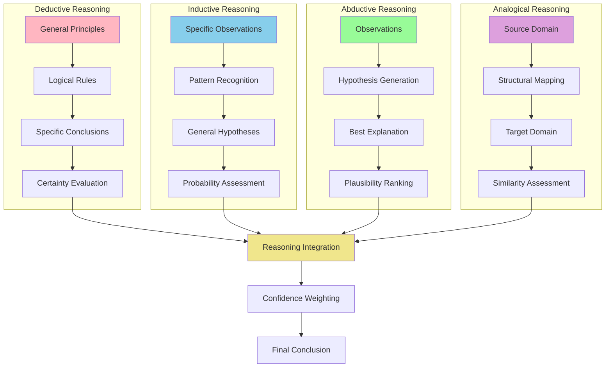

### Causal Reasoning Framework

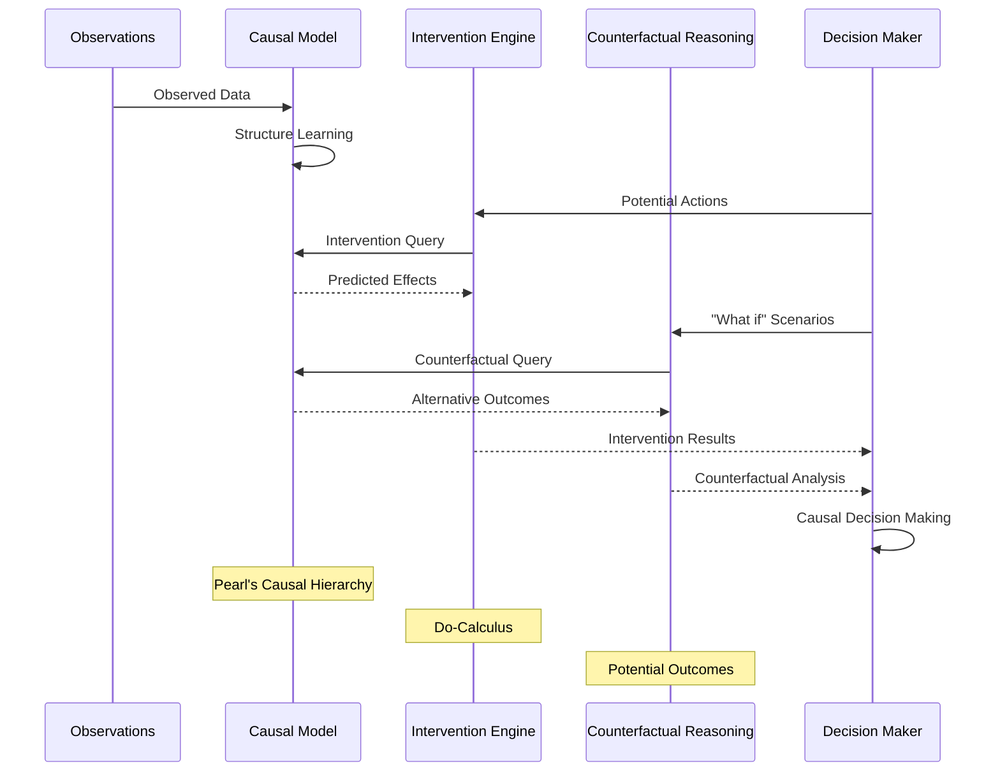

---

## 🔄 Adaptive Decision Making

### Learning from Decisions

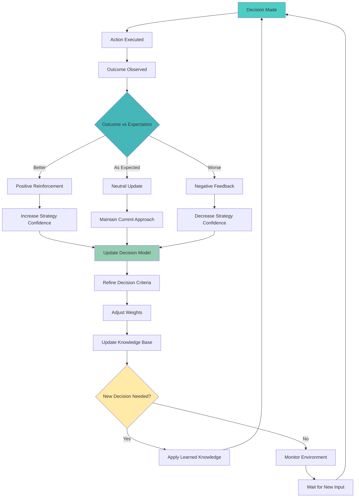

### Meta-Decision Framework

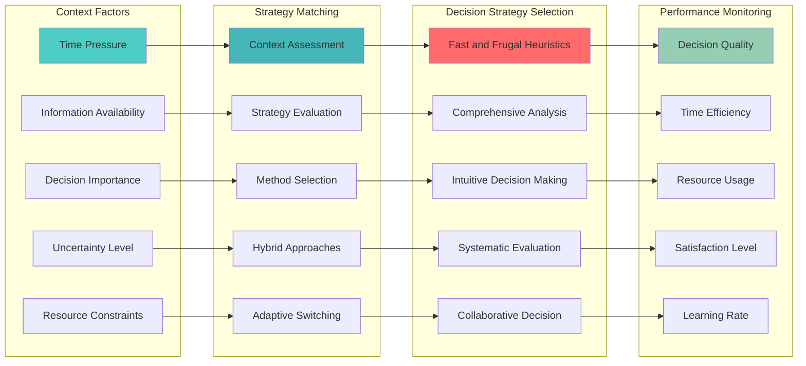

---

## 🎨 Creative Decision Making

### Innovation and Creativity Flow

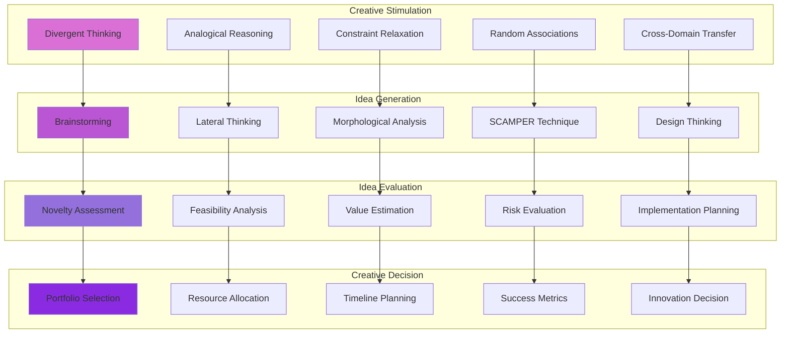

### Breakthrough Innovation Process

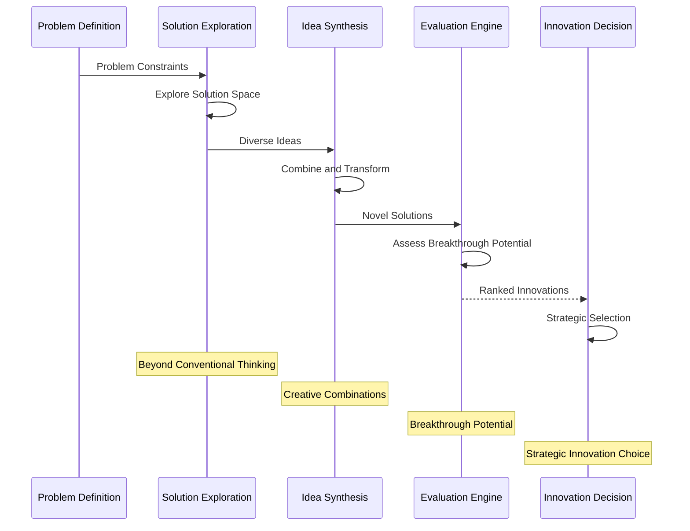

---

## 📊 Decision Performance Analytics

### Decision Quality Metrics

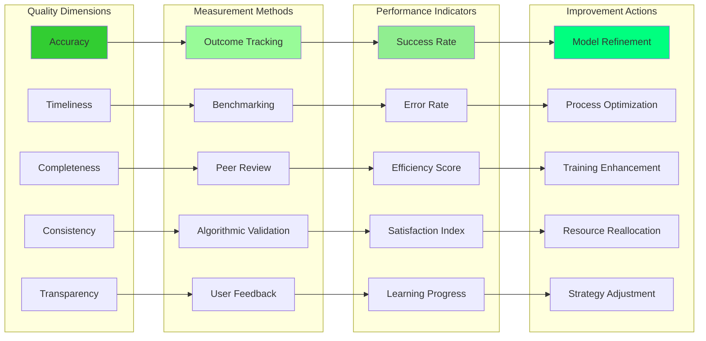

### Continuous Improvement Loop

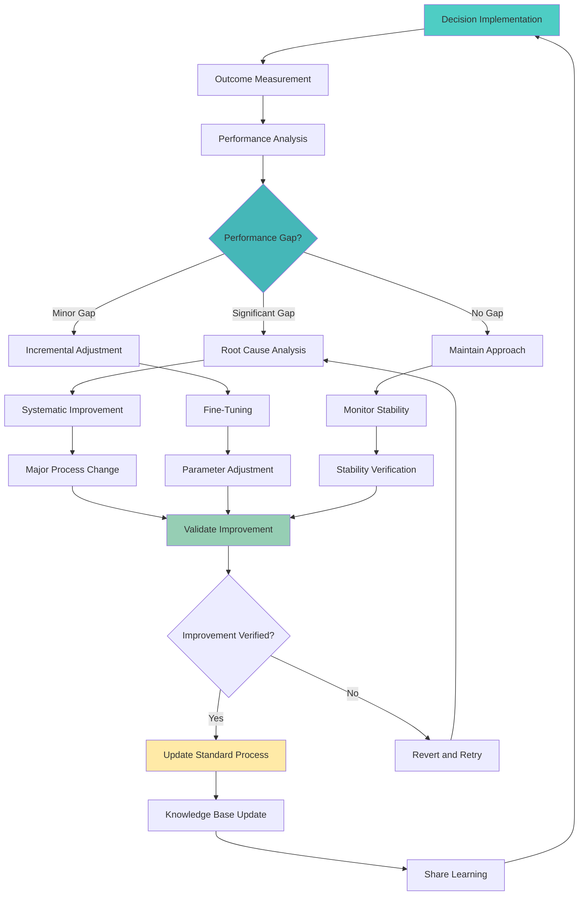

---

## 🔧 Decision System Configuration

### AI Decision Engine Settings

```yaml
# NEO AI Decision Making Configuration
decision_engine:
  version: "2.1"
  mode: "production"
  
  reasoning_strategies:
    deductive_reasoning:
      enabled: true
      confidence_threshold: 0.9
      rule_base: "first_order_logic"
      inference_engine: "forward_chaining"
      
    inductive_reasoning:
      enabled: true
      pattern_recognition: "deep_learning"
      hypothesis_generation: "automated"
      evidence_threshold: 0.7
      
    abductive_reasoning:
      enabled: true
      explanation_search: "best_first"
      plausibility_ranking: "bayesian"
      hypothesis_pruning: "likelihood_based"
      
    analogical_reasoning:
      enabled: true
      similarity_measure: "structural_alignment"
      case_base: "episodic_memory"
      adaptation_strategy: "constraint_based"
      
  uncertainty_handling:
    uncertainty_quantification:
      method: "bayesian_networks"
      confidence_intervals: true
      monte_carlo_samples: 10000
      
    risk_assessment:
      risk_matrix: "5x5_likelihood_impact"
      risk_tolerance: "medium"
      mitigation_strategies: "automated"
      
    robustness_testing:
      sensitivity_analysis: true
      stress_testing: true
      adversarial_testing: true
      
  decision_criteria:
    multi_criteria_analysis:
      method: "analytic_hierarchy_process"
      criteria_weights: "dynamic"
      normalization: "min_max_scaling"
      
    optimization:
      objective_function: "weighted_utility"
      constraint_handling: "penalty_method"
      search_algorithm: "genetic_algorithm"
      
  learning_adaptation:
    feedback_integration:
      learning_rate: 0.01
      feedback_weighting: "recency_bias"
      concept_drift_detection: true
      
    meta_learning:
      strategy_selection: "contextual_bandits"
      adaptation_speed: "fast"
      transfer_learning: true
      
  performance_monitoring:
    metrics_collection:
      decision_quality: "outcome_tracking"
      response_time: "millisecond_precision"
      resource_usage: "comprehensive"
      
    quality_assurance:
      validation_method: "cross_validation"
      benchmark_comparison: "human_expert"
      error_analysis: "detailed"
      
  ethical_framework:
    ethical_principles:
      - "beneficence"
      - "non_maleficence"
      - "autonomy"
      - "justice"
      - "transparency"
      
    bias_detection:
      algorithmic_bias: "continuous_monitoring"
      fairness_metrics: ["demographic_parity", "equalized_odds"]
      bias_mitigation: "preprocessing_inprocessing_postprocessing"
      
    explainability:
      explanation_method: "lime_shap_gradcam"
      explanation_level: "detailed"
      stakeholder_tailored: true

execution_parameters:
  timeout_settings:
    routine_decisions: "100ms"
    complex_decisions: "5s"
    strategic_decisions: "60s"
    
  resource_limits:
    cpu_usage: "80%"
    memory_usage: "16GB"
    storage_usage: "1TB"
    
  fallback_mechanisms:
    timeout_fallback: "simplified_heuristic"
    error_fallback: "safe_default"
    uncertainty_fallback: "human_escalation"
    
integration:
  external_systems:
    knowledge_base: "neo_kb"
    user_interface: "neo_ui"
    execution_engine: "neo_executor"
    monitoring_system: "neo_monitor"
    
  api_endpoints:
    decision_request: "/api/v1/decisions/make"
    decision_explain: "/api/v1/decisions/explain"
    decision_feedback: "/api/v1/decisions/feedback"
    decision_analytics: "/api/v1/decisions/analytics"
```

---

## 📋 Implementation Roadmap

### Phase 1: Core Framework (Months 1-2)
- [ ] Implement basic decision-making pipeline
- [ ] Deploy multi-criteria analysis framework
- [ ] Set up uncertainty quantification
- [ ] Create decision logging and tracking
- [ ] Establish performance metrics

### Phase 2: Advanced Reasoning (Months 3-4)
- [ ] Implement multiple reasoning strategies
- [ ] Deploy causal reasoning framework
- [ ] Add creative decision-making capabilities
- [ ] Integrate meta-decision framework
- [ ] Enhance uncertainty handling

### Phase 3: Learning and Adaptation (Months 5-6)
- [ ] Deploy adaptive learning mechanisms
- [ ] Implement feedback integration
- [ ] Add meta-learning capabilities
- [ ] Create decision strategy optimization
- [ ] Enhance performance monitoring

### Phase 4: Production Deployment (Months 7-8)
- [ ] Optimize for production performance
- [ ] Deploy comprehensive testing
- [ ] Implement ethical framework
- [ ] Add explainability features
- [ ] Create decision analytics dashboard

---

*This AI decision-making framework provides NEO with sophisticated reasoning capabilities that enable intelligent, adaptive, and ethical decision-making across diverse scenarios and contexts.*
