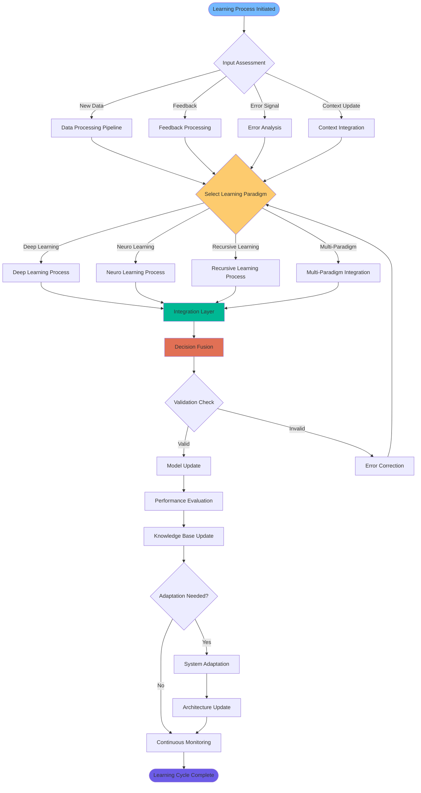
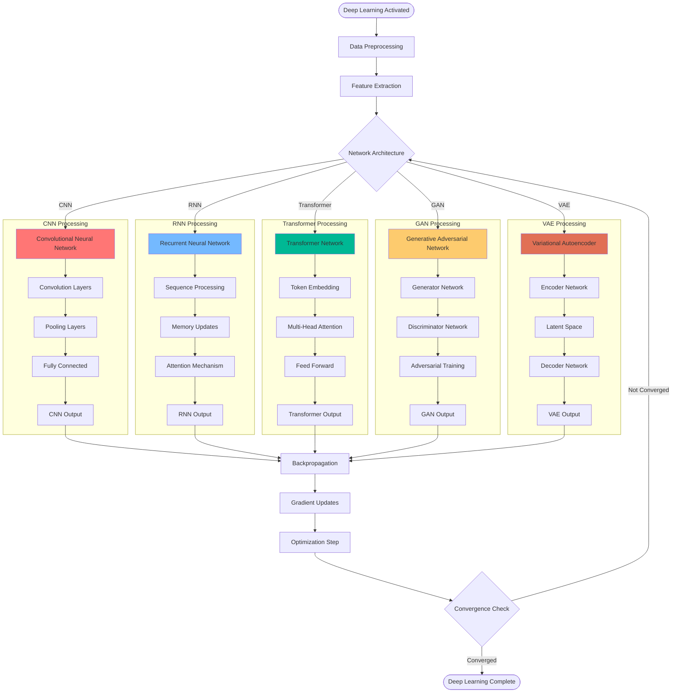
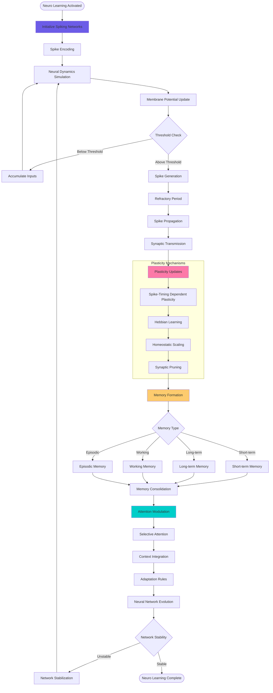
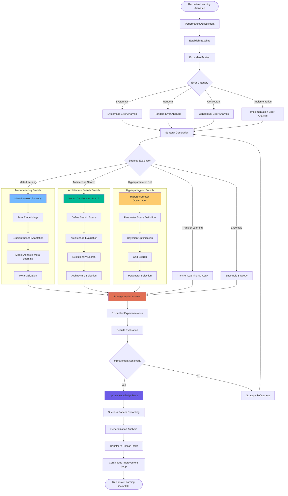
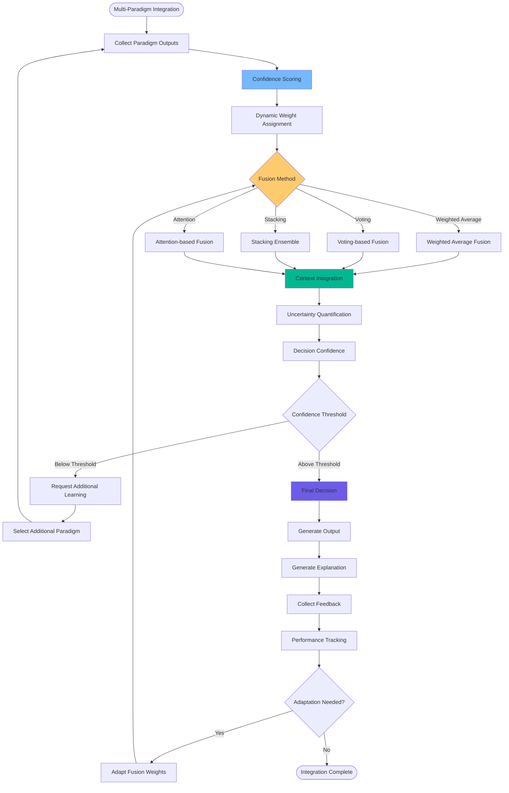

# Learning Process Flowchart
**Multi-Paradigm Learning System Workflow**

---

## Overview

This flowchart illustrates NEO's comprehensive learning process, integrating deep learning, neuro learning, and recursive learning paradigms with continuous adaptation and improvement mechanisms.

---

## Main Learning Process Flow

---

## Deep Learning Process

---

## Neuro Learning Process

---

## Recursive Learning Process

---

## Multi-Paradigm Integration

---

## Continuous Learning Loop

```mermaid
flowchart LR
    DEPLOYMENT([System Deployed]) --> MONITOR[Monitor Performance]
    
    MONITOR --> METRICS_COLLECTION[Collect Metrics]
    METRICS_COLLECTION --> DRIFT_DETECTION[Concept Drift Detection]
    
    DRIFT_DETECTION --> DRIFT_CHECK{Drift Detected?}
    
    DRIFT_CHECK -->|No| MONITOR
    DRIFT_CHECK -->|Yes| ADAPTATION_STRATEGY[Adaptation Strategy]
    
    ADAPTATION_STRATEGY --> INCREMENTAL[Incremental Learning]
    INCREMENTAL --> CATASTROPHIC_CHECK[Catastrophic Forgetting Check]
    
    CATASTROPHIC_CHECK --> REGULARIZATION[Regularization Techniques]
    REGULARIZATION --> EXPERIENCE_REPLAY[Experience Replay]
    EXPERIENCE_REPLAY --> KNOWLEDGE_DISTILLATION[Knowledge Distillation]
    
    KNOWLEDGE_DISTILLATION --> MODEL_UPDATE[Update Model]
    MODEL_UPDATE --> VALIDATION[Validate Performance]
    
    VALIDATION --> PERFORMANCE_CHECK{Performance Acceptable?}
    
    PERFORMANCE_CHECK -->|Yes| DEPLOY_UPDATE[Deploy Updated Model]
    PERFORMANCE_CHECK -->|No| ROLLBACK[Rollback to Previous Version]
    
    DEPLOY_UPDATE --> MONITOR
    ROLLBACK --> DEEP_ANALYSIS[Deep Analysis Required]
    DEEP_ANALYSIS --> MANUAL_INTERVENTION[Manual Intervention]
    MANUAL_INTERVENTION --> MONITOR
    
    style DRIFT_DETECTION fill:#e17055
    style ADAPTATION_STRATEGY fill:#fdcb6e
    style MODEL_UPDATE fill:#00b894
    style DEPLOY_UPDATE fill:#6c5ce7
```

---

## Performance Metrics and Evaluation

### Learning Efficiency Metrics
- **Convergence Speed**: Time to achieve target performance
- **Sample Efficiency**: Number of samples required for learning
- **Memory Efficiency**: Memory usage during learning process
- **Computational Efficiency**: FLOPS and energy consumption
- **Transfer Efficiency**: Performance on new tasks

### Quality Metrics
- **Accuracy**: Prediction accuracy across paradigms
- **Robustness**: Performance under adversarial conditions
- **Generalization**: Performance on unseen data
- **Consistency**: Reliability across multiple runs
- **Interpretability**: Explanation quality and comprehensibility

### Adaptation Metrics
- **Plasticity**: Ability to learn new information
- **Stability**: Retention of previous knowledge
- **Recovery**: Ability to recover from errors
- **Scalability**: Performance with increasing complexity
- **Autonomy**: Level of human intervention required

---

This comprehensive learning process flowchart enables NEO to continuously improve its capabilities through sophisticated multi-paradigm learning while maintaining high performance and adaptability across diverse tasks and domains.
