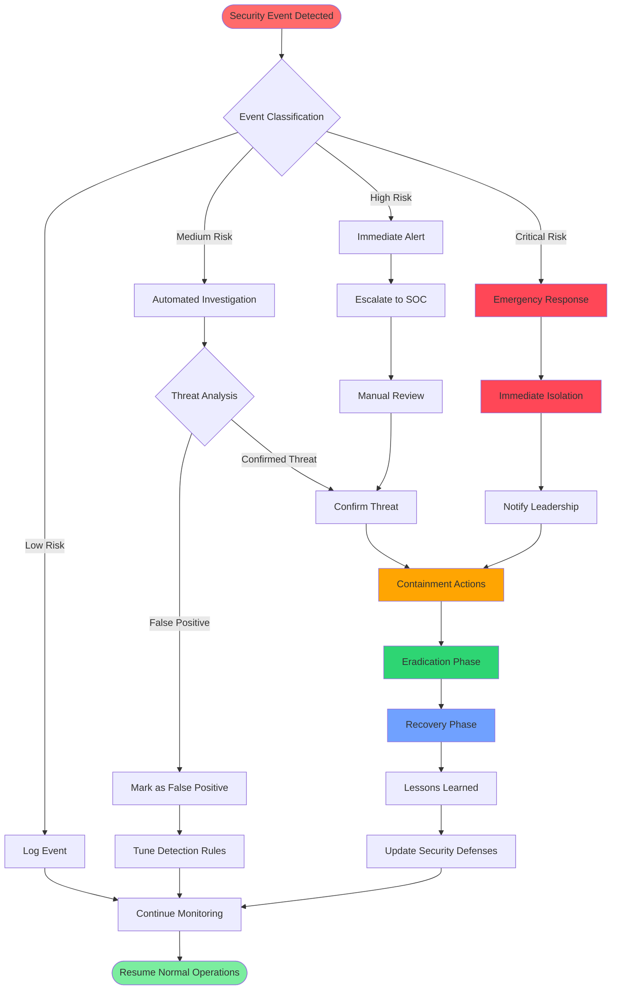
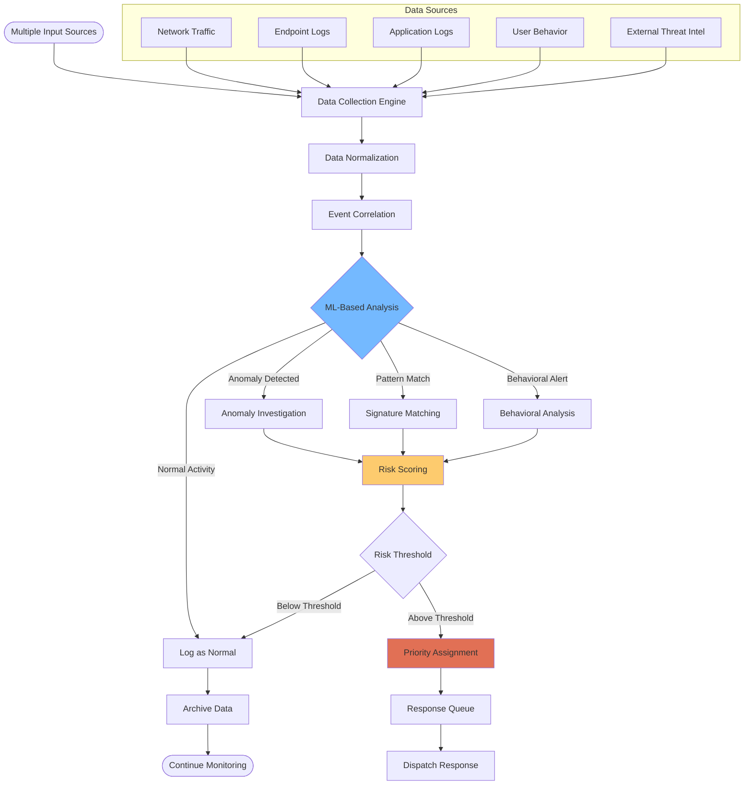
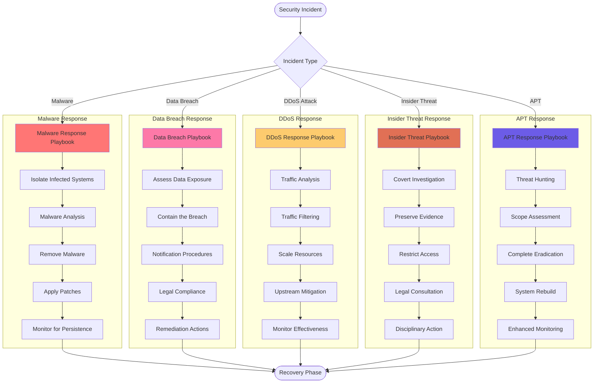
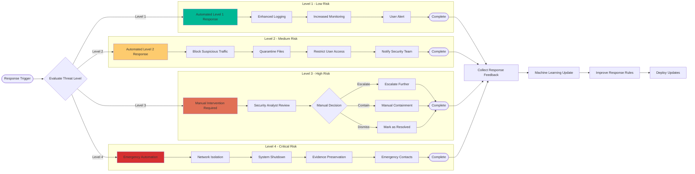
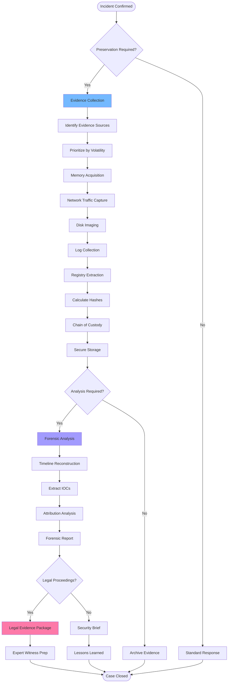
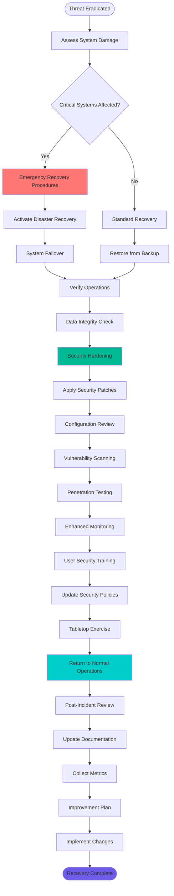

# Security Response Flowchart
**Automated Security Incident Response and Threat Mitigation**

---

## Overview

This flowchart illustrates NEO's comprehensive security response system, from threat detection through incident resolution and recovery, including automated response mechanisms and escalation procedures.

---

## Main Security Response Flow

---

## Threat Detection and Analysis

---

## Incident Response Playbooks

---

## Automated Response Actions

---

## Evidence Collection and Forensics

---

## Recovery and Business Continuity

---

## Key Performance Indicators

### Response Times
- **Detection to Alert**: < 5 minutes for critical threats
- **Alert to Response**: < 15 minutes for automated responses
- **Containment Time**: < 1 hour for most incidents
- **Recovery Time**: < 4 hours for business-critical systems
- **Post-Incident Analysis**: < 48 hours completion

### Automation Metrics
- **Automated Response Rate**: >80% of incidents handled automatically
- **False Positive Rate**: <5% for automated decisions
- **Escalation Rate**: <20% of incidents require manual intervention
- **Recovery Success Rate**: >99% successful automated recovery
- **Learning Accuracy**: >95% improvement in detection over time

### Compliance and Reporting
- **Incident Documentation**: 100% of incidents documented
- **Regulatory Reporting**: <24 hours for required notifications
- **Evidence Preservation**: 100% chain of custody maintained
- **Training Compliance**: >95% staff training completion
- **Policy Updates**: Quarterly security policy reviews

---

This comprehensive security response flowchart ensures NEO can automatically detect, respond to, and recover from security incidents while maintaining detailed forensic capabilities and continuous improvement through machine learning.
