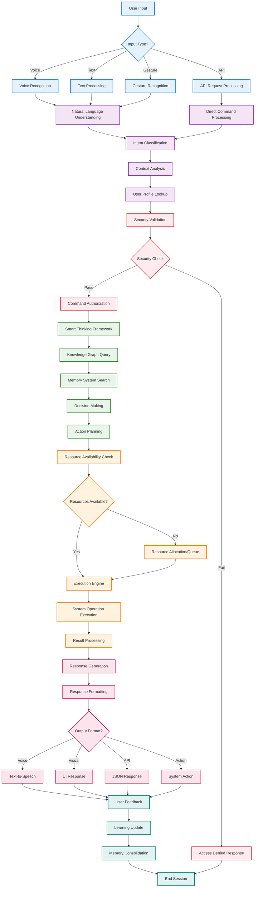
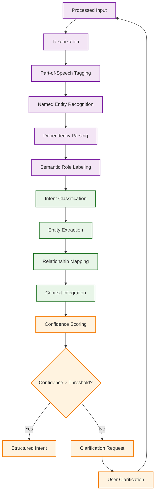
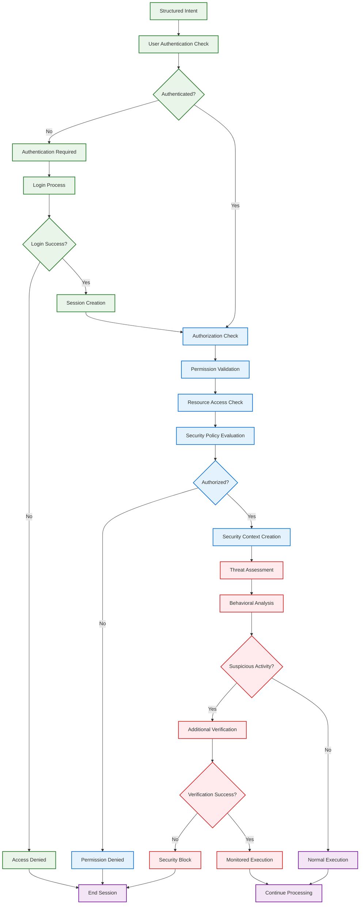
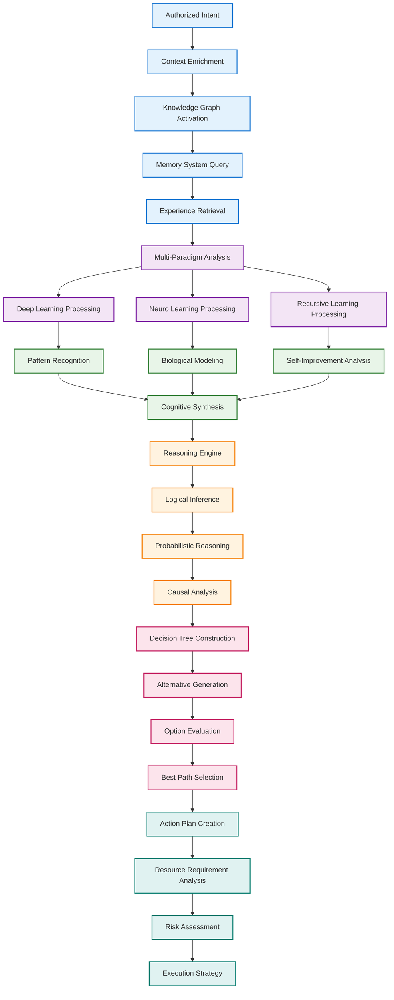
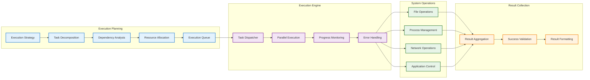
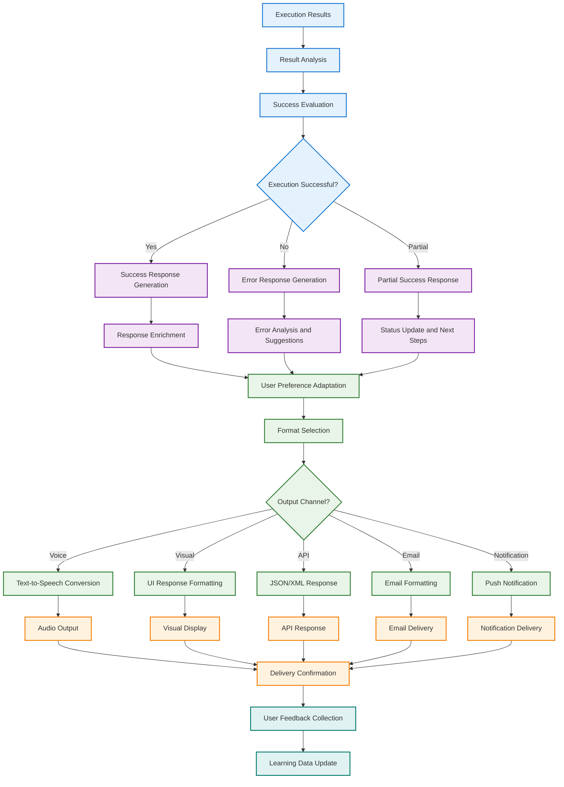
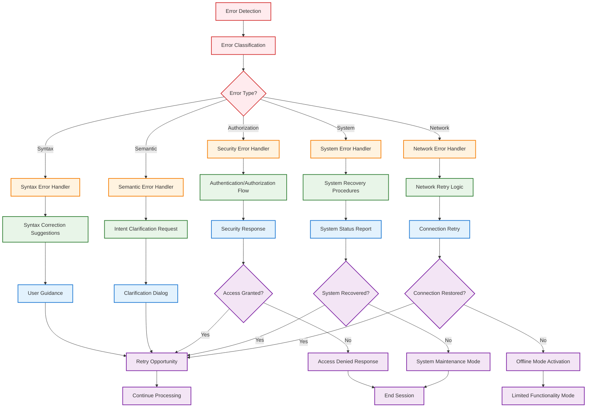
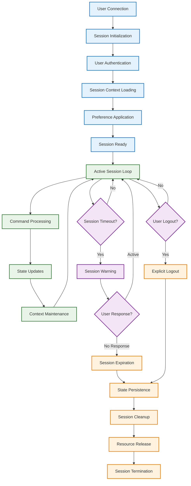

# 🔄 NEO User Interaction Flow
**Complete User Command Processing and Response Workflow**

---

## Primary User Interaction Flow

---

## Detailed Command Processing Stages

### 1. Input Processing Stage

```mermaid
flowchart LR
    subgraph "Input Capture"
        A[Raw Input] --> B[Input Validation]
        B --> C[Format Detection]
        C --> D[Encoding Normalization]
    end
    
    subgraph "Preprocessing"
        D --> E[Noise Reduction]
        E --> F[Feature Extraction]
        F --> G[Context Tagging]
    end
    
    subgraph "Initial Analysis"
        G --> H[Language Detection]
        H --> I[Intent Hint Extraction]
        I --> J[Urgency Assessment]
    end
    
    J --> K[Processed Input Object]
    
    classDef capture fill:#e3f2fd,stroke:#1976d2,stroke-width:2px
    classDef preprocess fill:#f3e5f5,stroke:#7b1fa2,stroke-width:2px
    classDef analysis fill:#e8f5e8,stroke:#2e7d32,stroke-width:2px
    
    class A,B,C,D capture
    class E,F,G preprocess
    class H,I,J,K analysis
```

### 2. Natural Language Understanding

### 3. Security and Authorization Flow

---

## Smart Thinking Framework Processing

---

## Execution and Response Flow

### Action Execution Pipeline

### Response Generation Flow

---

## Error Handling and Recovery

---

## Learning and Adaptation Flow

```mermaid
flowchart LR
    subgraph "Experience Capture"
        A[User Interaction] --> B[Interaction Logging]
        B --> C[Outcome Recording]
        C --> D[Context Preservation]
        D --> E[Experience Object]
    end
    
    subgraph "Learning Analysis"
        E --> F[Pattern Detection]
        F --> G[Success/Failure Analysis]
        G --> H[User Preference Extraction]
        H --> I[Behavioral Pattern Recognition]
    end
    
    subgraph "Knowledge Update"
        I --> J[Knowledge Graph Updates]
        J --> K[Memory Consolidation]
        K --> L[Rule Base Refinement]
        L --> M[Model Parameter Updates]
    end
    
    subgraph "Adaptation Implementation"
        M --> N[Personalization Updates]
        N --> O[Interface Adaptations]
        O --> P[Response Style Tuning]
        P --> Q[Capability Enhancement]
    end
    
    Q --> R[Improved Performance]
    
    classDef capture fill:#e3f2fd,stroke:#1976d2,stroke-width:2px
    classDef analysis fill:#f3e5f5,stroke:#7b1fa2,stroke-width:2px
    classDef update fill:#e8f5e8,stroke:#2e7d32,stroke-width:2px
    classDef adaptation fill:#fff3e0,stroke:#f57c00,stroke-width:2px
    classDef improvement fill:#e0f2f1,stroke:#00796b,stroke-width:2px
    
    class A,B,C,D,E capture
    class F,G,H,I analysis
    class J,K,L,M update
    class N,O,P,Q adaptation
    class R improvement
```

---

## Session Management Flow

---

*This comprehensive user interaction flow illustrates the complete journey from user input to system response, including all processing stages, security checks, AI reasoning, execution, and learning components that make NEO an intelligent and adaptive system.*
