# 🌐 NEO API Architecture
**Comprehensive API Structure and Integration Framework**

---

## Overview

NEO's API architecture provides a robust, scalable, and secure interface for integrating with external services, applications, and client systems. This document outlines the complete API structure, endpoints, authentication mechanisms, and integration patterns.

---

## 🏗️ API Architecture Overview

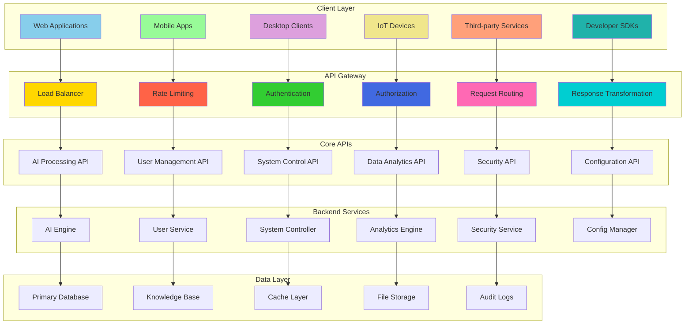

---

## 🔌 API Gateway Architecture

### Request Processing Flow

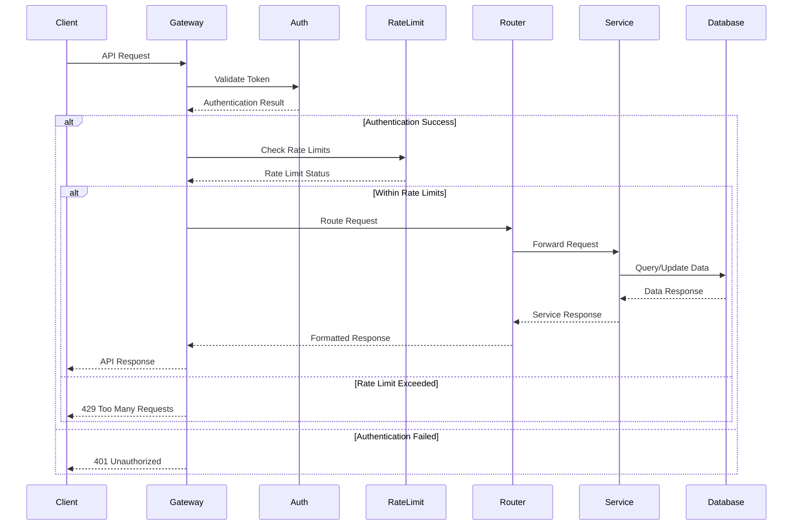

### API Gateway Components

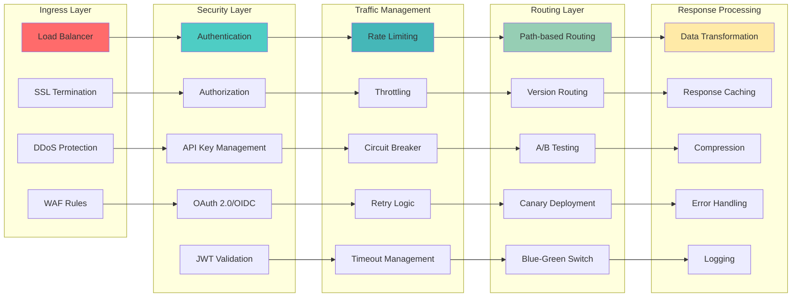

---

## 🧠 AI Processing API

### AI Engine Endpoints

```mermaid
graph TB
    subgraph "Core AI Endpoints"
        A[/api/v1/ai/process]
        B[/api/v1/ai/analyze]
        C[/api/v1/ai/generate]
        D[/api/v1/ai/learn]
        E[/api/v1/ai/predict]
    end
    
    subgraph "Specialized AI Services"
        F[/api/v1/nlp/understand]
        G[/api/v1/vision/analyze]
        H[/api/v1/voice/transcribe]
        I[/api/v1/reasoning/solve]
        J[/api/v1/memory/store]
    end
    
    subgraph "Model Management"
        K[/api/v1/models/list]
        L[/api/v1/models/deploy]
        M[/api/v1/models/update]
        N[/api/v1/models/monitor]
        O[/api/v1/models/rollback]
    end
    
    subgraph "Training & Learning"
        P[/api/v1/training/start]
        Q[/api/v1/training/status]
        R[/api/v1/training/stop]
        S[/api/v1/feedback/submit]
        T[/api/v1/adaptation/configure]
    end
    
    A --> F --> K --> P
    B --> G --> L --> Q
    C --> H --> M --> R
    D --> I --> N --> S
    E --> J --> O --> T
    
    style A fill:#FF9F43
    style F fill:#10AC84
    style K fill:#5F27CD
    style P fill:#00D2D3
```

### AI Request/Response Flow

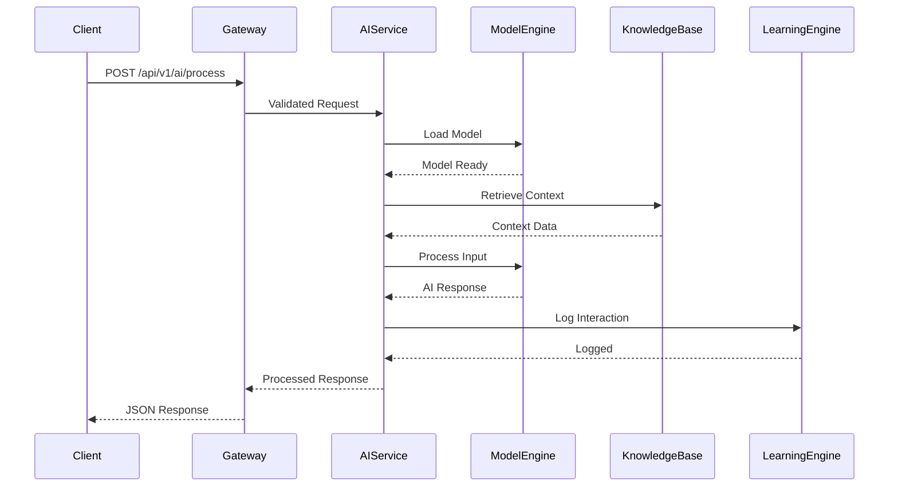

---

## 📊 Data Analytics API

### Analytics Endpoints Structure

```mermaid
graph LR
    subgraph "Real-time Analytics"
        A[/api/v1/analytics/metrics]
        B[/api/v1/analytics/events]
        C[/api/v1/analytics/performance]
        D[/api/v1/analytics/usage]
    end
    
    subgraph "Historical Analytics"
        E[/api/v1/reports/generate]
        F[/api/v1/reports/schedule]
        G[/api/v1/reports/download]
        H[/api/v1/insights/trends]
    end
    
    subgraph "Custom Analytics"
        I[/api/v1/queries/execute]
        J[/api/v1/dashboards/create]
        K[/api/v1/alerts/configure]
        L[/api/v1/exports/data]
    end
    
    subgraph "Machine Learning Analytics"
        M[/api/v1/ml/patterns]
        N[/api/v1/ml/predictions]
        O[/api/v1/ml/anomalies]
        P[/api/v1/ml/correlations]
    end
    
    A --> E --> I --> M
    B --> F --> J --> N
    C --> G --> K --> O
    D --> H --> L --> P
    
    style A fill:#FF6B6B
    style E fill:#4ECDC4
    style I fill:#45B7B8
    style M fill:#96CEB4
```

### Analytics Data Flow

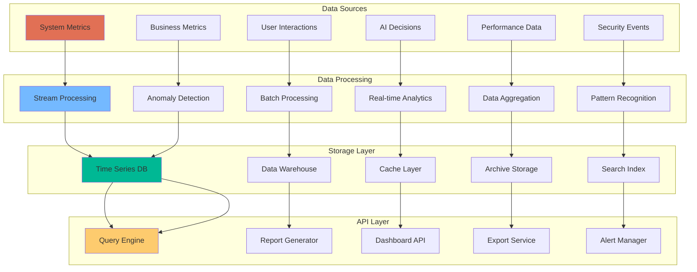

---

## 🔐 Authentication & Authorization API

### OAuth 2.0 / OpenID Connect Flow

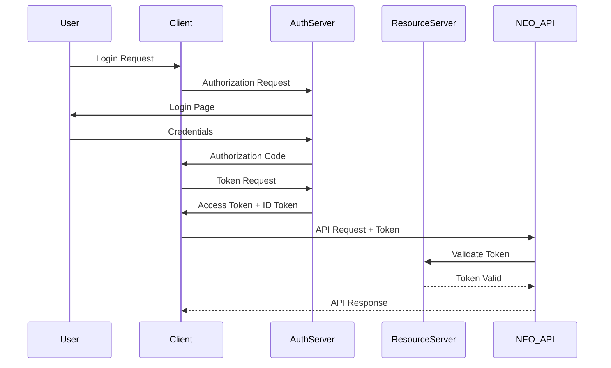

### Security Endpoints

```mermaid
graph TB
    subgraph "Authentication"
        A[/api/v1/auth/login]
        B[/api/v1/auth/logout]
        C[/api/v1/auth/refresh]
        D[/api/v1/auth/validate]
        E[/api/v1/auth/revoke]
    end
    
    subgraph "User Management"
        F[/api/v1/users/profile]
        G[/api/v1/users/preferences]
        H[/api/v1/users/permissions]
        I[/api/v1/users/roles]
        J[/api/v1/users/sessions]
    end
    
    subgraph "Security Controls"
        K[/api/v1/security/audit]
        L[/api/v1/security/threats]
        M[/api/v1/security/policies]
        N[/api/v1/security/compliance]
        O[/api/v1/security/incidents]
    end
    
    subgraph "Access Control"
        P[/api/v1/access/check]
        Q[/api/v1/access/grant]
        R[/api/v1/access/revoke]
        S[/api/v1/access/policies]
        T[/api/v1/access/history]
    end
    
    A --> F --> K --> P
    B --> G --> L --> Q
    C --> H --> M --> R
    D --> I --> N --> S
    E --> J --> O --> T
    
    style A fill:#FF7675
    style F fill:#74B9FF
    style K fill:#00B894
    style P fill:#FDCB6E
```

---

## 🔄 WebSocket & Real-time APIs

### Real-time Communication Architecture

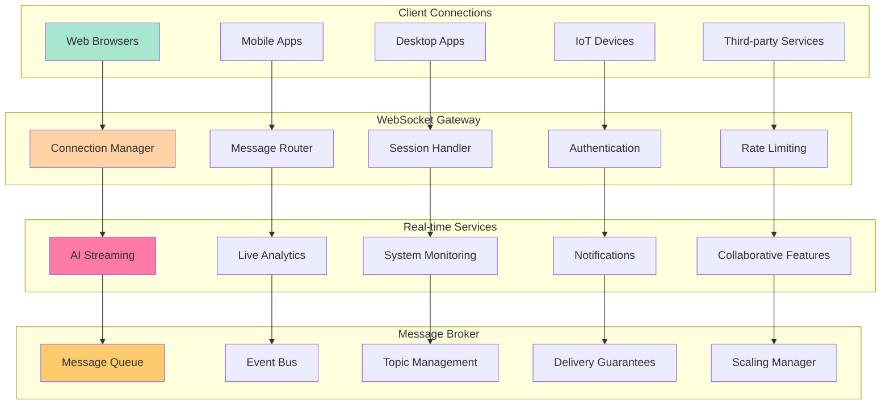

### WebSocket Message Types

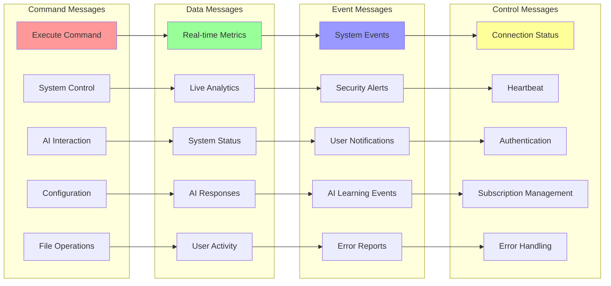

---

## 📡 REST API Specifications

### Core API Patterns

```mermaid
graph TB
    subgraph "Resource-Based URLs"
        A[/api/v1/users]
        B[/api/v1/users/{id}]
        C[/api/v1/users/{id}/preferences]
        D[/api/v1/ai/models]
        E[/api/v1/ai/models/{id}/versions]
    end
    
    subgraph "HTTP Methods"
        F[GET - Retrieve]
        G[POST - Create]
        H[PUT - Update/Replace]
        I[PATCH - Partial Update]
        J[DELETE - Remove]
    end
    
    subgraph "Status Codes"
        K[200 - Success]
        L[201 - Created]
        M[400 - Bad Request]
        N[401 - Unauthorized]
        O[500 - Server Error]
    end
    
    subgraph "Content Types"
        P[application/json]
        Q[application/xml]
        R[multipart/form-data]
        S[text/plain]
        T[application/octet-stream]
    end
    
    A --> F --> K --> P
    B --> G --> L --> Q
    C --> H --> M --> R
    D --> I --> N --> S
    E --> J --> O --> T
    
    style A fill:#3498DB
    style F fill:#2ECC71
    style K fill:#E74C3C
    style P fill:#F39C12
```

### API Versioning Strategy

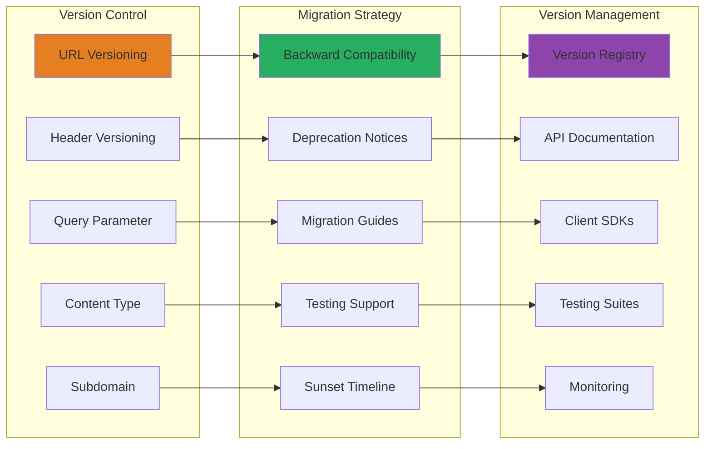

---

## 🛠️ SDK and Client Libraries

### Multi-Language SDK Architecture

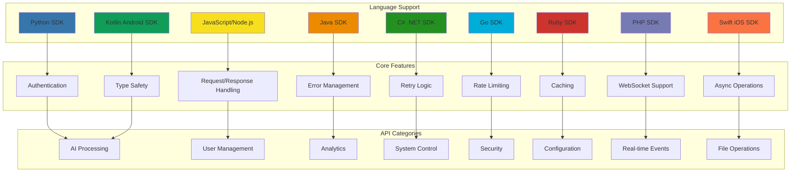

### SDK Code Generation Pipeline

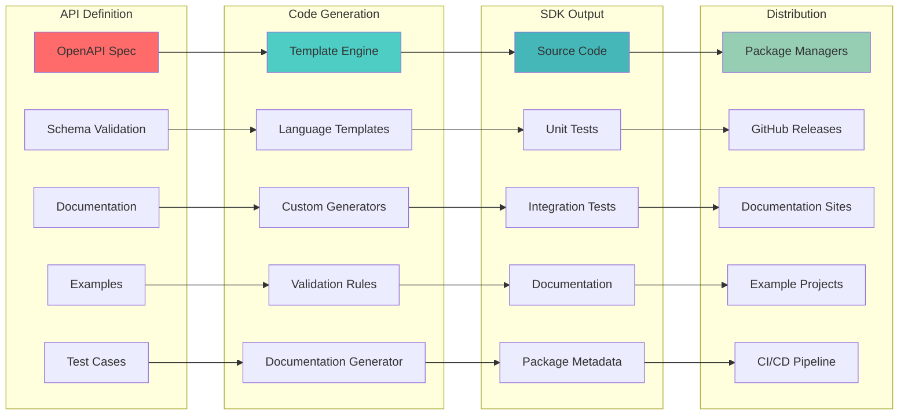

---

## 📊 API Monitoring and Analytics

### API Performance Metrics

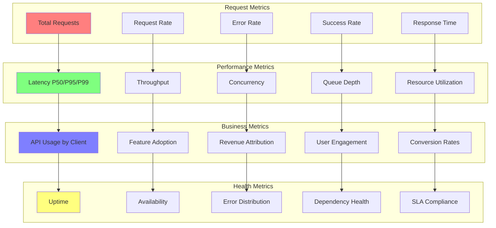

### API Usage Analytics Dashboard

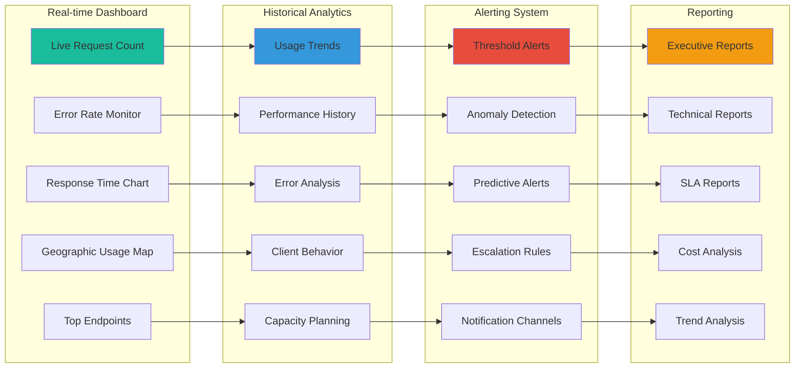

---

## 🔧 API Configuration Schema

### API Gateway Configuration

```yaml
# NEO API Gateway Configuration
api_gateway:
  version: "2.0"
  deployment: "production"
  
  server:
    host: "api.neo-system.com"
    port: 443
    ssl_enabled: true
    http2_enabled: true
    
  security:
    authentication:
      methods: ["oauth2", "api_key", "jwt"]
      oauth2:
        provider: "auth0"
        scopes: ["read", "write", "admin"]
      jwt:
        issuer: "neo-auth-server"
        algorithm: "RS256"
        
    rate_limiting:
      default_limit: "1000/hour"
      burst_limit: "50/minute"
      premium_limit: "10000/hour"
      
    cors:
      enabled: true
      allowed_origins: ["https://neo-app.com"]
      allowed_methods: ["GET", "POST", "PUT", "DELETE"]
      
  routing:
    base_path: "/api/v1"
    services:
      ai_service:
        path: "/ai/*"
        upstream: "ai-service:8080"
        timeout: "30s"
        retries: 3
        
      analytics_service:
        path: "/analytics/*"
        upstream: "analytics-service:8080"
        timeout: "10s"
        retries: 2
        
      user_service:
        path: "/users/*"
        upstream: "user-service:8080"
        timeout: "5s"
        retries: 1
        
  monitoring:
    metrics_enabled: true
    logging_level: "info"
    trace_sampling: 0.1
    health_check_interval: "30s"
    
  caching:
    enabled: true
    default_ttl: "300s"
    cache_size: "1GB"
    cache_policies:
      - path: "/api/v1/analytics/reports"
        ttl: "1h"
      - path: "/api/v1/users/profile"
        ttl: "5m"
```

### API Endpoint Definitions

```json
{
  "openapi": "3.0.0",
  "info": {
    "title": "NEO Intelligent System API",
    "version": "1.0.0",
    "description": "Comprehensive API for NEO AI system integration"
  },
  "servers": [
    {
      "url": "https://api.neo-system.com/v1",
      "description": "Production server"
    }
  ],
  "paths": {
    "/ai/process": {
      "post": {
        "summary": "Process AI request",
        "operationId": "processAIRequest",
        "tags": ["AI Processing"],
        "requestBody": {
          "required": true,
          "content": {
            "application/json": {
              "schema": {
                "$ref": "#/components/schemas/AIRequest"
              }
            }
          }
        },
        "responses": {
          "200": {
            "description": "AI processing result",
            "content": {
              "application/json": {
                "schema": {
                  "$ref": "#/components/schemas/AIResponse"
                }
              }
            }
          }
        }
      }
    }
  },
  "components": {
    "schemas": {
      "AIRequest": {
        "type": "object",
        "required": ["input", "task_type"],
        "properties": {
          "input": {
            "type": "string",
            "description": "Input text or data for AI processing"
          },
          "task_type": {
            "type": "string",
            "enum": ["analyze", "generate", "classify", "summarize"],
            "description": "Type of AI task to perform"
          },
          "parameters": {
            "type": "object",
            "description": "Task-specific parameters"
          }
        }
      },
      "AIResponse": {
        "type": "object",
        "properties": {
          "result": {
            "type": "string",
            "description": "AI processing result"
          },
          "confidence": {
            "type": "number",
            "format": "float",
            "minimum": 0,
            "maximum": 1,
            "description": "Confidence score of the result"
          },
          "processing_time": {
            "type": "number",
            "format": "float",
            "description": "Processing time in seconds"
          },
          "metadata": {
            "type": "object",
            "description": "Additional result metadata"
          }
        }
      }
    },
    "securitySchemes": {
      "BearerAuth": {
        "type": "http",
        "scheme": "bearer",
        "bearerFormat": "JWT"
      },
      "ApiKeyAuth": {
        "type": "apiKey",
        "in": "header",
        "name": "X-API-Key"
      }
    }
  },
  "security": [
    {
      "BearerAuth": []
    },
    {
      "ApiKeyAuth": []
    }
  ]
}
```

---

## 📋 API Implementation Roadmap

### Phase 1: Core APIs (Months 1-2)
- [ ] Implement API Gateway with basic routing
- [ ] Deploy authentication and authorization services
- [ ] Create AI processing endpoints
- [ ] Set up basic monitoring and logging
- [ ] Implement rate limiting and security controls

### Phase 2: Enhanced APIs (Months 3-4)
- [ ] Add analytics and reporting APIs
- [ ] Implement WebSocket real-time APIs
- [ ] Deploy advanced caching strategies
- [ ] Create comprehensive error handling
- [ ] Add API versioning and migration support

### Phase 3: Advanced Features (Months 5-6)
- [ ] Generate and distribute client SDKs
- [ ] Implement advanced security features
- [ ] Deploy comprehensive monitoring and analytics
- [ ] Add API marketplace and developer portal
- [ ] Implement advanced orchestration and workflows

### Phase 4: Optimization (Months 7-12)
- [ ] Performance optimization and scaling
- [ ] Advanced ML-powered API analytics
- [ ] Implement API governance and compliance
- [ ] Deploy edge computing capabilities
- [ ] Continuous improvement based on usage patterns

---

*This API architecture provides a comprehensive, scalable, and secure foundation for integrating with the NEO intelligent system, supporting diverse client applications and use cases while maintaining high performance and reliability.*
