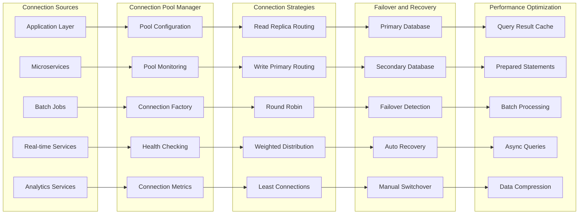
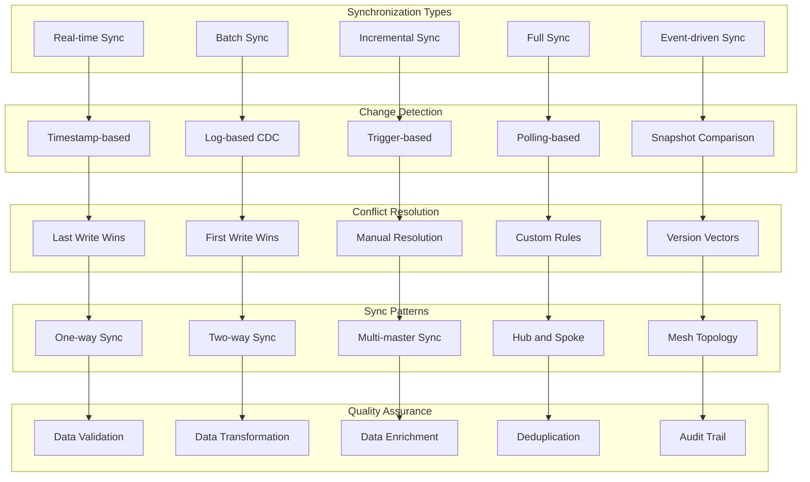
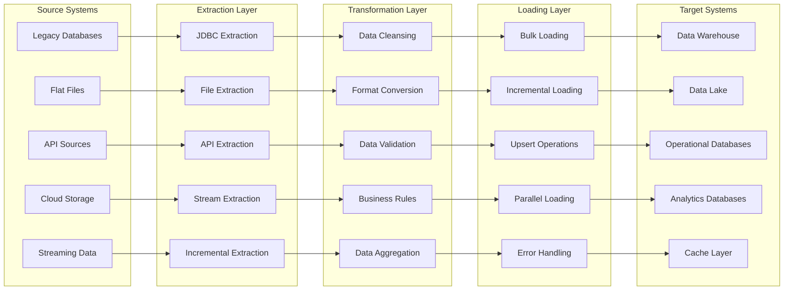
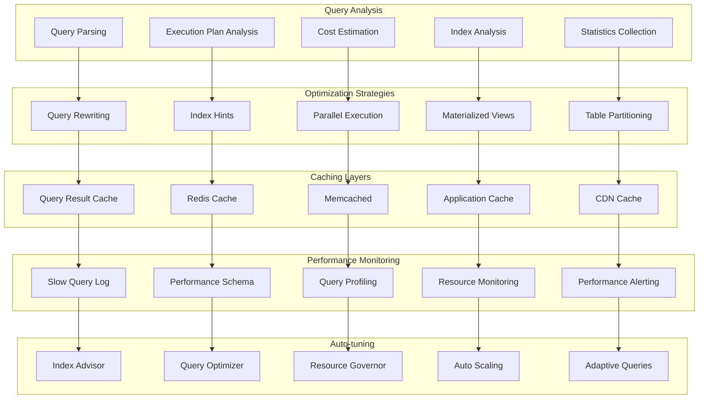
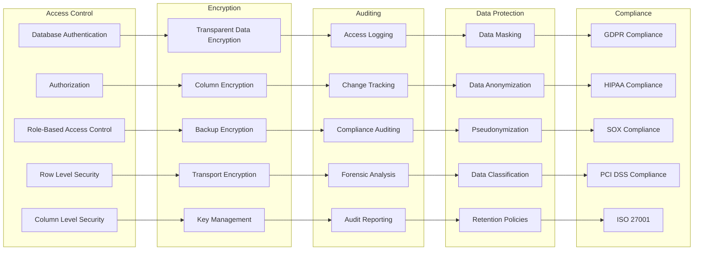
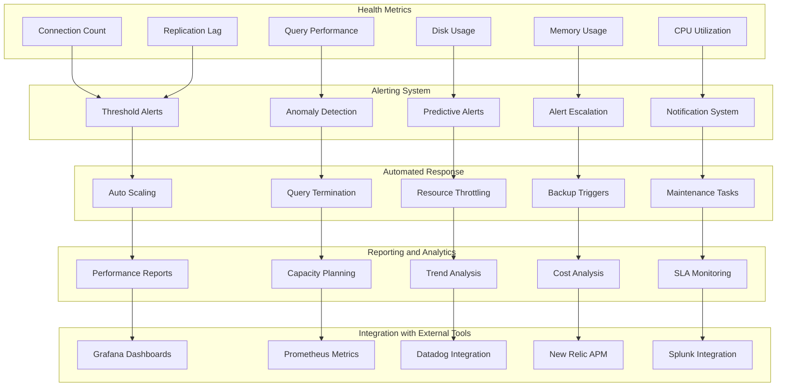

# Database Integration
**Comprehensive Database Connectivity and Data Management**

---

## Overview

This diagram illustrates NEO's comprehensive database integration capabilities, supporting multiple database types, connection patterns, data synchronization, and advanced data management features.

---

## Database Integration Architecture

```mermaid
graph TB
    subgraph "Relational Databases"
        POSTGRESQL[PostgreSQL]
        MYSQL[MySQL/MariaDB]
        ORACLE[Oracle Database]
        SQLSERVER[SQL Server]
        SQLITE[SQLite]
        DB2[IBM DB2]
    end
    
    subgraph "NoSQL Databases"
        MONGODB[MongoDB]
        CASSANDRA[Apache Cassandra]
        COUCHDB[CouchDB]
        DYNAMODB[Amazon DynamoDB]
        COSMOS[Azure Cosmos DB]
        FIRESTORE[Google Firestore]
    end
    
    subgraph "Graph Databases"
        NEO4J[Neo4j]
        AMAZON_NEPTUNE[Amazon Neptune]
        ARANGODB[ArangoDB]
        ORIENTDB[OrientDB]
        DGRAPH[Dgraph]
        JANUSGRAPH[JanusGraph]
    end
    
    subgraph "Time Series Databases"
        INFLUXDB[InfluxDB]
        PROMETHEUS[Prometheus]
        TIMESCALEDB[TimescaleDB]
        OPENTSDB[OpenTSDB]
        KAIROSDB[KairosDB]
        VICTORIA[VictoriaMetrics]
    end
    
    subgraph "Search and Analytics"
        ELASTICSEARCH[Elasticsearch]
        SOLR[Apache Solr]
        OPENSEARCH[OpenSearch]
        ALGOLIA[Algolia]
        MEILI[MeiliSearch]
        TYPESENSE[Typesense]
    end
    
    subgraph "Vector Databases"
        PINECONE[Pinecone]
        WEAVIATE[Weaviate]
        QDRANT[Qdrant]
        MILVUS[Milvus]
        CHROMA[ChromaDB]
        FAISS[Facebook FAISS]
    end
    
    subgraph "Connection Layer"
        CONNECTION_POOL[Connection Pooling]
        LOAD_BALANCER[Database Load Balancer]
        FAILOVER[Automatic Failover]
        CACHING[Query Caching]
        RETRY_LOGIC[Retry Logic]
    end
    
    subgraph "Data Access Layer"
        ORM[Object-Relational Mapping]
        QUERY_BUILDER[Query Builder]
        RAW_SQL[Raw SQL Interface]
        GRAPHQL_API[GraphQL API]
        REST_API[REST API]
    end
    
    POSTGRESQL --> CONNECTION_POOL
    MYSQL --> CONNECTION_POOL
    MONGODB --> LOAD_BALANCER
    CASSANDRA --> LOAD_BALANCER
    NEO4J --> FAILOVER
    AMAZON_NEPTUNE --> FAILOVER
    INFLUXDB --> CACHING
    PROMETHEUS --> CACHING
    ELASTICSEARCH --> RETRY_LOGIC
    SOLR --> RETRY_LOGIC
    PINECONE --> CONNECTION_POOL
    WEAVIATE --> LOAD_BALANCER
    
    CONNECTION_POOL --> ORM
    LOAD_BALANCER --> QUERY_BUILDER
    FAILOVER --> RAW_SQL
    CACHING --> GRAPHQL_API
    RETRY_LOGIC --> REST_API
```

---

## Database Connection Management

---

## Data Synchronization Patterns

---

## Data Migration and ETL

---

## Query Optimization and Performance

---

## Database Security and Compliance

---

## Database Monitoring and Health Management

---

## Technical Implementation

### Connection Technologies
- **JDBC/ODBC**: Standard database connectivity
- **Native Drivers**: Database-specific optimized drivers
- **Connection Pooling**: HikariCP, Apache DBCP2
- **ORM Frameworks**: Hibernate, SQLAlchemy, Prisma
- **Query Builders**: JOOQ, Knex.js, QueryBuilder

### Performance Features
- **Connection Pooling**: 1000+ concurrent connections per pool
- **Query Caching**: 95%+ cache hit ratio for repeated queries
- **Read Replicas**: Automatic read/write splitting
- **Sharding**: Horizontal scaling across multiple databases
- **Compression**: 70%+ reduction in network traffic

### High Availability
- **Multi-AZ Deployment**: Cross-availability zone redundancy
- **Automatic Failover**: < 30 seconds failover time
- **Backup and Recovery**: Point-in-time recovery capabilities
- **Disaster Recovery**: Cross-region replication
- **Zero-Downtime Maintenance**: Rolling updates and maintenance

### Security Standards
- **Encryption**: AES-256 encryption at rest and in transit
- **Access Control**: Fine-grained permission management
- **Auditing**: Complete audit trail for all database operations
- **Compliance**: GDPR, HIPAA, SOC 2, PCI DSS compliance
- **Network Security**: VPC isolation and private subnets

---

This comprehensive database integration architecture enables NEO to work with any database technology while maintaining high performance, security, and reliability standards required for enterprise applications.
