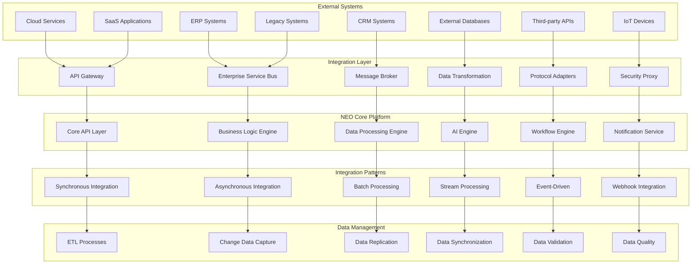
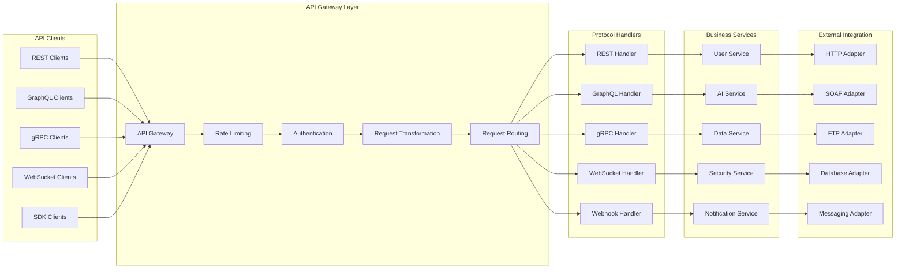
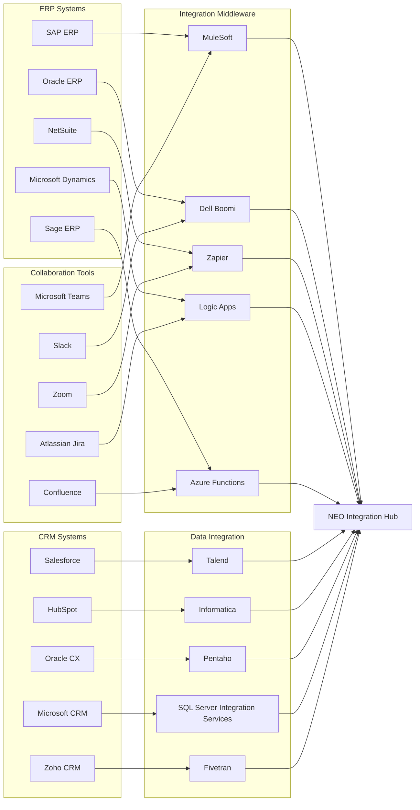
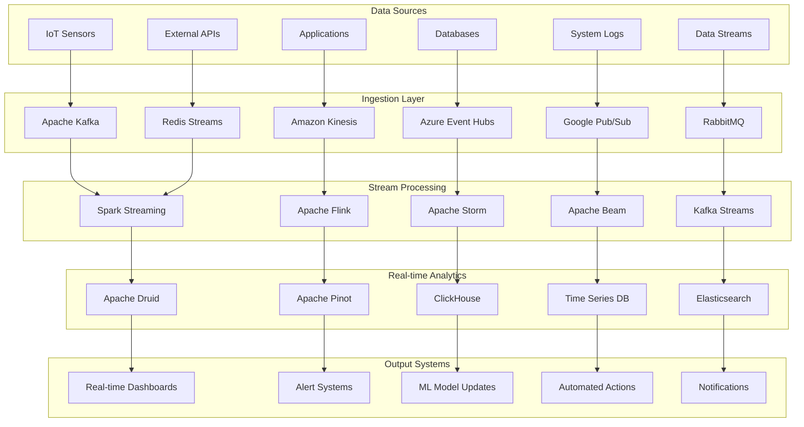
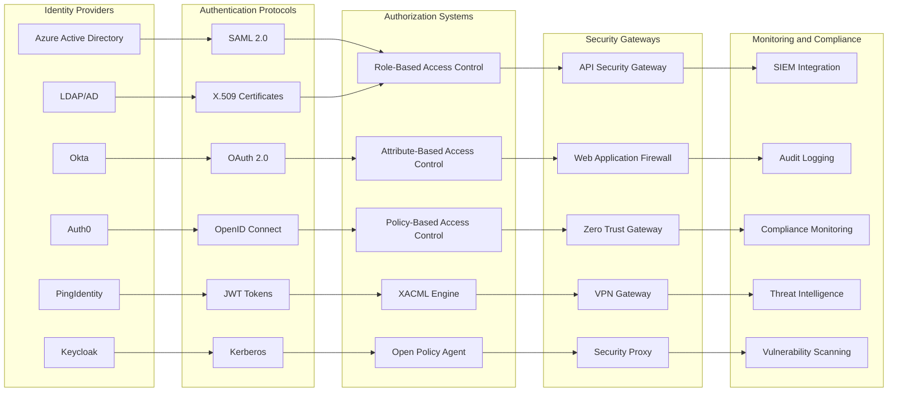
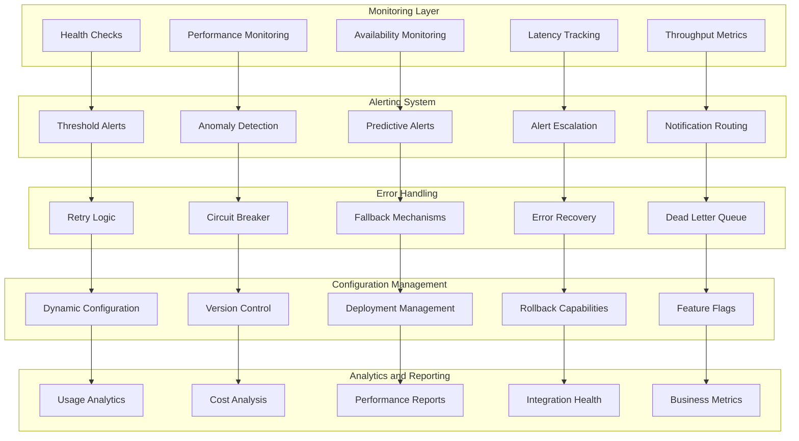

# External System Integration
**Comprehensive Integration Architecture for Third-Party Systems**

---

## Overview

This diagram illustrates NEO's comprehensive integration architecture, enabling seamless connectivity with external systems, APIs, databases, cloud services, and enterprise applications while maintaining security and performance.

---

## Integration Architecture Overview

---

## API Integration Framework

---

## Cloud Services Integration

```mermaid
graph TB
    subgraph "AWS Integration"
        EC2[Amazon EC2]
        S3[Amazon S3]
        RDS[Amazon RDS]
        LAMBDA[AWS Lambda]
        SQS[Amazon SQS]
        SNS[Amazon SNS]
        COGNITO[Amazon Cognito]
        BEDROCK[Amazon Bedrock]
    end
    
    subgraph "Azure Integration"
        VM[Azure Virtual Machines]
        BLOB[Azure Blob Storage]
        SQL_DB[Azure SQL Database]
        FUNCTIONS[Azure Functions]
        SERVICE_BUS[Azure Service Bus]
        EVENT_HUB[Azure Event Hubs]
        AD[Azure Active Directory]
        OPENAI[Azure OpenAI]
    end
    
    subgraph "Google Cloud Integration"
        COMPUTE[Google Compute Engine]
        STORAGE[Google Cloud Storage]
        CLOUD_SQL[Google Cloud SQL]
        CLOUD_FUNCTIONS[Google Cloud Functions]
        PUBSUB[Google Pub/Sub]
        FIRESTORE[Google Firestore]
        IDENTITY[Google Identity]
        VERTEX_AI[Google Vertex AI]
    end
    
    subgraph "Multi-Cloud Management"
        CLOUD_BROKER[Cloud Broker]
        COST_OPTIMIZATION[Cost Optimization]
        WORKLOAD_DISTRIBUTION[Workload Distribution]
        FAILOVER[Multi-Cloud Failover]
        DATA_SYNC[Cross-Cloud Data Sync]
    end
    
    subgraph "Cloud Abstraction Layer"
        COMPUTE_API[Compute Abstraction]
        STORAGE_API[Storage Abstraction]
        DATABASE_API[Database Abstraction]
        MESSAGING_API[Messaging Abstraction]
        AI_API[AI Services Abstraction]
    end
    
    EC2 --> CLOUD_BROKER
    VM --> CLOUD_BROKER
    COMPUTE --> CLOUD_BROKER
    
    S3 --> STORAGE_API
    BLOB --> STORAGE_API
    STORAGE --> STORAGE_API
    
    RDS --> DATABASE_API
    SQL_DB --> DATABASE_API
    CLOUD_SQL --> DATABASE_API
    
    SQS --> MESSAGING_API
    SERVICE_BUS --> MESSAGING_API
    PUBSUB --> MESSAGING_API
    
    BEDROCK --> AI_API
    OPENAI --> AI_API
    VERTEX_AI --> AI_API
    
    CLOUD_BROKER --> COST_OPTIMIZATION
    COST_OPTIMIZATION --> WORKLOAD_DISTRIBUTION
    WORKLOAD_DISTRIBUTION --> FAILOVER
    FAILOVER --> DATA_SYNC
```

---

## Enterprise System Integration

---

## Real-time Data Integration

---

## Security and Authentication Integration

---

## Integration Monitoring and Management

---

## Technical Implementation

### Integration Protocols
- **REST APIs**: HTTP/HTTPS with JSON/XML payloads
- **GraphQL**: Flexible query language for APIs
- **gRPC**: High-performance RPC framework
- **WebSockets**: Real-time bidirectional communication
- **Message Queues**: Asynchronous messaging patterns

### Data Formats
- **JSON**: Lightweight data interchange
- **XML**: Structured markup language
- **Avro**: Schema evolution support
- **Protocol Buffers**: Binary serialization
- **Parquet**: Columnar storage format

### Performance Characteristics
- **API Response Time**: < 100ms for 95th percentile
- **Throughput**: 10,000+ requests per second
- **Availability**: 99.9% uptime SLA
- **Scalability**: Auto-scaling based on demand
- **Reliability**: Fault-tolerant with automatic recovery

### Security Features
- **End-to-End Encryption**: TLS 1.3 for all communications
- **API Authentication**: OAuth 2.0, JWT, API keys
- **Rate Limiting**: Adaptive rate limiting per client
- **Data Privacy**: PII encryption and anonymization
- **Compliance**: GDPR, HIPAA, SOC 2 compliance

---

This comprehensive integration architecture enables NEO to seamlessly connect with any external system while maintaining security, performance, and reliability standards required for enterprise-grade deployments.
