# 🛡️ NEO Multi-Layered Defense Architecture
**Comprehensive Security Defense Strategy**

---

## Overview

NEO implements a multi-layered defense-in-depth security architecture that provides comprehensive protection across all system components. This document outlines the security layers, controls, and defensive strategies employed to protect the intelligent system.

---

## 🏰 Defense-in-Depth Architecture

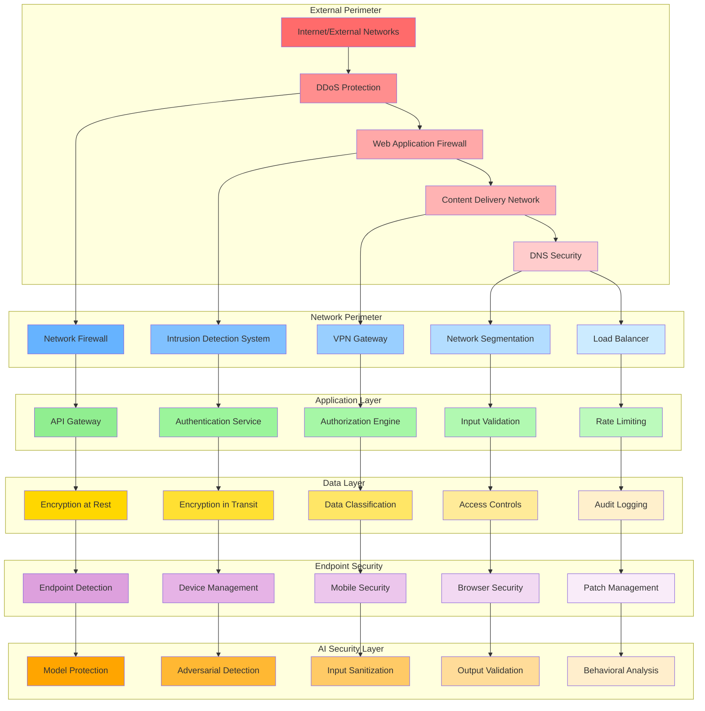

---

## 🌐 External Perimeter Defense

### DDoS Protection and Traffic Filtering

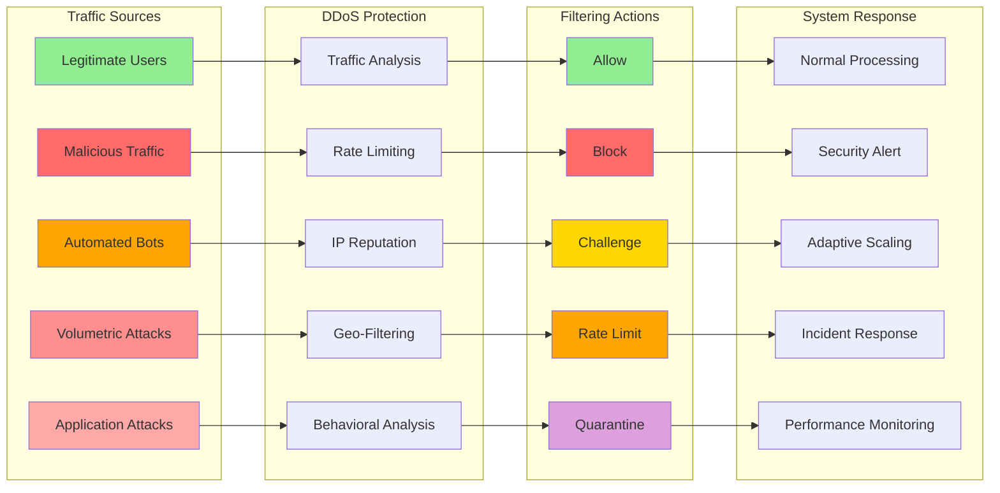

### Web Application Firewall (WAF) Rules

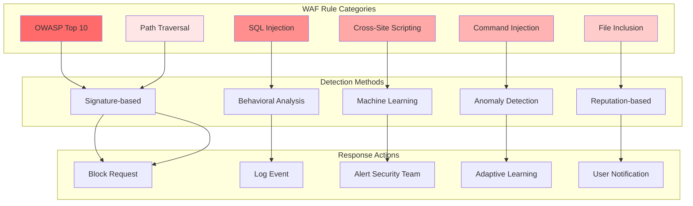

---

## 🔐 Application Security Layer

### Authentication and Authorization Matrix

```mermaid
graph TB
    subgraph "Authentication Factors"
        A[Username/Password]
        B[Multi-Factor Auth]
        C[Biometric]
        D[Hardware Token]
        E[Risk-based Auth]
    end
    
    subgraph "Authorization Models"
        F[Role-Based Access Control]
        G[Attribute-Based Access Control]
        H[Policy-Based Access Control]
        I[Context-Aware Access]
        J[Zero Trust Model]
    end
    
    subgraph "Access Decisions"
        K[Grant Access]
        L[Deny Access]
        M[Conditional Access]
        N[Step-up Authentication]
        O[Session Monitoring]
    end
    
    subgraph "Security Controls"
        P[Session Management]
        Q[Privilege Escalation Protection]
        R[Access Logging]
        S[Behavioral Monitoring]
        T[Anomaly Detection]
    end
    
    A --> F --> K --> P
    B --> G --> L --> Q
    C --> H --> M --> R
    D --> I --> N --> S
    E --> J --> O --> T
    
    style A fill:#87CEEB
    style B fill:#4682B4
    style C fill:#1E90FF
    style D fill:#0000CD
    style E fill:#191970
    style F fill:#90EE90
    style G fill:#32CD32
    style H fill:#228B22
    style I fill:#006400
    style J fill:#2F4F4F
```

### API Security Gateway

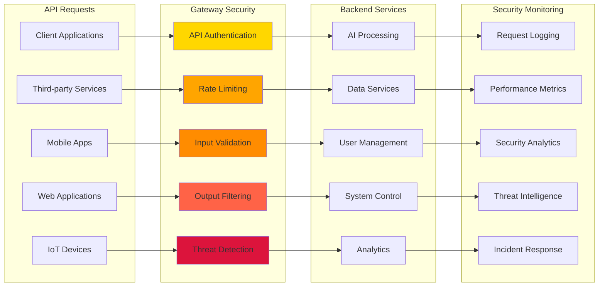

---

## 🧠 AI-Specific Security Layer

### AI Model Protection Framework

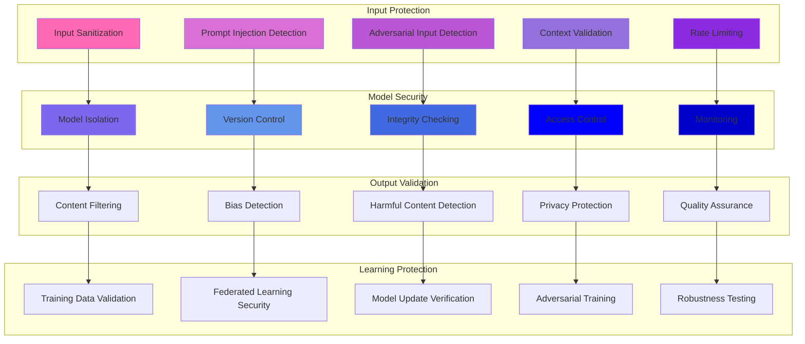

### Adversarial Defense Strategies

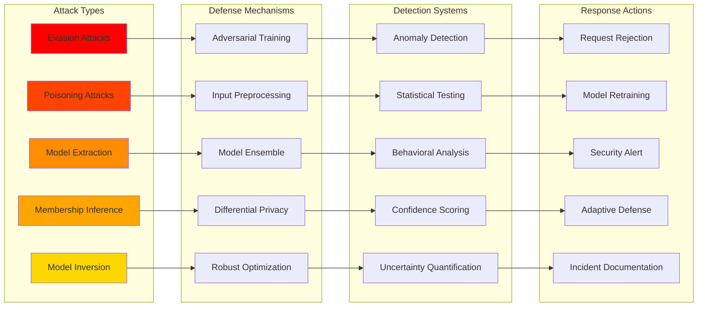

---

## 💾 Data Protection Layer

### Data Classification and Protection

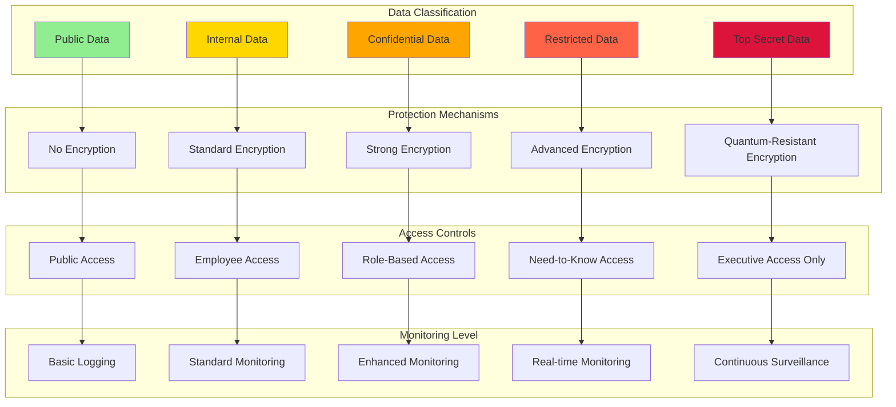

### Encryption Architecture

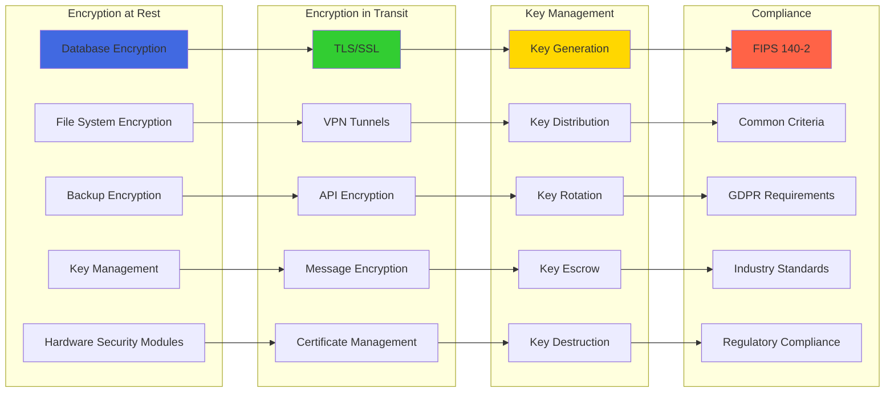

---

## 🚨 Security Monitoring and Response

### Security Operations Center (SOC) Architecture

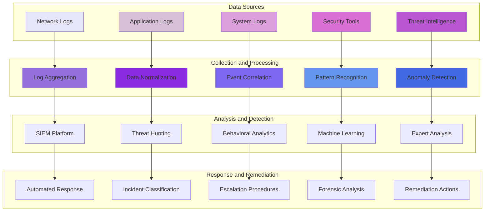

### Incident Response Workflow

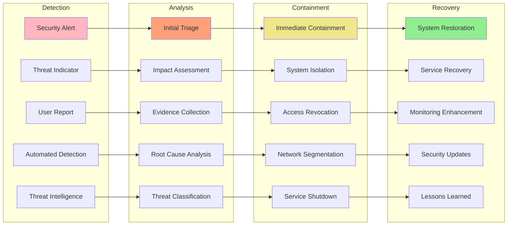

---

## 📊 Security Metrics and KPIs

### Defense Effectiveness Dashboard

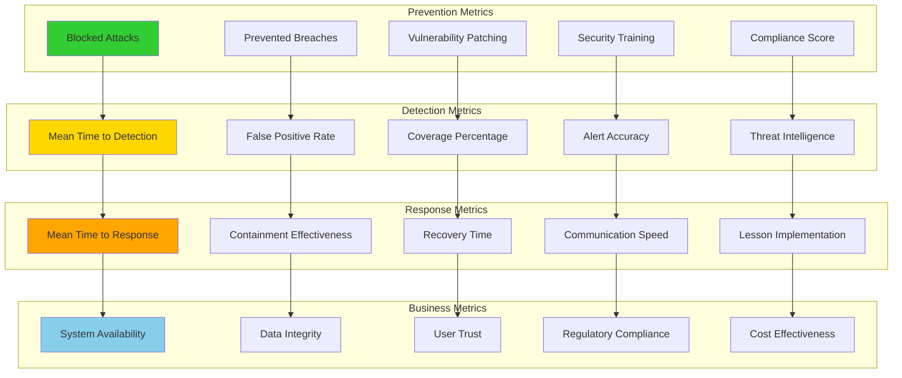

---

## 🔧 Implementation Configuration

### Defense Layer Configuration

```yaml
# Multi-Layer Defense Configuration
defense_layers:
  version: "2.0"
  implementation_date: "2024-01-15"
  
  external_perimeter:
    ddos_protection:
      provider: "CloudFlare"
      threshold: "10000 requests/minute"
      challenge_mode: "automatic"
      
    waf_rules:
      owasp_top10: "enabled"
      custom_rules: "ai_specific_protection"
      update_frequency: "daily"
      
    cdn:
      edge_locations: "global"
      cache_policy: "security_optimized"
      ssl_settings: "strict"

  network_layer:
    firewall:
      type: "next_generation"
      rules: "deny_by_default"
      logging: "all_traffic"
      
    ids_ips:
      mode: "inline"
      signatures: "latest"
      custom_rules: "ai_behavioral"
      
    segmentation:
      strategy: "zero_trust"
      micro_segmentation: "enabled"
      east_west_monitoring: "full"

  application_layer:
    authentication:
      mfa_required: true
      adaptive_auth: "risk_based"
      session_timeout: "30_minutes"
      
    authorization:
      model: "attribute_based"
      policy_engine: "opa"
      decision_caching: "5_minutes"
      
    api_security:
      rate_limiting: "dynamic"
      input_validation: "strict"
      output_filtering: "enabled"

  data_layer:
    encryption:
      at_rest: "AES-256"
      in_transit: "TLS-1.3"
      key_rotation: "90_days"
      
    classification:
      auto_classification: "enabled"
      policy_enforcement: "automatic"
      data_discovery: "continuous"
      
    access_control:
      model: "least_privilege"
      review_frequency: "quarterly"
      audit_logging: "comprehensive"

  ai_security:
    model_protection:
      isolation: "container_based"
      integrity_checks: "continuous"
      version_control: "strict"
      
    input_validation:
      sanitization: "multi_layer"
      adversarial_detection: "enabled"
      prompt_injection_protection: "active"
      
    output_validation:
      content_filtering: "comprehensive"
      bias_detection: "automated"
      privacy_protection: "default"

  monitoring:
    siem:
      platform: "enterprise_grade"
      data_sources: "all_layers"
      correlation_rules: "ai_enhanced"
      
    threat_hunting:
      automated: "24x7"
      manual: "weekly"
      threat_intelligence: "real_time"
      
    incident_response:
      automation: "tier1_responses"
      escalation: "risk_based"
      communication: "stakeholder_matrix"

compliance:
  frameworks:
    - "NIST_Cybersecurity_Framework"
    - "ISO_27001"
    - "GDPR"
    - "SOC_2_Type_II"
    - "CCPA"
    
  assessments:
    frequency: "quarterly"
    third_party: "annual"
    penetration_testing: "bi_annual"
    
  reporting:
    executive_dashboard: "real_time"
    compliance_reports: "monthly"
    risk_assessments: "quarterly"
```

---

## 📋 Defense Layer Implementation Checklist

### Phase 1: Foundation (Months 1-2)
- [ ] Deploy external perimeter defenses (DDoS, WAF, CDN)
- [ ] Implement basic network segmentation
- [ ] Set up core monitoring and logging
- [ ] Establish incident response procedures
- [ ] Deploy basic encryption (at rest and in transit)

### Phase 2: Enhancement (Months 3-4)
- [ ] Implement advanced authentication and authorization
- [ ] Deploy API security gateway
- [ ] Set up behavioral analytics
- [ ] Implement AI-specific security controls
- [ ] Establish threat intelligence integration

### Phase 3: Advanced Protection (Months 5-6)
- [ ] Deploy zero-trust architecture
- [ ] Implement advanced threat hunting
- [ ] Set up automated incident response
- [ ] Deploy quantum-resistant encryption
- [ ] Establish continuous compliance monitoring

### Phase 4: Optimization (Months 7-12)
- [ ] Fine-tune all security controls
- [ ] Implement machine learning for threat detection
- [ ] Establish security orchestration and automation
- [ ] Deploy advanced AI model protection
- [ ] Continuous improvement based on threat landscape

---

*This multi-layered defense architecture provides comprehensive protection for the NEO intelligent system, ensuring security at every level while maintaining system performance and user experience.*
