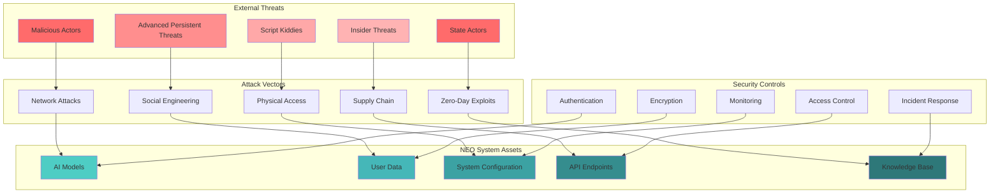
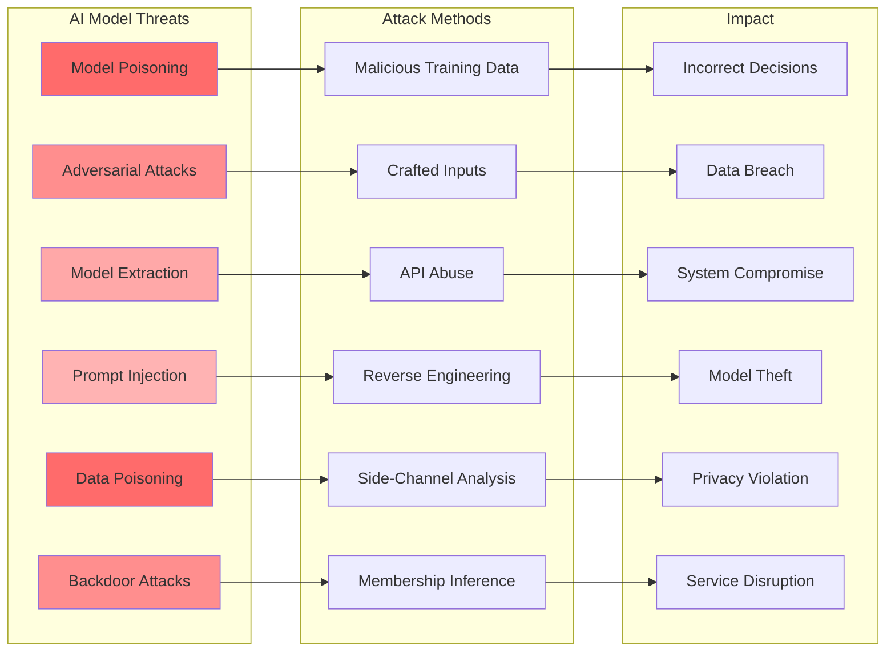
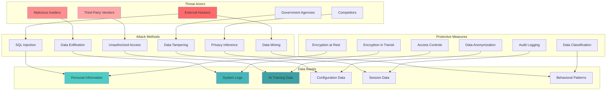
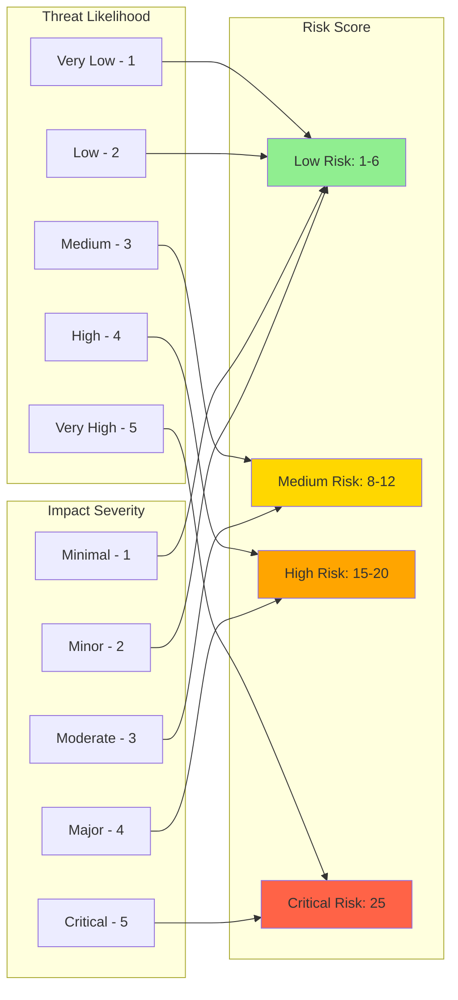
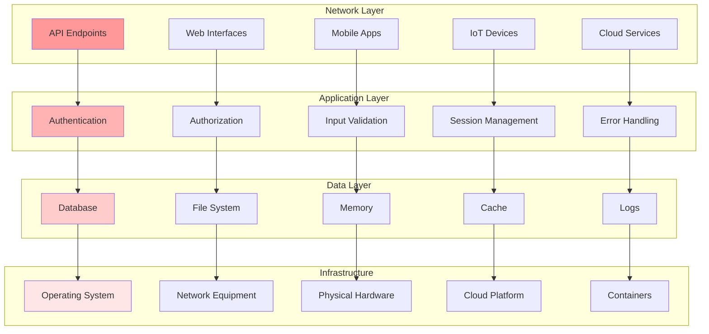
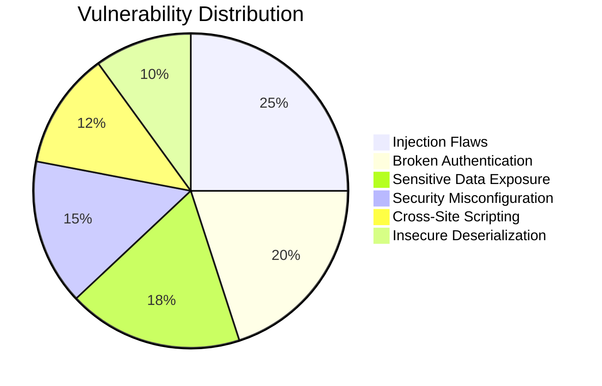
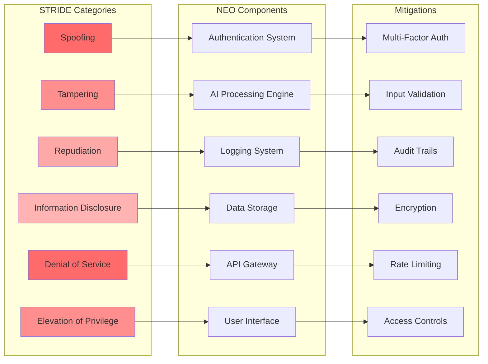
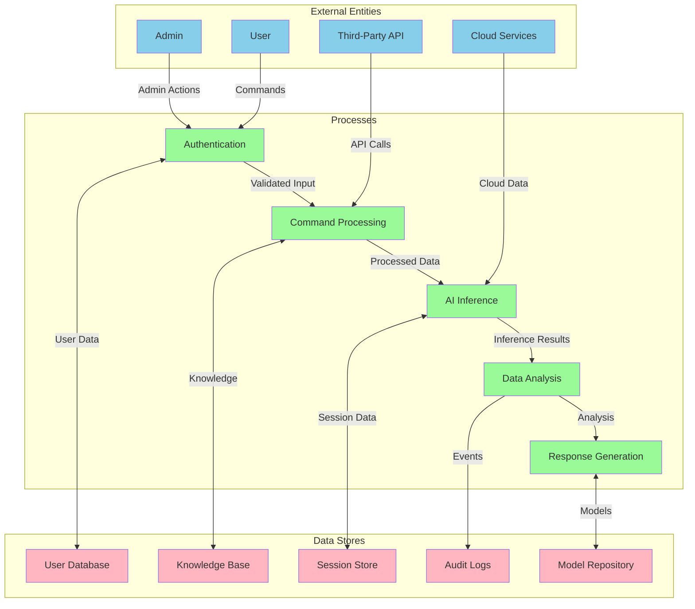
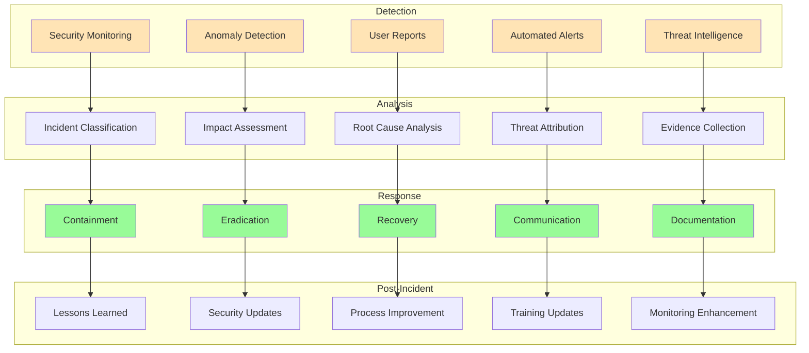
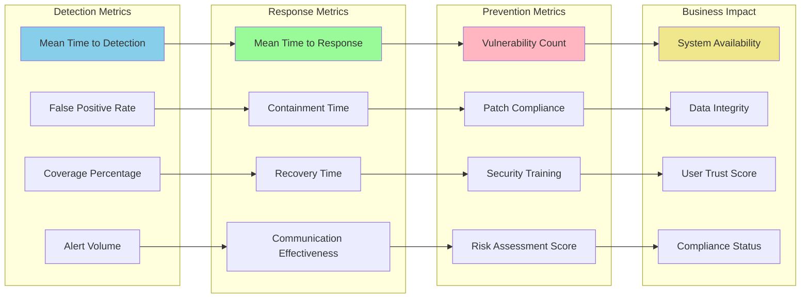

# 🔒 NEO Security Threat Model
**Comprehensive Security Analysis and Threat Landscape**

---

## Overview

This document provides a comprehensive threat model for the NEO intelligent system, identifying potential security vulnerabilities, attack vectors, and defensive strategies across all system components.

---

## 🎯 Threat Model Overview



---

## 🚨 Critical Threat Categories

### 1. AI Model Security Threats



### 2. Data Security Threat Model



---

## 🛡️ Threat Assessment Matrix

### Risk Level Classification



### Threat Prioritization Matrix

| Threat Category | Likelihood | Impact | Risk Score | Priority |
|----------------|------------|---------|------------|----------|
| AI Model Poisoning | 3 | 5 | 15 | High |
| Data Breach | 4 | 5 | 20 | High |
| Prompt Injection | 4 | 3 | 12 | Medium |
| Insider Threats | 2 | 4 | 8 | Medium |
| DDoS Attacks | 4 | 2 | 8 | Medium |
| Physical Access | 1 | 3 | 3 | Low |
| Supply Chain | 2 | 4 | 8 | Medium |
| Zero-Day Exploits | 2 | 5 | 10 | Medium |

---

## 🔍 Attack Surface Analysis



---

## ⚠️ Vulnerability Assessment

### Common Vulnerability Categories



### STRIDE Threat Model



---

## 🎯 Threat Modeling Methodology

### Data Flow Diagram (DFD) Analysis



---

## 🚨 Incident Response Framework

### Threat Detection and Response Flow



---

## 📊 Security Metrics and KPIs

### Security Dashboard Metrics



---

## 🔧 Threat Model Implementation

### Security Control Mapping

```yaml
# Threat Model Configuration
threat_model:
  version: "1.0"
  last_updated: "2024-01-15"
  
  threat_categories:
    - name: "AI Model Security"
      threats:
        - "Model Poisoning"
        - "Adversarial Attacks"
        - "Model Extraction"
        - "Prompt Injection"
      controls:
        - "Input Validation"
        - "Model Monitoring"
        - "Access Control"
        - "Anomaly Detection"
    
    - name: "Data Security"
      threats:
        - "Data Breach"
        - "Unauthorized Access"
        - "Data Tampering"
        - "Privacy Violation"
      controls:
        - "Encryption"
        - "Access Control"
        - "Audit Logging"
        - "Data Classification"
    
    - name: "Infrastructure Security"
      threats:
        - "Network Attacks"
        - "System Compromise"
        - "DDoS Attacks"
        - "Physical Access"
      controls:
        - "Network Segmentation"
        - "Intrusion Detection"
        - "Rate Limiting"
        - "Physical Security"

  risk_assessment:
    methodology: "NIST"
    frequency: "quarterly"
    stakeholders:
      - "Security Team"
      - "Development Team"
      - "Operations Team"
      - "Management"

  compliance_frameworks:
    - "GDPR"
    - "CCPA"
    - "ISO 27001"
    - "NIST Cybersecurity Framework"
    - "SOC 2"
```

---

## 📋 Action Items and Recommendations

### Immediate Actions (0-30 days)
1. **Implement AI Model Protection**
   - Deploy input validation for AI models
   - Set up model monitoring and anomaly detection
   - Establish model versioning and rollback procedures

2. **Enhance Authentication Security**
   - Implement multi-factor authentication
   - Deploy adaptive authentication based on risk
   - Establish session management security

3. **Data Protection Measures**
   - Encrypt sensitive data at rest and in transit
   - Implement data classification and handling procedures
   - Deploy data loss prevention (DLP) tools

### Short-term Actions (1-3 months)
1. **Security Monitoring Enhancement**
   - Deploy SIEM solution for centralized monitoring
   - Implement threat intelligence integration
   - Establish security operations center (SOC)

2. **Vulnerability Management**
   - Conduct comprehensive vulnerability assessment
   - Implement automated vulnerability scanning
   - Establish patch management procedures

### Long-term Actions (3-12 months)
1. **Advanced Threat Protection**
   - Deploy advanced persistent threat (APT) detection
   - Implement zero-trust architecture
   - Establish threat hunting capabilities

2. **Continuous Improvement**
   - Regular threat model updates
   - Security awareness training program
   - Incident response plan testing

---

*This threat model provides a comprehensive framework for identifying, assessing, and mitigating security risks in the NEO intelligent system. Regular updates and reviews ensure continued effectiveness against evolving threats.*
