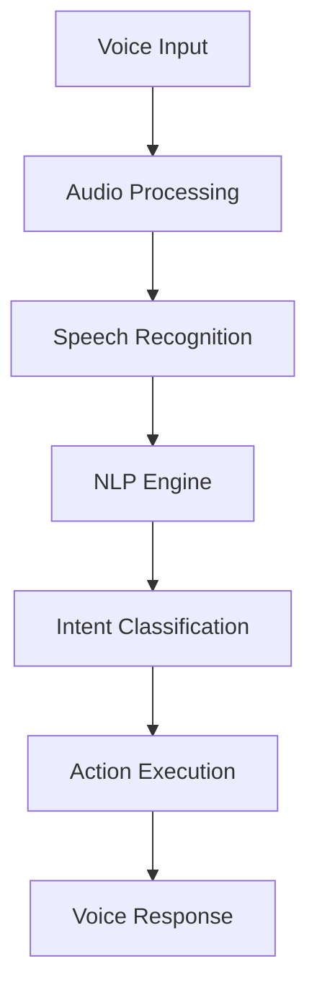

# Chapter 6: Voice Commands
**Advanced Voice Interface & Natural Language Processing**

---

## Overview

NEO's voice command system represents the pinnacle of natural language processing, enabling intuitive vocal interaction with your AI assistant. This chapter covers voice activation, command recognition, customization, and advanced voice features.

## Voice System Architecture



## Getting Started with Voice Commands

### Initial Voice Setup

```bash
# Enable voice recognition
neo voice enable

# Calibrate microphone
neo voice calibrate

# Set voice activation phrase
neo voice wake-word "Hey NEO"

# Test voice recognition
neo voice test
```

### Basic Voice Commands

#### System Control
```
"NEO, show system status"
"NEO, open calculator"
"NEO, lock the computer"
"NEO, what's the weather?"
```

#### File Operations
```
"NEO, create a new document called 'meeting notes'"
"NEO, find files modified today"
"NEO, backup my documents"
"NEO, delete temporary files"
```

#### Development Tasks
```
"NEO, create a Python project called 'data analyzer'"
"NEO, run unit tests"
"NEO, commit changes with message 'bug fixes'"
"NEO, deploy to staging"
```

## Advanced Voice Features

### Natural Language Processing

NEO understands complex, conversational commands:

```
# Instead of: "neo file create --name report.txt --type document"
"NEO, I need to create a report document for the quarterly meeting"

# Instead of: "neo system process --kill --name chrome"
"NEO, Chrome is using too much memory, please close it"

# Instead of: "neo security scan --type vulnerability --target network"
"NEO, can you check if our network has any security vulnerabilities?"
```

### Context Awareness

```
# Multi-turn conversations
User: "NEO, show me the sales data"
NEO: "Here's the sales data for this quarter. Would you like me to analyze trends?"
User: "Yes, and compare it to last year"
NEO: "Comparing current quarter to Q3 2023..."

# Contextual references
User: "NEO, create a backup of that database"
NEO: "Creating backup of the customer database we discussed earlier..."
```

### Voice Command Categories

#### 1. System Administration
```yaml
commands:
  system_status: "Show system performance and health"
  memory_usage: "Display RAM and storage usage"
  network_status: "Check network connectivity"
  service_management: "Start, stop, or restart services"
```

#### 2. Development Workflows
```yaml
commands:
  code_review: "Analyze code quality and suggest improvements"
  test_execution: "Run automated tests and report results"
  deployment: "Deploy applications to various environments"
  documentation: "Generate or update project documentation"
```

#### 3. Security Operations
```yaml
commands:
  vulnerability_scan: "Scan for security vulnerabilities"
  log_analysis: "Analyze system logs for anomalies"
  firewall_management: "Configure firewall rules"
  encryption: "Encrypt or decrypt files and communications"
```

## Voice Configuration

### Customizing Voice Recognition

```yaml
# ~/.neo/voice_config.yaml
voice_settings:
  wake_word: "Hey NEO"
  language: "en-US"
  accent_adaptation: true
  noise_cancellation: true
  sensitivity: 0.8
  
recognition:
  confidence_threshold: 0.75
  timeout_seconds: 5
  max_retry_attempts: 3
  
responses:
  voice_feedback: true
  response_speed: "normal"  # slow, normal, fast
  personality: "professional"  # casual, professional, technical
```

### Custom Voice Commands

```python
# custom_voice_commands.py
from neo.voice import VoiceCommand, VoiceResponse

@VoiceCommand("deploy my project")
def deploy_project():
    """Custom deployment command"""
    return VoiceResponse(
        action="deployment.start",
        params={"environment": "production"},
        response="Starting deployment to production environment"
    )

@VoiceCommand("analyze this code for bugs")
def code_analysis():
    """AI-powered code analysis"""
    return VoiceResponse(
        action="code.analyze",
        params={"type": "bug_detection"},
        response="Analyzing code for potential bugs and issues"
    )
```

## Voice Security & Privacy

### Security Features

```yaml
security:
  voice_authentication:
    enabled: true
    voice_print_verification: true
    multi_factor_required: false
    
  privacy:
    local_processing: true
    cloud_backup: false
    recording_retention: 7  # days
    
  permissions:
    system_commands: "voice_auth_required"
    file_operations: "password_required"
    network_access: "biometric_required"
```

### Voice Authentication Setup

```bash
# Create voice print
neo voice auth setup

# Verify identity
neo voice auth verify

# Enable voice-based 2FA
neo voice auth enable-2fa

# Set command permissions
neo voice permissions set --level admin
```

## Troubleshooting Voice Commands

### Common Issues

#### 1. Recognition Problems
```bash
# Check microphone
neo voice diagnose microphone

# Retrain voice model
neo voice retrain

# Adjust sensitivity
neo voice config sensitivity 0.9
```

#### 2. Command Execution Failures
```bash
# View command logs
neo voice logs --last 10

# Test specific commands
neo voice test-command "show system status"

# Reset voice engine
neo voice reset
```

#### 3. Performance Issues
```bash
# Optimize voice processing
neo voice optimize

# Check system resources
neo voice performance

# Update voice models
neo voice update-models
```

### Advanced Configuration

#### Multi-Language Support
```yaml
languages:
  primary: "en-US"
  secondary: ["es-ES", "fr-FR", "de-DE"]
  auto_detect: true
  translation: true
```

#### Voice Synthesis Customization
```yaml
synthesis:
  voice_type: "neural"  # standard, neural, custom
  speed: 1.0
  pitch: 1.0
  volume: 0.8
  emotion: "neutral"  # neutral, friendly, professional
```

## Voice Command Examples

### Project Management
```
"NEO, create a new project timeline for the Q4 release"
"NEO, schedule a code review for tomorrow at 2 PM"
"NEO, generate a status report for all active projects"
"NEO, remind me to update the documentation before Friday"
```

### Data Analysis
```
"NEO, analyze the sales trends from the last quarter"
"NEO, create a visualization of user engagement metrics"
"NEO, compare performance between different marketing campaigns"
"NEO, export the analysis results to a PowerPoint presentation"
```

### System Maintenance
```
"NEO, run a full system health check"
"NEO, clean up temporary files and optimize disk space"
"NEO, update all software packages and security patches"
"NEO, backup critical data to the cloud storage"
```

## Best Practices

### Effective Voice Communication

1. **Clear Pronunciation**: Speak clearly and at moderate pace
2. **Specific Commands**: Use precise language for better recognition
3. **Context Building**: Provide context for complex requests
4. **Confirmation**: Always confirm critical operations

### Command Structure Tips

```
# Good examples:
"NEO, create a Python script to analyze CSV data"
"NEO, find all PDF files modified in the last week"
"NEO, start the development server on port 3000"

# Avoid:
"NEO, do something with files"
"NEO, make it work"
"NEO, fix the problem"
```

---

**Next Chapter**: [Learning Systems →](07-learning-systems.md)

**Previous Chapter**: [← Command Interface](05-command-interface.md)
