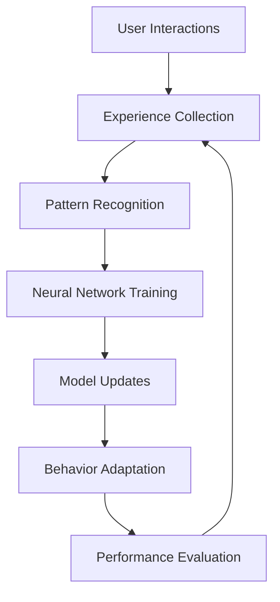
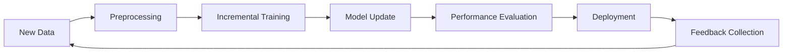

# Chapter 7: Learning Systems
**Adaptive AI, Neural Networks, and Continuous Learning**

---

## Overview

NEO's learning systems represent the cutting edge of artificial intelligence, featuring neural networks, recursive learning, adaptive algorithms, and continuous improvement capabilities. This chapter explores how NEO learns, adapts, and evolves to better serve your needs.

## Learning Architecture



## Types of Learning

### 1. Supervised Learning

NEO learns from labeled examples and feedback:

```python
# Example: Teaching NEO to classify code quality
from neo.learning import SupervisedLearner

learner = SupervisedLearner("code_quality")

# Training data
training_examples = [
    {"code": "def clean_function():\n    return True", "quality": "high"},
    {"code": "def bad():\n  x=1;y=2;return x+y", "quality": "low"},
    # ... more examples
]

# Train the model
learner.train(training_examples)
learner.evaluate()
```

### 2. Reinforcement Learning

NEO learns through trial and error with rewards:

```yaml
# Reinforcement learning configuration
reinforcement:
  environment: "system_optimization"
  reward_function: "user_satisfaction"
  exploration_rate: 0.1
  learning_rate: 0.01
  
  rewards:
    task_completion: +10
    efficiency_improvement: +5
    error_occurrence: -5
    user_correction: -2
```

### 3. Unsupervised Learning

NEO discovers patterns without explicit guidance:

```python
# Pattern discovery in user behavior
from neo.learning import PatternDiscovery

discovery = PatternDiscovery()

# Analyze user command patterns
patterns = discovery.analyze_commands(
    time_range="last_30_days",
    min_frequency=5
)

# Discovered patterns
print(patterns)
# Output: [
#   {"pattern": "morning_routine", "commands": ["email", "calendar", "weather"]},
#   {"pattern": "coding_session", "commands": ["git", "test", "build", "deploy"]},
# ]
```

## Neural Network Components

### Core Neural Architecture

```python
# NEO's neural network structure
class NEONeuralNetwork:
    def __init__(self):
        self.layers = {
            'input': InputLayer(1024),
            'attention': MultiHeadAttention(heads=8),
            'transformer': TransformerStack(layers=12),
            'memory': LongTermMemory(capacity=1000000),
            'reasoning': ReasoningLayer(512),
            'output': OutputLayer(256)
        }
    
    def forward(self, input_data):
        x = self.layers['input'](input_data)
        x = self.layers['attention'](x)
        x = self.layers['transformer'](x)
        
        # Memory integration
        memory_context = self.layers['memory'].retrieve(x)
        x = self.layers['reasoning'](x, memory_context)
        
        return self.layers['output'](x)
```

### Specialized Learning Modules

#### 1. Language Understanding
```yaml
nlp_learning:
  modules:
    - semantic_analysis
    - intent_recognition
    - context_understanding
    - dialogue_management
  
  training_data:
    conversations: 1000000+
    commands: 500000+
    contexts: 50000+
```

#### 2. System Optimization
```yaml
system_learning:
  performance_metrics:
    - cpu_usage
    - memory_efficiency
    - response_time
    - task_success_rate
  
  optimization_targets:
    - resource_allocation
    - task_scheduling
    - cache_management
    - process_priority
```

#### 3. Security Learning
```yaml
security_learning:
  threat_detection:
    - behavioral_analysis
    - anomaly_detection
    - pattern_recognition
    - predictive_modeling
  
  training_sources:
    - security_logs
    - threat_intelligence
    - vulnerability_databases
    - incident_reports
```

## Adaptive Behaviors

### Personalization Learning

```python
# User preference learning
class PersonalizationEngine:
    def __init__(self, user_id):
        self.user_id = user_id
        self.preferences = {}
        self.behavior_patterns = {}
    
    def learn_from_interaction(self, interaction):
        # Extract preferences
        prefs = self.extract_preferences(interaction)
        self.update_preferences(prefs)
        
        # Learn behavior patterns
        pattern = self.extract_pattern(interaction)
        self.update_patterns(pattern)
    
    def adapt_response(self, context):
        # Customize response based on learned preferences
        style = self.preferences.get('communication_style', 'professional')
        detail = self.preferences.get('detail_level', 'medium')
        
        return self.generate_adaptive_response(context, style, detail)
```

### Context-Aware Learning

```yaml
context_learning:
  temporal_patterns:
    - time_of_day_preferences
    - weekly_routines
    - seasonal_behaviors
    - project_phases
  
  environmental_factors:
    - workspace_setup
    - available_resources
    - network_conditions
    - system_load
  
  task_contexts:
    - development_mode
    - research_mode
    - administration_mode
    - learning_mode
```

## Memory Systems

### Short-Term Memory

```python
class ShortTermMemory:
    def __init__(self, capacity=1000):
        self.capacity = capacity
        self.buffer = collections.deque(maxlen=capacity)
        self.attention_weights = {}
    
    def store(self, information, importance=1.0):
        """Store information with importance weighting"""
        self.buffer.append({
            'data': information,
            'timestamp': time.time(),
            'importance': importance,
            'access_count': 0
        })
    
    def recall(self, query, top_k=5):
        """Retrieve relevant information"""
        scores = []
        for item in self.buffer:
            score = self.similarity(query, item['data'])
            scores.append((score, item))
        
        return sorted(scores, reverse=True)[:top_k]
```

### Long-Term Memory

```python
class LongTermMemory:
    def __init__(self):
        self.episodic_memory = EpisodicMemory()  # Events and experiences
        self.semantic_memory = SemanticMemory()  # Facts and knowledge
        self.procedural_memory = ProceduralMemory()  # Skills and procedures
    
    def consolidate(self, short_term_data):
        """Move important information from short-term to long-term"""
        for item in short_term_data:
            if item['importance'] > 0.8:
                if self.is_episodic(item):
                    self.episodic_memory.store(item)
                elif self.is_semantic(item):
                    self.semantic_memory.store(item)
                elif self.is_procedural(item):
                    self.procedural_memory.store(item)
```

## Learning Configuration

### Training Parameters

```yaml
# ~/.neo/learning_config.yaml
learning_settings:
  neural_network:
    learning_rate: 0.001
    batch_size: 32
    epochs: 100
    validation_split: 0.2
    early_stopping: true
  
  memory:
    short_term_capacity: 1000
    long_term_retention: 365  # days
    consolidation_threshold: 0.8
    forgetting_curve: true
  
  adaptation:
    personalization_enabled: true
    context_awareness: true
    continuous_learning: true
    feedback_integration: true
```

### Learning Modes

```python
# Configure learning behavior
neo.learning.set_mode("active")  # active, passive, supervised

# Set learning domains
neo.learning.enable_domains([
    "language_processing",
    "system_optimization", 
    "security_analysis",
    "code_development"
])

# Configure feedback learning
neo.learning.feedback.enable_auto_correction()
neo.learning.feedback.set_sensitivity(0.7)
```

## Training and Improvement

### Custom Training Data

```python
# Add custom training examples
from neo.learning import TrainingDataset

dataset = TrainingDataset("custom_commands")

# Add examples
dataset.add_example(
    input="optimize the database",
    expected_output="database.optimize()",
    category="system_administration"
)

dataset.add_example(
    input="check for security vulnerabilities",
    expected_output="security.scan_vulnerabilities()",
    category="cybersecurity"
)

# Train on custom data
neo.learning.train(dataset, epochs=50)
```

### Performance Monitoring

```python
# Monitor learning performance
performance = neo.learning.get_performance_metrics()

print(f"Accuracy: {performance['accuracy']:.2%}")
print(f"Learning Rate: {performance['learning_rate']}")
print(f"Memory Usage: {performance['memory_usage']}")
print(f"Adaptation Score: {performance['adaptation_score']}")
```

### Learning Analytics

```yaml
analytics:
  metrics:
    - accuracy_over_time
    - learning_speed
    - retention_rate
    - adaptation_effectiveness
  
  visualization:
    - learning_curves
    - performance_heatmaps
    - memory_usage_graphs
    - improvement_trends
```

## Advanced Learning Features

### Meta-Learning

```python
class MetaLearning:
    """Learning how to learn more effectively"""
    
    def __init__(self):
        self.learning_strategies = []
        self.strategy_performance = {}
    
    def evaluate_learning_strategy(self, strategy, task):
        """Evaluate how well a learning strategy works for a task"""
        performance = self.test_strategy(strategy, task)
        self.strategy_performance[strategy] = performance
    
    def adapt_learning_approach(self, new_task):
        """Choose the best learning strategy for a new task"""
        best_strategy = max(
            self.strategy_performance.items(),
            key=lambda x: x[1]
        )[0]
        return best_strategy
```

### Transfer Learning

```python
class TransferLearning:
    """Apply knowledge from one domain to another"""
    
    def transfer_knowledge(self, source_domain, target_domain):
        """Transfer learned patterns between domains"""
        source_patterns = self.extract_patterns(source_domain)
        adapted_patterns = self.adapt_patterns(source_patterns, target_domain)
        self.apply_patterns(adapted_patterns, target_domain)
```

### Continuous Learning Pipeline



## Learning Examples

### Workflow Optimization

```python
# NEO learns your development workflow
workflow_learner = WorkflowLearner()

# Track development patterns
workflow_learner.observe([
    "neo git status",
    "neo test run",
    "neo git add .",
    "neo git commit -m 'fix bug'",
    "neo deploy staging"
])

# NEO suggests workflow improvements
suggestions = workflow_learner.suggest_optimizations()
# Output: "I noticed you often run tests after checking git status. 
#          Would you like me to create a combined command?"
```

### Error Pattern Learning

```python
# Learn from errors to prevent future issues
error_learner = ErrorPatternLearner()

# Analyze error patterns
patterns = error_learner.analyze_errors(
    time_range="last_month",
    categories=["syntax", "logic", "runtime"]
)

# Proactive suggestions
error_learner.suggest_preventive_measures()
# Output: "Based on your coding patterns, consider using type hints 
#          to prevent the TypeError issues you encountered last week."
```

## Best Practices

### Effective Learning Setup

1. **Provide Quality Feedback**: Correct NEO when it makes mistakes
2. **Consistent Patterns**: Maintain consistent workflows for better learning
3. **Regular Training**: Schedule regular training sessions with new data
4. **Monitor Performance**: Keep track of learning metrics and progress

### Learning Optimization

```yaml
optimization_tips:
  data_quality:
    - clean_training_data
    - consistent_labeling
    - diverse_examples
    - balanced_datasets
  
  training_efficiency:
    - batch_processing
    - incremental_updates
    - adaptive_learning_rates
    - early_stopping
  
  memory_management:
    - periodic_cleanup
    - importance_weighting
    - selective_retention
    - compression_techniques
```

---

**Next Chapter**: [Problem Solving →](08-problem-solving.md)

**Previous Chapter**: [← Voice Commands](06-voice-commands.md)
