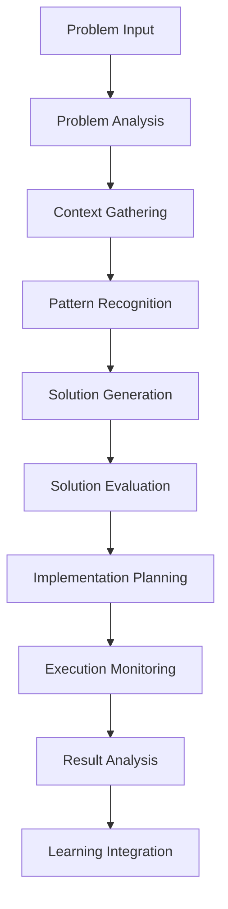

# Chapter 8: Problem Solving
**AI-Powered Analysis, Decision Making, and Solution Generation**

---

## Overview

NEO's problem-solving capabilities combine advanced AI reasoning, pattern recognition, and domain expertise to tackle complex challenges across multiple disciplines. This chapter explores NEO's analytical frameworks, decision-making processes, and solution generation techniques.

## Problem-Solving Architecture



## Problem Analysis Framework

### Problem Classification

```python
class ProblemClassifier:
    def __init__(self):
        self.categories = {
            'technical': ['debugging', 'optimization', 'architecture'],
            'analytical': ['data_analysis', 'research', 'forecasting'],
            'creative': ['design', 'content', 'innovation'],
            'strategic': ['planning', 'decision_making', 'resource_allocation'],
            'operational': ['automation', 'process_improvement', 'monitoring']
        }
    
    def classify_problem(self, problem_description):
        """Classify problem type and complexity"""
        analysis = {
            'type': self.determine_type(problem_description),
            'complexity': self.assess_complexity(problem_description),
            'domain': self.identify_domain(problem_description),
            'urgency': self.evaluate_urgency(problem_description)
        }
        return analysis
```

### Problem Decomposition

```yaml
decomposition_strategy:
  hierarchical:
    - break_into_subproblems
    - identify_dependencies
    - prioritize_components
    - plan_solution_sequence
  
  dimensional:
    - technical_aspects
    - business_requirements
    - resource_constraints
    - time_limitations
  
  stakeholder:
    - user_needs
    - business_goals
    - technical_requirements
    - compliance_standards
```

## Solution Generation Methods

### 1. Rule-Based Reasoning

```python
class RuleBasedSolver:
    def __init__(self):
        self.rules = self.load_expert_rules()
    
    def solve(self, problem):
        """Apply expert rules to generate solutions"""
        applicable_rules = self.find_applicable_rules(problem)
        solutions = []
        
        for rule in applicable_rules:
            if rule.conditions_met(problem):
                solution = rule.apply(problem)
                solutions.append(solution)
        
        return self.rank_solutions(solutions)

# Example rules
rules = [
    {
        'condition': 'high_cpu_usage',
        'solution': 'identify_and_optimize_processes',
        'confidence': 0.9
    },
    {
        'condition': 'memory_leak',
        'solution': 'analyze_memory_allocation_patterns',
        'confidence': 0.85
    }
]
```

### 2. Machine Learning Solutions

```python
class MLSolutionGenerator:
    def __init__(self):
        self.models = {
            'classification': self.load_classifier(),
            'regression': self.load_regressor(),
            'clustering': self.load_clusterer(),
            'recommendation': self.load_recommender()
        }
    
    def generate_solutions(self, problem_data):
        """Use ML models to predict optimal solutions"""
        problem_vector = self.vectorize_problem(problem_data)
        
        # Generate multiple solution candidates
        solutions = []
        for model_name, model in self.models.items():
            prediction = model.predict(problem_vector)
            solution = self.interpret_prediction(prediction, model_name)
            solutions.append(solution)
        
        return self.ensemble_solutions(solutions)
```

### 3. Heuristic Search

```python
class HeuristicSolver:
    def __init__(self):
        self.heuristics = [
            self.greedy_search,
            self.beam_search,
            self.genetic_algorithm,
            self.simulated_annealing
        ]
    
    def solve_optimization_problem(self, problem):
        """Apply heuristic methods for optimization problems"""
        best_solution = None
        best_score = float('-inf')
        
        for heuristic in self.heuristics:
            solution = heuristic(problem)
            score = self.evaluate_solution(solution, problem)
            
            if score > best_score:
                best_solution = solution
                best_score = score
        
        return best_solution, best_score
```

## Domain-Specific Problem Solving

### Software Development Problems

```python
# Code debugging assistant
class CodeDebugger:
    def analyze_bug(self, code, error_message, stack_trace):
        """Analyze code issues and suggest fixes"""
        analysis = {
            'error_type': self.classify_error(error_message),
            'root_cause': self.find_root_cause(stack_trace),
            'affected_components': self.identify_components(code),
            'suggested_fixes': self.generate_fixes(code, error_message)
        }
        return analysis

# Example usage
debugger = CodeDebugger()
bug_analysis = debugger.analyze_bug(
    code=problematic_code,
    error_message="AttributeError: 'NoneType' object has no attribute 'value'",
    stack_trace=stack_trace_data
)
```

### System Administration Problems

```yaml
system_problems:
  performance_issues:
    analysis_steps:
      - monitor_resource_usage
      - identify_bottlenecks
      - analyze_process_behavior
      - check_system_configuration
    
    solutions:
      - resource_optimization
      - process_tuning
      - configuration_adjustments
      - hardware_upgrades
  
  security_concerns:
    analysis_steps:
      - vulnerability_assessment
      - log_analysis
      - network_monitoring
      - access_pattern_review
    
    solutions:
      - patch_management
      - access_control_updates
      - security_configuration
      - monitoring_enhancement
```

### Data Analysis Problems

```python
class DataAnalysisSolver:
    def solve_data_problem(self, dataset, question):
        """Solve data analysis problems"""
        
        # Problem understanding
        problem_type = self.classify_data_problem(question)
        
        # Data preparation
        cleaned_data = self.prepare_data(dataset)
        
        # Analysis approach selection
        if problem_type == 'prediction':
            return self.build_predictive_model(cleaned_data, question)
        elif problem_type == 'clustering':
            return self.perform_clustering_analysis(cleaned_data)
        elif problem_type == 'visualization':
            return self.create_visualizations(cleaned_data, question)
        elif problem_type == 'statistical':
            return self.perform_statistical_analysis(cleaned_data, question)
```

## Decision-Making Framework

### Multi-Criteria Decision Analysis

```python
class DecisionAnalyzer:
    def __init__(self):
        self.criteria_weights = {}
        self.alternatives = []
        self.evaluation_matrix = {}
    
    def analyze_decision(self, alternatives, criteria, weights=None):
        """Perform multi-criteria decision analysis"""
        
        # Normalize weights
        if weights is None:
            weights = {criterion: 1.0 for criterion in criteria}
        
        # Evaluate alternatives
        scores = {}
        for alternative in alternatives:
            score = 0
            for criterion in criteria:
                value = self.evaluate_criterion(alternative, criterion)
                score += value * weights[criterion]
            scores[alternative] = score
        
        # Rank alternatives
        ranked = sorted(scores.items(), key=lambda x: x[1], reverse=True)
        return ranked

# Example: Choosing development framework
decision = DecisionAnalyzer()
frameworks = ['React', 'Vue', 'Angular']
criteria = ['performance', 'learning_curve', 'community_support', 'documentation']
weights = {'performance': 0.3, 'learning_curve': 0.2, 'community_support': 0.3, 'documentation': 0.2}

ranking = decision.analyze_decision(frameworks, criteria, weights)
```

### Risk Assessment

```yaml
risk_assessment:
  identification:
    - technical_risks
    - business_risks
    - operational_risks
    - external_risks
  
  analysis:
    probability: [low, medium, high]
    impact: [minor, moderate, major, critical]
    timeframe: [immediate, short_term, long_term]
  
  mitigation_strategies:
    - risk_avoidance
    - risk_reduction
    - risk_transfer
    - risk_acceptance
```

## Problem-Solving Commands

### Basic Problem Solving

```bash
# General problem analysis
neo solve "How to optimize database queries?"

# Code debugging
neo debug --file app.py --error "AttributeError"

# Performance analysis
neo analyze performance --target system

# Decision support
neo decide --alternatives ["option1", "option2"] --criteria ["cost", "time"]
```

### Advanced Problem Solving

```bash
# Multi-step problem solving
neo solve complex --problem "Design scalable microservices architecture" \
  --constraints "budget=100k, timeline=6months" \
  --requirements "high_availability, security, performance"

# Research assistance
neo research --topic "machine learning optimization" \
  --focus "neural network efficiency" \
  --output "detailed_report"

# Automated troubleshooting
neo troubleshoot --component database \
  --symptoms "slow_queries, high_cpu" \
  --auto-fix true
```

## Solution Evaluation and Optimization

### Solution Scoring

```python
class SolutionEvaluator:
    def __init__(self):
        self.evaluation_criteria = {
            'feasibility': 0.25,
            'effectiveness': 0.30,
            'efficiency': 0.20,
            'cost': 0.15,
            'risk': 0.10
        }
    
    def evaluate_solution(self, solution, problem_context):
        """Evaluate solution quality"""
        scores = {}
        
        # Feasibility assessment
        scores['feasibility'] = self.assess_feasibility(solution, problem_context)
        
        # Effectiveness prediction
        scores['effectiveness'] = self.predict_effectiveness(solution)
        
        # Efficiency analysis
        scores['efficiency'] = self.analyze_efficiency(solution)
        
        # Cost estimation
        scores['cost'] = self.estimate_cost(solution)
        
        # Risk evaluation
        scores['risk'] = self.evaluate_risk(solution)
        
        # Weighted score
        total_score = sum(
            scores[criterion] * weight 
            for criterion, weight in self.evaluation_criteria.items()
        )
        
        return total_score, scores
```

### Iterative Improvement

```python
class SolutionOptimizer:
    def optimize_solution(self, initial_solution, problem):
        """Iteratively improve solution quality"""
        current_solution = initial_solution
        iteration = 0
        max_iterations = 100
        
        while iteration < max_iterations:
            # Generate variations
            variations = self.generate_variations(current_solution)
            
            # Evaluate variations
            best_variation = None
            best_score = self.evaluate_solution(current_solution, problem)
            
            for variation in variations:
                score = self.evaluate_solution(variation, problem)
                if score > best_score:
                    best_variation = variation
                    best_score = score
            
            # Update if improvement found
            if best_variation:
                current_solution = best_variation
                iteration += 1
            else:
                break  # No further improvement
        
        return current_solution
```

## Collaborative Problem Solving

### Team Integration

```yaml
collaboration:
  team_roles:
    - problem_owner
    - domain_expert
    - implementation_lead
    - quality_assurance
  
  workflow:
    - problem_definition
    - stakeholder_input
    - collaborative_analysis
    - solution_review
    - implementation_planning
```

### Knowledge Sharing

```python
class KnowledgeBase:
    def __init__(self):
        self.solutions = {}
        self.problem_patterns = {}
        self.expert_knowledge = {}
    
    def add_solution(self, problem_signature, solution, metadata):
        """Add successful solution to knowledge base"""
        self.solutions[problem_signature] = {
            'solution': solution,
            'metadata': metadata,
            'success_rate': 1.0,
            'usage_count': 0
        }
    
    def find_similar_problems(self, new_problem):
        """Find similar solved problems"""
        similarities = []
        for signature, data in self.solutions.items():
            similarity = self.calculate_similarity(new_problem, signature)
            if similarity > 0.7:
                similarities.append((signature, similarity, data))
        
        return sorted(similarities, key=lambda x: x[1], reverse=True)
```

## Problem-Solving Examples

### Example 1: Performance Optimization

```bash
# Problem: Web application is slow
neo solve performance --app web_app --symptoms "slow_response, high_memory"

# NEO's analysis and solution:
# 1. Identified database query bottlenecks
# 2. Found memory leaks in image processing
# 3. Detected inefficient caching strategy
# 
# Recommended solutions:
# - Add database indexes
# - Implement query optimization
# - Fix memory management
# - Improve caching strategy
```

### Example 2: Security Vulnerability

```bash
# Problem: Potential security breach detected
neo solve security --alert "suspicious_activity" --component "user_authentication"

# NEO's approach:
# 1. Analyzed security logs
# 2. Identified attack patterns
# 3. Assessed impact scope
# 4. Generated mitigation plan
#
# Implemented solutions:
# - Strengthened authentication
# - Updated access controls
# - Enhanced monitoring
# - Applied security patches
```

### Example 3: Resource Planning

```bash
# Problem: Plan development team resources
neo solve planning --project "mobile_app" --timeline "6_months" --team_size 8

# NEO's planning process:
# 1. Analyzed project requirements
# 2. Broke down into development phases
# 3. Estimated effort and dependencies
# 4. Optimized resource allocation
#
# Generated plan:
# - Phase 1: Architecture & Setup (4 weeks)
# - Phase 2: Core Features (12 weeks)
# - Phase 3: Integration & Testing (6 weeks)
# - Phase 4: Deployment & Launch (2 weeks)
```

## Best Practices

### Effective Problem Definition

1. **Be Specific**: Clearly define the problem scope and constraints
2. **Provide Context**: Include relevant background information
3. **State Objectives**: Define what constitutes a successful solution
4. **Identify Stakeholders**: List all parties affected by the problem

### Solution Implementation

```yaml
implementation_guidelines:
  planning:
    - break_into_phases
    - identify_dependencies
    - allocate_resources
    - set_milestones
  
  execution:
    - monitor_progress
    - adapt_to_changes
    - maintain_quality
    - communicate_status
  
  validation:
    - test_solutions
    - measure_effectiveness
    - gather_feedback
    - document_results
```

---

**Next Chapter**: [PC Control & Automation →](09-pc-control.md)

**Previous Chapter**: [← Learning Systems](07-learning-systems.md)
