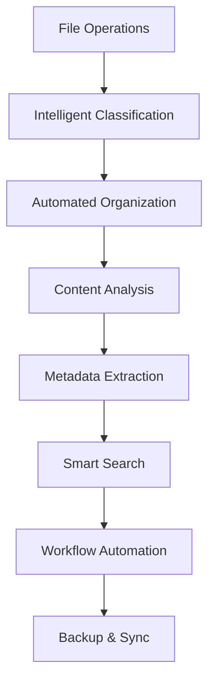

# Chapter 10: File Management
**Intelligent File Operations, Organization, and Automation**

---

## Overview

NEO's file management system combines traditional file operations with AI-powered organization, intelligent search, automated workflows, and predictive file handling. This chapter covers comprehensive file management capabilities from basic operations to advanced automation.

## File Management Architecture



## Basic File Operations

### Standard File Commands

```bash
# Create files and directories
neo file create --name "project_plan.md" --type document
neo dir create --path "/projects/new_project" --structure complete

# Copy and move operations
neo file copy --source "file.txt" --destination "/backup/"
neo file move --source "old_location/*" --destination "/new_location/"

# Delete operations (with safety checks)
neo file delete --path "temp_files" --confirm --backup
neo file clean --type "temporary" --older-than "7days"

# File information and statistics
neo file info --path "important_document.pdf"
neo file stats --directory "/projects" --recursive
```

### Advanced File Operations

```python
# Batch file operations
from neo.file_management import FileManager

manager = FileManager()

# Batch rename with patterns
manager.batch_rename(
    pattern="IMG_*.jpg",
    new_pattern="vacation_2024_{counter:03d}.jpg",
    directory="/photos/vacation"
)

# Conditional file operations
manager.conditional_operation(
    condition="file_size > 100MB",
    operation="compress",
    target_directory="/large_files"
)

# Smart duplicate detection
duplicates = manager.find_duplicates(
    directory="/documents",
    method="content_hash",
    ignore_extensions=[".tmp", ".log"]
)
```

## Intelligent File Organization

### Auto-Classification System

```yaml
# File classification rules
classification:
  documents:
    extensions: [".pdf", ".doc", ".docx", ".txt", ".md"]
    keywords: ["report", "document", "note", "memo"]
    location: "/documents"
  
  development:
    extensions: [".py", ".js", ".cpp", ".java", ".go"]
    keywords: ["source", "code", "script", "program"]
    location: "/projects/code"
  
  media:
    extensions: [".jpg", ".png", ".mp4", ".mp3", ".wav"]
    keywords: ["photo", "image", "video", "audio"]
    location: "/media"
  
  data:
    extensions: [".csv", ".json", ".xml", ".sql", ".db"]
    keywords: ["dataset", "data", "database", "export"]
    location: "/data"
```

### Smart Folder Structure

```python
class SmartOrganizer:
    def __init__(self):
        self.organization_rules = self.load_rules()
        self.user_preferences = self.load_preferences()
    
    def organize_directory(self, directory_path):
        """Automatically organize files in a directory"""
        files = self.scan_files(directory_path)
        
        for file in files:
            # Analyze file content and context
            analysis = self.analyze_file(file)
            
            # Determine optimal location
            target_location = self.determine_location(analysis)
            
            # Create directory structure if needed
            self.ensure_directory_exists(target_location)
            
            # Move file with verification
            self.safe_move(file, target_location)
    
    def suggest_organization(self, directory_path):
        """Suggest organization improvements"""
        analysis = self.analyze_directory_structure(directory_path)
        suggestions = []
        
        # Check for common issues
        if analysis['max_depth'] > 5:
            suggestions.append("Consider flattening deep directory structures")
        
        if analysis['avg_files_per_dir'] > 50:
            suggestions.append("Some directories have too many files")
        
        return suggestions
```

## Content-Based File Management

### Document Analysis

```python
class DocumentAnalyzer:
    def analyze_document(self, file_path):
        """Extract information from documents"""
        content = self.extract_text(file_path)
        
        analysis = {
            'language': self.detect_language(content),
            'topic': self.extract_topic(content),
            'keywords': self.extract_keywords(content),
            'summary': self.generate_summary(content),
            'sentiment': self.analyze_sentiment(content),
            'entities': self.extract_entities(content)
        }
        
        return analysis

# Example usage
analyzer = DocumentAnalyzer()
doc_info = analyzer.analyze_document("/documents/research_paper.pdf")

# Automatic tagging based on content
neo file tag --path "research_paper.pdf" --auto-tags
# Tags: research, machine-learning, neural-networks, academic
```

### Image and Media Processing

```python
class MediaProcessor:
    def process_image(self, image_path):
        """Extract metadata and analyze image content"""
        metadata = {
            'dimensions': self.get_dimensions(image_path),
            'file_size': self.get_file_size(image_path),
            'creation_date': self.get_creation_date(image_path),
            'camera_info': self.extract_exif(image_path),
            'objects_detected': self.detect_objects(image_path),
            'text_content': self.extract_text_ocr(image_path),
            'quality_score': self.assess_quality(image_path)
        }
        
        return metadata

# Automatic photo organization
neo file organize --type photos --by-date --by-location --remove-duplicates
```

## Smart Search and Discovery

### Advanced Search Capabilities

```bash
# Content-based search
neo file search --content "machine learning" --type document
neo file search --similar-to "example_image.jpg" --type image

# Metadata search
neo file search --created-after "2024-01-01" --size ">10MB"
neo file search --tags "project,important" --modified-last "week"

# Fuzzy search
neo file search --fuzzy "aproximate_filename" --threshold 0.8

# Natural language search
neo file search --query "find my presentation about quarterly results from last month"
```

### Search Index Management

```python
class SearchIndexer:
    def __init__(self):
        self.index = SearchIndex()
        self.content_analyzer = ContentAnalyzer()
    
    def index_file(self, file_path):
        """Add file to search index"""
        file_info = {
            'path': file_path,
            'name': os.path.basename(file_path),
            'extension': os.path.splitext(file_path)[1],
            'size': os.path.getsize(file_path),
            'modified': os.path.getmtime(file_path),
            'content': self.extract_searchable_content(file_path),
            'metadata': self.extract_metadata(file_path)
        }
        
        self.index.add_document(file_info)
    
    def search(self, query, filters=None):
        """Search files using natural language"""
        # Parse natural language query
        parsed_query = self.parse_query(query)
        
        # Build search parameters
        search_params = {
            'text': parsed_query['text_terms'],
            'date_range': parsed_query['date_range'],
            'file_types': parsed_query['file_types'],
            'size_range': parsed_query['size_range']
        }
        
        # Execute search
        results = self.index.search(search_params)
        
        # Rank results by relevance
        ranked_results = self.rank_results(results, query)
        
        return ranked_results
```

## File Workflow Automation

### Automated File Processing

```yaml
# Workflow definitions
workflows:
  document_processing:
    trigger: "new_file_in_inbox"
    conditions:
      - file_type: "document"
      - file_size: "> 1MB"
    actions:
      - extract_text
      - generate_summary
      - auto_tag
      - move_to_organized_folder
      - create_backup
  
  code_repository_sync:
    trigger: "file_modified"
    conditions:
      - file_extension: [".py", ".js", ".cpp"]
      - directory: "/projects"
    actions:
      - run_linting
      - update_documentation
      - commit_changes
      - notify_team
  
  media_optimization:
    trigger: "new_image_added"
    conditions:
      - file_type: "image"
      - file_size: "> 5MB"
    actions:
      - compress_image
      - generate_thumbnails
      - extract_metadata
      - organize_by_date
```

### Custom Automation Scripts

```python
# Custom file automation
from neo.automation import FileAutomation

automation = FileAutomation()

# Auto-backup important files
@automation.schedule(interval="daily")
def backup_important_files():
    """Daily backup of critical files"""
    important_patterns = [
        "/documents/projects/*.md",
        "/code/src/**/*.py",
        "/data/databases/*.db"
    ]
    
    for pattern in important_patterns:
        files = automation.find_files(pattern)
        for file in files:
            backup_path = automation.get_backup_path(file)
            automation.create_backup(file, backup_path)

# Intelligent file cleanup
@automation.schedule(interval="weekly")
def intelligent_cleanup():
    """Clean up unnecessary files"""
    # Find and remove temporary files
    temp_files = automation.find_files("**/*.tmp", "**/*~", "**/cache/*")
    automation.safe_delete(temp_files, backup=True)
    
    # Compress old log files
    old_logs = automation.find_files("**/*.log", older_than="30days")
    automation.compress_files(old_logs)
    
    # Archive completed projects
    completed_projects = automation.find_inactive_projects(inactive_days=90)
    automation.archive_projects(completed_projects)
```

## File Synchronization and Backup

### Multi-Location Sync

```python
class FileSynchronizer:
    def __init__(self):
        self.sync_locations = []
        self.conflict_resolver = ConflictResolver()
    
    def add_sync_location(self, local_path, remote_path, provider):
        """Add a synchronization location"""
        sync_config = {
            'local_path': local_path,
            'remote_path': remote_path,
            'provider': provider,  # cloud, network, external_drive
            'sync_mode': 'bidirectional',  # upload, download, bidirectional
            'conflict_resolution': 'prompt'  # prompt, local_wins, remote_wins
        }
        self.sync_locations.append(sync_config)
    
    def sync_all(self):
        """Synchronize all configured locations"""
        for location in self.sync_locations:
            try:
                self.sync_location(location)
            except SyncError as e:
                self.handle_sync_error(e, location)
    
    def smart_sync(self, file_path):
        """Intelligently sync based on file importance and usage"""
        importance = self.assess_file_importance(file_path)
        
        if importance > 0.8:
            # High importance: sync to all locations
            self.sync_to_all_locations(file_path)
        elif importance > 0.5:
            # Medium importance: sync to primary backup
            self.sync_to_primary_backup(file_path)
        else:
            # Low importance: local backup only
            self.create_local_backup(file_path)
```

### Intelligent Backup Strategy

```yaml
backup_strategy:
  critical_files:
    frequency: "real_time"
    locations: ["cloud", "local_nas", "external_drive"]
    encryption: true
    compression: false
    retention: "indefinite"
  
  project_files:
    frequency: "hourly"
    locations: ["cloud", "local_nas"]
    encryption: true
    compression: true
    retention: "1_year"
  
  media_files:
    frequency: "daily"
    locations: ["cloud", "external_drive"]
    encryption: false
    compression: true
    retention: "2_years"
  
  temporary_files:
    frequency: "weekly"
    locations: ["local_nas"]
    encryption: false
    compression: true
    retention: "1_month"
```

## File Security and Permissions

### Access Control Management

```python
class FileSecurityManager:
    def __init__(self):
        self.encryption_engine = EncryptionEngine()
        self.access_controller = AccessController()
    
    def secure_file(self, file_path, security_level="medium"):
        """Apply security measures to a file"""
        if security_level == "high":
            # Encrypt file
            encrypted_path = self.encryption_engine.encrypt_file(file_path)
            
            # Set restrictive permissions
            self.access_controller.set_permissions(encrypted_path, "owner_only")
            
            # Add to secure monitoring
            self.add_to_secure_monitoring(encrypted_path)
        
        elif security_level == "medium":
            # Set permissions but don't encrypt
            self.access_controller.set_permissions(file_path, "user_group")
            
            # Add access logging
            self.enable_access_logging(file_path)
    
    def audit_file_access(self, directory_path):
        """Audit file access patterns"""
        access_logs = self.get_access_logs(directory_path)
        
        # Analyze for suspicious patterns
        suspicious_activity = self.analyze_access_patterns(access_logs)
        
        if suspicious_activity:
            self.alert_security_team(suspicious_activity)
        
        return access_logs
```

### Data Loss Prevention

```python
class DataLossPreventionSystem:
    def __init__(self):
        self.sensitive_patterns = self.load_sensitive_patterns()
        self.monitoring_rules = self.load_monitoring_rules()
    
    def scan_for_sensitive_data(self, file_path):
        """Scan file for sensitive information"""
        content = self.read_file_safely(file_path)
        
        findings = []
        for pattern_name, pattern in self.sensitive_patterns.items():
            matches = self.find_pattern_matches(content, pattern)
            if matches:
                findings.append({
                    'type': pattern_name,
                    'matches': matches,
                    'confidence': self.calculate_confidence(matches)
                })
        
        return findings
    
    def protect_sensitive_file(self, file_path, findings):
        """Apply protection measures based on findings"""
        protection_level = self.determine_protection_level(findings)
        
        if protection_level == "critical":
            self.encrypt_file(file_path)
            self.restrict_access(file_path)
            self.enable_audit_logging(file_path)
        elif protection_level == "sensitive":
            self.restrict_access(file_path)
            self.enable_access_monitoring(file_path)
```

## File Management Examples

### Example 1: Project Organization

```bash
# Organize a messy project directory
neo file organize --directory "/downloads/project_files" --auto-structure

# NEO's organization:
# 1. Detected project type (Python web application)
# 2. Created standard directory structure
# 3. Moved files to appropriate locations:
#    - Source code → /src
#    - Documentation → /docs
#    - Tests → /tests
#    - Configuration → /config
#    - Static files → /static
```

### Example 2: Smart Backup

```bash
# Set up intelligent backup system
neo file backup setup --strategy smart --locations ["cloud", "nas"]

# Configure backup rules
neo file backup rule --pattern "*.py" --frequency hourly --location all
neo file backup rule --pattern "*.db" --frequency realtime --location critical
neo file backup rule --pattern "*.tmp" --frequency never
```

### Example 3: Content-Based Search

```bash
# Natural language file search
neo file search "find the presentation I worked on last week about quarterly sales"

# Results:
# 1. Q3_Sales_Presentation.pptx (modified: 6 days ago, confidence: 95%)
# 2. Sales_Quarter_Report.pdf (modified: 5 days ago, confidence: 87%)
# 3. Quarterly_Analysis.xlsx (modified: 8 days ago, confidence: 82%)
```

## Performance Optimization

### File System Optimization

```python
class FileSystemOptimizer:
    def optimize_directory(self, directory_path):
        """Optimize directory for better performance"""
        
        # Analyze current structure
        analysis = self.analyze_directory_structure(directory_path)
        
        optimizations = []
        
        # Check for fragmentation
        if analysis['fragmentation'] > 0.3:
            optimizations.append("defragment_files")
        
        # Check directory depth
        if analysis['max_depth'] > 10:
            optimizations.append("flatten_structure")
        
        # Check file distribution
        if analysis['uneven_distribution'] > 0.5:
            optimizations.append("redistribute_files")
        
        # Apply optimizations
        for optimization in optimizations:
            self.apply_optimization(optimization, directory_path)
        
        return optimizations
```

### Caching and Indexing

```yaml
performance_settings:
  file_indexing:
    enabled: true
    update_frequency: "real_time"
    index_content: true
    index_metadata: true
    cache_thumbnails: true
  
  search_optimization:
    cache_results: true
    cache_duration: "1_hour"
    parallel_search: true
    max_threads: 4
  
  file_operations:
    use_bulk_operations: true
    async_operations: true
    progress_reporting: true
    error_recovery: true
```

## Best Practices

### File Management Guidelines

1. **Consistent Naming**: Use clear, descriptive file names
2. **Logical Structure**: Organize files in intuitive hierarchies
3. **Regular Cleanup**: Remove unnecessary files periodically
4. **Backup Strategy**: Implement comprehensive backup plans
5. **Security Awareness**: Protect sensitive files appropriately

### Automation Best Practices

```yaml
automation_guidelines:
  safety:
    - always_backup_before_operations
    - test_rules_on_sample_data
    - implement_rollback_mechanisms
    - monitor_automated_actions
  
  efficiency:
    - batch_similar_operations
    - use_appropriate_scheduling
    - optimize_for_system_resources
    - implement_error_handling
  
  maintenance:
    - regularly_review_rules
    - update_automation_logic
    - monitor_performance_impact
    - document_automation_workflows
```

---

**Next Chapter**: [Process Management →](11-process-management.md)

**Previous Chapter**: [← PC Control & Automation](09-pc-control.md)
