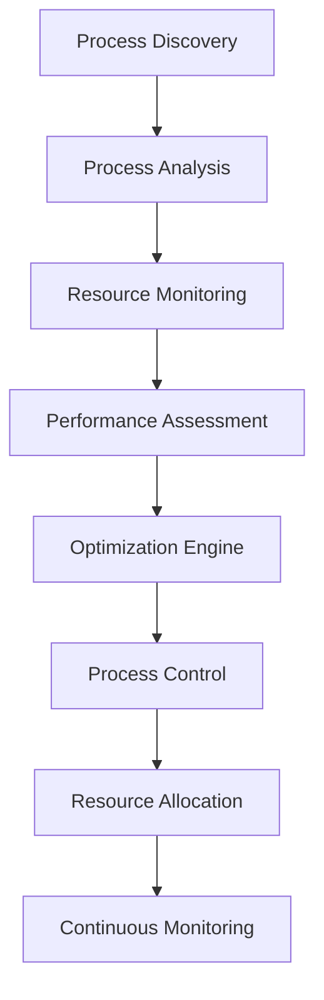

# Chapter 11: Process Management
**System Process Control, Monitoring, and Optimization**

---

## Overview

NEO's process management system provides comprehensive control over system processes, applications, and services. This chapter covers process monitoring, automatic optimization, resource management, and advanced process control techniques.

## Process Management Architecture



## Process Discovery and Monitoring

### System Process Overview

```bash
# Basic process monitoring
neo process list --sort cpu --top 10
neo process list --filter "memory > 1GB"
neo process list --user current --status running

# Detailed process information
neo process info --pid 1234
neo process info --name "firefox" --verbose

# Process tree visualization
neo process tree --root-pid 1
neo process tree --filter "development"
```

### Advanced Process Analysis

```python
class ProcessMonitor:
    def __init__(self):
        self.processes = {}
        self.monitoring_active = False
        self.alerts = AlertManager()
    
    def scan_processes(self):
        """Scan and catalog all running processes"""
        current_processes = {}
        
        for proc in psutil.process_iter(['pid', 'name', 'cpu_percent', 'memory_percent']):
            try:
                proc_info = proc.info
                proc_info.update({
                    'cmdline': proc.cmdline(),
                    'create_time': proc.create_time(),
                    'status': proc.status(),
                    'threads': proc.num_threads(),
                    'open_files': len(proc.open_files()),
                    'connections': len(proc.connections())
                })
                current_processes[proc_info['pid']] = proc_info
            except (psutil.NoSuchProcess, psutil.AccessDenied):
                continue
        
        return current_processes
    
    def analyze_process_behavior(self, pid, duration=300):
        """Analyze process behavior over time"""
        proc = psutil.Process(pid)
        samples = []
        
        start_time = time.time()
        while time.time() - start_time < duration:
            try:
                sample = {
                    'timestamp': time.time(),
                    'cpu_percent': proc.cpu_percent(),
                    'memory_mb': proc.memory_info().rss / 1024 / 1024,
                    'threads': proc.num_threads(),
                    'io_read': proc.io_counters().read_bytes,
                    'io_write': proc.io_counters().write_bytes
                }
                samples.append(sample)
                time.sleep(1)
            except psutil.NoSuchProcess:
                break
        
        return self.generate_behavior_analysis(samples)
```

### Real-Time Process Monitoring

```python
class RealTimeMonitor:
    def __init__(self):
        self.monitoring_rules = []
        self.process_history = {}
        self.alerts = []
    
    def add_monitoring_rule(self, rule):
        """Add a process monitoring rule"""
        # Example rule: Alert if CPU usage > 80% for 5 minutes
        rule_config = {
            'name': rule['name'],
            'condition': rule['condition'],  # "cpu > 80"
            'duration': rule['duration'],    # 300 seconds
            'action': rule['action'],        # "alert", "throttle", "terminate"
            'severity': rule['severity']     # "low", "medium", "high", "critical"
        }
        self.monitoring_rules.append(rule_config)
    
    def check_rules(self, process_data):
        """Check if any monitoring rules are triggered"""
        triggered_rules = []
        
        for rule in self.monitoring_rules:
            if self.evaluate_condition(rule['condition'], process_data):
                # Check duration
                if self.check_duration(rule, process_data):
                    triggered_rules.append(rule)
                    self.execute_rule_action(rule, process_data)
        
        return triggered_rules

# Example monitoring setup
monitor = RealTimeMonitor()

# Monitor memory usage
monitor.add_monitoring_rule({
    'name': 'high_memory_usage',
    'condition': 'memory > 4GB',
    'duration': 60,
    'action': 'alert',
    'severity': 'medium'
})

# Monitor runaway processes
monitor.add_monitoring_rule({
    'name': 'runaway_process',
    'condition': 'cpu > 95 AND duration > 300',
    'duration': 300,
    'action': 'throttle',
    'severity': 'high'
})
```

## Process Control and Management

### Basic Process Operations

```bash
# Start and stop processes
neo process start --command "python app.py" --working-dir "/project"
neo process stop --pid 1234 --graceful
neo process restart --name "web_server" --wait

# Process priority management
neo process priority --pid 1234 --level high
neo process priority --name "backup_script" --level low

# Process resource limits
neo process limit --pid 1234 --memory 2GB --cpu 50%
neo process limit --name "data_processor" --io-bandwidth 100MB/s
```

### Advanced Process Control

```python
class ProcessController:
    def __init__(self):
        self.managed_processes = {}
        self.resource_manager = ResourceManager()
    
    def create_managed_process(self, command, config):
        """Create a process with advanced management"""
        process_config = {
            'command': command,
            'working_directory': config.get('cwd', os.getcwd()),
            'environment': config.get('env', {}),
            'resource_limits': config.get('limits', {}),
            'restart_policy': config.get('restart', 'on-failure'),
            'healthcheck': config.get('healthcheck', {}),
            'logging': config.get('logging', {})
        }
        
        # Create process with resource limits
        proc = self.create_process_with_limits(process_config)
        
        # Set up monitoring
        self.setup_process_monitoring(proc, process_config)
        
        # Store managed process
        self.managed_processes[proc.pid] = {
            'process': proc,
            'config': process_config,
            'start_time': time.time(),
            'restart_count': 0
        }
        
        return proc
    
    def apply_resource_limits(self, pid, limits):
        """Apply resource limits to a process"""
        try:
            proc = psutil.Process(pid)
            
            # CPU limit
            if 'cpu_percent' in limits:
                self.set_cpu_limit(proc, limits['cpu_percent'])
            
            # Memory limit
            if 'memory_mb' in limits:
                self.set_memory_limit(proc, limits['memory_mb'])
            
            # I/O limits
            if 'io_bandwidth' in limits:
                self.set_io_limit(proc, limits['io_bandwidth'])
            
            return True
        except psutil.NoSuchProcess:
            return False
    
    def auto_restart_process(self, pid, reason):
        """Automatically restart a failed process"""
        if pid not in self.managed_processes:
            return False
        
        proc_info = self.managed_processes[pid]
        
        # Check restart policy
        if proc_info['config']['restart_policy'] == 'never':
            return False
        
        if proc_info['restart_count'] >= 3:  # Max restart attempts
            self.alert_restart_failure(pid, reason)
            return False
        
        # Restart process
        new_proc = self.create_managed_process(
            proc_info['config']['command'],
            proc_info['config']
        )
        
        # Update restart count
        self.managed_processes[new_proc.pid]['restart_count'] = proc_info['restart_count'] + 1
        
        return True
```

## Resource Management and Optimization

### System Resource Monitoring

```python
class ResourceMonitor:
    def __init__(self):
        self.cpu_history = []
        self.memory_history = []
        self.disk_history = []
        self.network_history = []
    
    def get_system_resources(self):
        """Get current system resource usage"""
        resources = {
            'cpu': {
                'percent': psutil.cpu_percent(interval=1),
                'count': psutil.cpu_count(),
                'per_cpu': psutil.cpu_percent(interval=1, percpu=True),
                'frequency': psutil.cpu_freq(),
                'load_average': os.getloadavg() if hasattr(os, 'getloadavg') else None
            },
            'memory': {
                'total': psutil.virtual_memory().total,
                'available': psutil.virtual_memory().available,
                'percent': psutil.virtual_memory().percent,
                'used': psutil.virtual_memory().used,
                'swap': psutil.swap_memory()._asdict()
            },
            'disk': {
                'usage': {mount.mountpoint: psutil.disk_usage(mount.mountpoint)._asdict() 
                         for mount in psutil.disk_partitions()},
                'io_stats': psutil.disk_io_counters()._asdict()
            },
            'network': {
                'io_stats': psutil.net_io_counters()._asdict(),
                'connections': len(psutil.net_connections()),
                'interfaces': {name: stats._asdict() 
                             for name, stats in psutil.net_io_counters(pernic=True).items()}
            }
        }
        
        return resources
    
    def analyze_resource_trends(self, timeframe_hours=24):
        """Analyze resource usage trends"""
        current_time = time.time()
        cutoff_time = current_time - (timeframe_hours * 3600)
        
        # Filter recent data
        recent_cpu = [entry for entry in self.cpu_history if entry['timestamp'] > cutoff_time]
        recent_memory = [entry for entry in self.memory_history if entry['timestamp'] > cutoff_time]
        
        # Calculate trends
        trends = {
            'cpu_trend': self.calculate_trend([entry['percent'] for entry in recent_cpu]),
            'memory_trend': self.calculate_trend([entry['percent'] for entry in recent_memory]),
            'peak_cpu': max([entry['percent'] for entry in recent_cpu], default=0),
            'peak_memory': max([entry['percent'] for entry in recent_memory], default=0),
            'average_cpu': sum([entry['percent'] for entry in recent_cpu]) / len(recent_cpu) if recent_cpu else 0,
            'average_memory': sum([entry['percent'] for entry in recent_memory]) / len(recent_memory) if recent_memory else 0
        }
        
        return trends
```

### Automatic Process Optimization

```python
class ProcessOptimizer:
    def __init__(self):
        self.optimization_strategies = [
            self.cpu_optimization,
            self.memory_optimization,
            self.io_optimization,
            self.priority_optimization
        ]
    
    def optimize_system_performance(self):
        """Automatically optimize system performance"""
        # Get current system state
        system_resources = self.get_system_resources()
        process_list = self.get_process_list()
        
        optimization_actions = []
        
        # Identify optimization opportunities
        for strategy in self.optimization_strategies:
            actions = strategy(system_resources, process_list)
            optimization_actions.extend(actions)
        
        # Execute optimization actions
        results = []
        for action in optimization_actions:
            result = self.execute_optimization_action(action)
            results.append(result)
        
        return results
    
    def cpu_optimization(self, resources, processes):
        """Optimize CPU usage"""
        actions = []
        
        # If CPU usage is high
        if resources['cpu']['percent'] > 80:
            # Find CPU-intensive processes
            cpu_hogs = [p for p in processes if p['cpu_percent'] > 20]
            
            for proc in cpu_hogs:
                # Lower priority of non-critical processes
                if not self.is_critical_process(proc):
                    actions.append({
                        'type': 'lower_priority',
                        'pid': proc['pid'],
                        'reason': 'high_cpu_usage'
                    })
        
        return actions
    
    def memory_optimization(self, resources, processes):
        """Optimize memory usage"""
        actions = []
        
        # If memory usage is high
        if resources['memory']['percent'] > 85:
            # Find memory-intensive processes
            memory_hogs = [p for p in processes if p['memory_percent'] > 10]
            
            for proc in memory_hogs:
                # Suggest process restart if memory usage is growing
                if self.is_memory_leak_suspected(proc):
                    actions.append({
                        'type': 'restart_process',
                        'pid': proc['pid'],
                        'reason': 'suspected_memory_leak'
                    })
        
        return actions
```

## Service Management

### System Service Control

```bash
# Service management
neo service list --status all
neo service start --name "apache2"
neo service stop --name "mysql" --timeout 30
neo service restart --name "nginx" --graceful

# Service configuration
neo service config --name "postgresql" --auto-start true
neo service config --name "redis" --restart-policy always

# Service monitoring
neo service monitor --name "web_server" --health-check enabled
neo service logs --name "application" --tail 100 --follow
```

### Custom Service Creation

```python
class ServiceManager:
    def __init__(self):
        self.services = {}
        self.service_configs = self.load_service_configs()
    
    def create_service(self, name, config):
        """Create a custom service"""
        service_config = {
            'name': name,
            'command': config['command'],
            'working_directory': config.get('working_directory', '/'),
            'user': config.get('user', 'root'),
            'group': config.get('group', 'root'),
            'environment': config.get('environment', {}),
            'auto_start': config.get('auto_start', False),
            'restart_policy': config.get('restart_policy', 'on-failure'),
            'restart_delay': config.get('restart_delay', 5),
            'max_restarts': config.get('max_restarts', 3),
            'health_check': config.get('health_check', {}),
            'dependencies': config.get('dependencies', [])
        }
        
        # Create service file
        service_file = self.generate_service_file(service_config)
        self.install_service_file(name, service_file)
        
        # Register service
        self.services[name] = service_config
        
        return True
    
    def monitor_service_health(self, service_name):
        """Monitor service health"""
        if service_name not in self.services:
            return None
        
        config = self.services[service_name]
        health_check = config.get('health_check', {})
        
        if not health_check:
            return self.basic_health_check(service_name)
        
        # Custom health check
        if health_check.get('type') == 'http':
            return self.http_health_check(health_check)
        elif health_check.get('type') == 'tcp':
            return self.tcp_health_check(health_check)
        elif health_check.get('type') == 'command':
            return self.command_health_check(health_check)
        
        return None

# Example service creation
service_manager = ServiceManager()

service_manager.create_service('my_web_app', {
    'command': 'python /app/server.py',
    'working_directory': '/app',
    'user': 'webapp',
    'auto_start': True,
    'restart_policy': 'always',
    'health_check': {
        'type': 'http',
        'url': 'http://localhost:8080/health',
        'interval': 30,
        'timeout': 5
    }
})
```

## Performance Analysis and Tuning

### Process Performance Analysis

```python
class PerformanceAnalyzer:
    def __init__(self):
        self.benchmarks = {}
        self.performance_history = {}
    
    def analyze_process_performance(self, pid, duration=300):
        """Analyze process performance over time"""
        proc = psutil.Process(pid)
        analysis_data = []
        
        start_time = time.time()
        while time.time() - start_time < duration:
            try:
                sample = {
                    'timestamp': time.time(),
                    'cpu_percent': proc.cpu_percent(),
                    'memory_mb': proc.memory_info().rss / 1024 / 1024,
                    'io_read_mb': proc.io_counters().read_bytes / 1024 / 1024,
                    'io_write_mb': proc.io_counters().write_bytes / 1024 / 1024,
                    'threads': proc.num_threads(),
                    'open_files': len(proc.open_files()),
                    'network_connections': len(proc.connections())
                }
                analysis_data.append(sample)
                time.sleep(5)
            except psutil.NoSuchProcess:
                break
        
        # Generate performance report
        report = self.generate_performance_report(analysis_data)
        return report
    
    def generate_performance_report(self, data):
        """Generate comprehensive performance report"""
        if not data:
            return None
        
        report = {
            'duration': data[-1]['timestamp'] - data[0]['timestamp'],
            'cpu_stats': {
                'average': sum(d['cpu_percent'] for d in data) / len(data),
                'peak': max(d['cpu_percent'] for d in data),
                'minimum': min(d['cpu_percent'] for d in data)
            },
            'memory_stats': {
                'average': sum(d['memory_mb'] for d in data) / len(data),
                'peak': max(d['memory_mb'] for d in data),
                'growth_rate': self.calculate_growth_rate([d['memory_mb'] for d in data])
            },
            'io_stats': {
                'total_read': data[-1]['io_read_mb'] - data[0]['io_read_mb'],
                'total_write': data[-1]['io_write_mb'] - data[0]['io_write_mb'],
                'read_rate': self.calculate_io_rate([d['io_read_mb'] for d in data]),
                'write_rate': self.calculate_io_rate([d['io_write_mb'] for d in data])
            },
            'recommendations': self.generate_recommendations(data)
        }
        
        return report
    
    def generate_recommendations(self, data):
        """Generate performance optimization recommendations"""
        recommendations = []
        
        # Check for high CPU usage
        avg_cpu = sum(d['cpu_percent'] for d in data) / len(data)
        if avg_cpu > 80:
            recommendations.append({
                'type': 'cpu_optimization',
                'priority': 'high',
                'description': 'Consider optimizing CPU-intensive operations or increasing CPU resources'
            })
        
        # Check for memory growth
        memory_values = [d['memory_mb'] for d in data]
        memory_growth = self.calculate_growth_rate(memory_values)
        if memory_growth > 0.1:  # 10% growth
            recommendations.append({
                'type': 'memory_leak',
                'priority': 'critical',
                'description': 'Potential memory leak detected. Review memory allocation patterns'
            })
        
        # Check for I/O bottlenecks
        io_variance = self.calculate_variance([d['io_read_mb'] + d['io_write_mb'] for d in data])
        if io_variance > 100:  # High I/O variance
            recommendations.append({
                'type': 'io_optimization',
                'priority': 'medium',
                'description': 'Consider optimizing I/O operations or using caching'
            })
        
        return recommendations
```

### System-Wide Performance Tuning

```yaml
performance_tuning:
  cpu_optimization:
    - enable_cpu_governor: "performance"
    - set_cpu_scaling: "performance"
    - optimize_process_affinity: true
    - enable_turbo_boost: true
  
  memory_optimization:
    - enable_memory_compression: true
    - optimize_swap_usage: true
    - configure_memory_overcommit: true
    - tune_cache_pressure: 60
  
  io_optimization:
    - use_io_scheduler: "deadline"
    - enable_read_ahead: true
    - optimize_buffer_sizes: true
    - configure_dirty_ratios: true
  
  network_optimization:
    - tune_tcp_buffers: true
    - enable_tcp_window_scaling: true
    - optimize_network_queues: true
    - configure_interrupt_affinity: true
```

## Process Management Examples

### Example 1: Automated Process Monitoring

```bash
# Set up comprehensive process monitoring
neo process monitor setup --profile development

# Monitor specific applications
neo process monitor add --name "web_server" --cpu-threshold 80 --memory-threshold 2GB
neo process monitor add --name "database" --io-threshold 100MB/s --health-check enabled

# View monitoring dashboard
neo process monitor dashboard --refresh 5s
```

### Example 2: Resource Optimization

```bash
# Analyze system performance
neo process analyze --duration 1h --output report.json

# Automatic optimization
neo process optimize --mode automatic --apply-recommendations

# Manual optimization
neo process optimize --target cpu --aggressive
neo process optimize --target memory --conservative
```

### Example 3: Service Management

```bash
# Create and manage custom service
neo service create --name "data_processor" \
  --command "python /app/processor.py" \
  --auto-start true \
  --restart-policy always \
  --health-check http://localhost:5000/health

# Monitor service cluster
neo service cluster monitor --services ["web", "api", "database"] --alerts enabled
```

## Best Practices

### Process Management Guidelines

1. **Regular Monitoring**: Continuously monitor critical processes
2. **Resource Limits**: Set appropriate resource limits for processes
3. **Graceful Shutdowns**: Always attempt graceful process termination first
4. **Health Checks**: Implement comprehensive health checking
5. **Restart Policies**: Configure appropriate restart policies for services

### Performance Optimization Tips

```yaml
optimization_best_practices:
  monitoring:
    - establish_baselines
    - track_trends_over_time
    - set_appropriate_thresholds
    - implement_automated_alerts
  
  resource_management:
    - allocate_resources_based_on_usage_patterns
    - implement_resource_quotas
    - use_process_priorities_effectively
    - monitor_resource_contention
  
  troubleshooting:
    - collect_comprehensive_diagnostics
    - analyze_performance_bottlenecks
    - implement_gradual_optimizations
    - validate_optimization_effectiveness
```

---

**Next Chapter**: [System Monitoring →](12-system-monitoring.md)

**Previous Chapter**: [← File Management](10-file-management.md)
