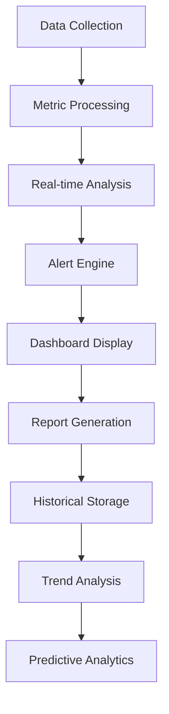

# Chapter 12: System Monitoring
**Comprehensive System Health, Performance, and Infrastructure Monitoring**

---

## Overview

NEO's system monitoring capabilities provide real-time visibility into system health, performance metrics, security events, and infrastructure status. This chapter covers monitoring setup, alerting systems, performance analysis, and proactive system maintenance.

## Monitoring Architecture



## System Health Monitoring

### Core System Metrics

```python
class SystemHealthMonitor:
    def __init__(self):
        self.metrics_collector = MetricsCollector()
        self.alert_manager = AlertManager()
        self.dashboard = MonitoringDashboard()
    
    def collect_system_metrics(self):
        """Collect comprehensive system metrics"""
        metrics = {
            'timestamp': time.time(),
            'cpu': self.get_cpu_metrics(),
            'memory': self.get_memory_metrics(),
            'disk': self.get_disk_metrics(),
            'network': self.get_network_metrics(),
            'processes': self.get_process_metrics(),
            'services': self.get_service_metrics(),
            'temperature': self.get_temperature_metrics(),
            'power': self.get_power_metrics()
        }
        
        return metrics
    
    def get_cpu_metrics(self):
        """Collect CPU performance metrics"""
        return {
            'usage_percent': psutil.cpu_percent(interval=1),
            'usage_per_core': psutil.cpu_percent(interval=1, percpu=True),
            'frequency': psutil.cpu_freq()._asdict(),
            'load_average': os.getloadavg() if hasattr(os, 'getloadavg') else None,
            'context_switches': psutil.cpu_stats().ctx_switches,
            'interrupts': psutil.cpu_stats().interrupts,
            'soft_interrupts': psutil.cpu_stats().soft_interrupts
        }
    
    def get_memory_metrics(self):
        """Collect memory usage metrics"""
        virtual_mem = psutil.virtual_memory()
        swap_mem = psutil.swap_memory()
        
        return {
            'virtual': {
                'total': virtual_mem.total,
                'available': virtual_mem.available,
                'used': virtual_mem.used,
                'percent': virtual_mem.percent,
                'buffers': virtual_mem.buffers,
                'cached': virtual_mem.cached
            },
            'swap': {
                'total': swap_mem.total,
                'used': swap_mem.used,
                'free': swap_mem.free,
                'percent': swap_mem.percent,
                'sin': swap_mem.sin,
                'sout': swap_mem.sout
            }
        }
    
    def analyze_system_health(self, metrics):
        """Analyze system health based on metrics"""
        health_score = 100
        issues = []
        
        # CPU health check
        if metrics['cpu']['usage_percent'] > 90:
            health_score -= 20
            issues.append("High CPU usage detected")
        
        # Memory health check
        if metrics['memory']['virtual']['percent'] > 85:
            health_score -= 15
            issues.append("High memory usage detected")
        
        # Disk health check
        for mount, usage in metrics['disk']['usage'].items():
            if usage['percent'] > 90:
                health_score -= 10
                issues.append(f"Disk space critical on {mount}")
        
        # Temperature check
        if metrics.get('temperature', {}).get('cpu', 0) > 80:
            health_score -= 15
            issues.append("CPU temperature high")
        
        return {
            'score': max(0, health_score),
            'status': self.get_health_status(health_score),
            'issues': issues,
            'timestamp': time.time()
        }
```

### Real-Time Monitoring Dashboard

```bash
# Start system monitoring
neo monitor start --profile comprehensive
neo monitor dashboard --layout advanced --refresh 2s

# Specific monitoring categories
neo monitor cpu --graph --duration 1h
neo monitor memory --details --threshold 80%
neo monitor disk --all-mounts --space-alerts
neo monitor network --interfaces --bandwidth-tracking

# Custom monitoring
neo monitor custom --metrics "cpu,memory,disk" --interval 5s --alerts enabled
```

### Health Check Configuration

```yaml
# ~/.neo/monitoring_config.yaml
monitoring:
  system_health:
    check_interval: 30  # seconds
    metrics_retention: 7  # days
    alert_thresholds:
      cpu_usage: 85
      memory_usage: 90
      disk_usage: 95
      temperature: 80
      load_average: 5.0
    
    critical_services:
      - ssh
      - network-manager
      - systemd
      - neo-agent
    
    auto_remediation:
      enabled: true
      actions:
        high_memory: "clear_cache"
        high_disk: "cleanup_temp"
        high_cpu: "nice_processes"

  alerts:
    channels:
      - email: "admin@example.com"
      - slack: "#monitoring"
      - desktop: true
    
    severity_levels:
      critical: immediate
      high: 5_minutes
      medium: 15_minutes
      low: 1_hour
```

## Performance Monitoring

### Application Performance Monitoring (APM)

```python
class ApplicationMonitor:
    def __init__(self):
        self.traced_applications = {}
        self.performance_metrics = {}
        self.transaction_tracker = TransactionTracker()
    
    def start_application_monitoring(self, app_name, config):
        """Start monitoring an application"""
        monitor_config = {
            'app_name': app_name,
            'process_pattern': config.get('process_pattern'),
            'port_monitoring': config.get('ports', []),
            'log_files': config.get('log_files', []),
            'custom_metrics': config.get('custom_metrics', []),
            'trace_sampling': config.get('trace_sampling', 0.1),
            'performance_budgets': config.get('performance_budgets', {})
        }
        
        # Set up process monitoring
        processes = self.find_application_processes(monitor_config['process_pattern'])
        
        # Set up port monitoring
        for port in monitor_config['port_monitoring']:
            self.monitor_port(port, app_name)
        
        # Set up log monitoring
        for log_file in monitor_config['log_files']:
            self.monitor_log_file(log_file, app_name)
        
        self.traced_applications[app_name] = monitor_config
        
        return True
    
    def collect_application_metrics(self, app_name):
        """Collect performance metrics for an application"""
        if app_name not in self.traced_applications:
            return None
        
        config = self.traced_applications[app_name]
        metrics = {
            'timestamp': time.time(),
            'response_times': self.get_response_times(app_name),
            'throughput': self.get_throughput(app_name),
            'error_rates': self.get_error_rates(app_name),
            'resource_usage': self.get_resource_usage(app_name),
            'database_performance': self.get_database_metrics(app_name),
            'cache_performance': self.get_cache_metrics(app_name),
            'external_dependencies': self.get_dependency_metrics(app_name)
        }
        
        # Check performance budgets
        budget_violations = self.check_performance_budgets(metrics, config['performance_budgets'])
        if budget_violations:
            self.alert_performance_issues(app_name, budget_violations)
        
        return metrics

# Example APM setup
app_monitor = ApplicationMonitor()

app_monitor.start_application_monitoring('web_api', {
    'process_pattern': 'python.*app.py',
    'ports': [8080, 8443],
    'log_files': ['/var/log/webapp/access.log', '/var/log/webapp/error.log'],
    'performance_budgets': {
        'response_time_p95': 500,  # ms
        'error_rate': 0.01,        # 1%
        'cpu_usage': 70,           # %
        'memory_usage': 80         # %
    }
})
```

### Database Monitoring

```python
class DatabaseMonitor:
    def __init__(self):
        self.database_connections = {}
        self.query_analyzer = QueryAnalyzer()
        self.performance_tracker = PerformanceTracker()
    
    def monitor_database(self, db_config):
        """Set up database monitoring"""
        db_name = db_config['name']
        
        monitor = {
            'connection': self.create_connection(db_config),
            'queries': {
                'slow_queries': [],
                'failed_queries': [],
                'query_patterns': {}
            },
            'performance': {
                'connection_pool': {},
                'cache_hit_ratio': 0,
                'index_usage': {},
                'table_stats': {}
            }
        }
        
        self.database_connections[db_name] = monitor
        
        # Start monitoring threads
        self.start_query_monitoring(db_name)
        self.start_performance_monitoring(db_name)
        
        return True
    
    def analyze_database_performance(self, db_name):
        """Analyze database performance"""
        if db_name not in self.database_connections:
            return None
        
        monitor = self.database_connections[db_name]
        
        analysis = {
            'slow_queries': self.analyze_slow_queries(monitor['queries']['slow_queries']),
            'index_recommendations': self.suggest_index_improvements(db_name),
            'schema_optimization': self.analyze_schema_efficiency(db_name),
            'connection_pool_health': self.analyze_connection_pool(monitor['performance']['connection_pool']),
            'cache_efficiency': self.analyze_cache_performance(monitor['performance']['cache_hit_ratio'])
        }
        
        return analysis

# Database monitoring setup
db_monitor = DatabaseMonitor()

db_monitor.monitor_database({
    'name': 'production_db',
    'type': 'postgresql',
    'host': 'localhost',
    'port': 5432,
    'database': 'app_db',
    'monitoring': {
        'slow_query_threshold': 1000,  # ms
        'connection_monitoring': True,
        'index_analysis': True,
        'query_plan_analysis': True
    }
})
```

## Infrastructure Monitoring

### Network Monitoring

```python
class NetworkMonitor:
    def __init__(self):
        self.interfaces = {}
        self.connection_tracker = ConnectionTracker()
        self.bandwidth_monitor = BandwidthMonitor()
    
    def monitor_network_interfaces(self):
        """Monitor all network interfaces"""
        interfaces = psutil.net_if_stats()
        io_counters = psutil.net_io_counters(pernic=True)
        
        network_status = {}
        
        for interface_name, stats in interfaces.items():
            if interface_name in io_counters:
                io_stats = io_counters[interface_name]
                
                network_status[interface_name] = {
                    'is_up': stats.isup,
                    'speed': stats.speed,
                    'mtu': stats.mtu,
                    'bytes_sent': io_stats.bytes_sent,
                    'bytes_recv': io_stats.bytes_recv,
                    'packets_sent': io_stats.packets_sent,
                    'packets_recv': io_stats.packets_recv,
                    'errors_in': io_stats.errin,
                    'errors_out': io_stats.errout,
                    'drops_in': io_stats.dropin,
                    'drops_out': io_stats.dropout
                }
        
        return network_status
    
    def monitor_network_connections(self):
        """Monitor active network connections"""
        connections = psutil.net_connections()
        
        connection_analysis = {
            'total_connections': len(connections),
            'by_status': {},
            'by_protocol': {},
            'listening_ports': [],
            'external_connections': [],
            'suspicious_connections': []
        }
        
        for conn in connections:
            # Count by status
            status = conn.status
            connection_analysis['by_status'][status] = connection_analysis['by_status'].get(status, 0) + 1
            
            # Count by protocol
            protocol = 'TCP' if conn.type == 1 else 'UDP'
            connection_analysis['by_protocol'][protocol] = connection_analysis['by_protocol'].get(protocol, 0) + 1
            
            # Track listening ports
            if status == 'LISTEN' and conn.laddr:
                connection_analysis['listening_ports'].append(conn.laddr.port)
            
            # Track external connections
            if conn.raddr and not self.is_local_address(conn.raddr.ip):
                connection_analysis['external_connections'].append({
                    'remote_ip': conn.raddr.ip,
                    'remote_port': conn.raddr.port,
                    'local_port': conn.laddr.port if conn.laddr else None,
                    'status': status,
                    'pid': conn.pid
                })
        
        # Detect suspicious connections
        connection_analysis['suspicious_connections'] = self.detect_suspicious_connections(connections)
        
        return connection_analysis
```

### Storage Monitoring

```python
class StorageMonitor:
    def __init__(self):
        self.disk_health = DiskHealthChecker()
        self.io_analyzer = IOAnalyzer()
    
    def monitor_disk_health(self):
        """Monitor disk health using SMART data"""
        disks = self.get_physical_disks()
        health_report = {}
        
        for disk in disks:
            try:
                smart_data = self.get_smart_data(disk)
                health_analysis = self.analyze_smart_data(smart_data)
                
                health_report[disk] = {
                    'overall_health': health_analysis['status'],
                    'temperature': smart_data.get('temperature', 0),
                    'power_on_hours': smart_data.get('power_on_hours', 0),
                    'reallocated_sectors': smart_data.get('reallocated_sectors', 0),
                    'pending_sectors': smart_data.get('pending_sectors', 0),
                    'uncorrectable_errors': smart_data.get('uncorrectable_errors', 0),
                    'health_score': health_analysis['score'],
                    'predicted_failure': health_analysis['failure_prediction']
                }
                
            except Exception as e:
                health_report[disk] = {
                    'error': str(e),
                    'status': 'unknown'
                }
        
        return health_report
    
    def monitor_io_performance(self):
        """Monitor disk I/O performance"""
        io_stats = psutil.disk_io_counters(perdisk=True)
        
        io_analysis = {}
        
        for disk, stats in io_stats.items():
            io_analysis[disk] = {
                'read_bytes_per_sec': self.calculate_rate(stats.read_bytes, disk, 'read_bytes'),
                'write_bytes_per_sec': self.calculate_rate(stats.write_bytes, disk, 'write_bytes'),
                'read_iops': self.calculate_rate(stats.read_count, disk, 'read_count'),
                'write_iops': self.calculate_rate(stats.write_count, disk, 'write_count'),
                'read_latency': self.calculate_latency(stats.read_time, stats.read_count),
                'write_latency': self.calculate_latency(stats.write_time, stats.write_count),
                'utilization': self.calculate_utilization(disk),
                'queue_depth': self.get_queue_depth(disk)
            }
        
        return io_analysis
```

## Alert Management System

### Alert Configuration

```yaml
alerts:
  rules:
    # System alerts
    - name: "high_cpu_usage"
      condition: "cpu.usage_percent > 90"
      duration: "5m"
      severity: "warning"
      actions: ["notify", "log"]
    
    - name: "critical_memory_usage"
      condition: "memory.percent > 95"
      duration: "2m"
      severity: "critical"
      actions: ["notify", "clear_cache", "log"]
    
    - name: "disk_space_critical"
      condition: "disk.usage_percent > 95"
      duration: "1m"
      severity: "critical"
      actions: ["notify", "cleanup", "log"]
    
    # Application alerts
    - name: "application_down"
      condition: "app.response_code != 200"
      duration: "30s"
      severity: "critical"
      actions: ["notify", "restart_service", "log"]
    
    - name: "slow_response_time"
      condition: "app.response_time_p95 > 1000"
      duration: "5m"
      severity: "warning"
      actions: ["notify", "log"]
    
    # Security alerts
    - name: "suspicious_login_attempts"
      condition: "security.failed_logins > 10"
      duration: "1m"
      severity: "high"
      actions: ["notify", "block_ip", "log"]

  channels:
    email:
      enabled: true
      smtp_server: "smtp.example.com"
      recipients: ["admin@example.com", "team@example.com"]
    
    slack:
      enabled: true
      webhook_url: "https://hooks.slack.com/..."
      channel: "#alerts"
    
    sms:
      enabled: true
      provider: "twilio"
      numbers: ["+1234567890"]
    
    desktop:
      enabled: true
      priority_filter: "high"  # only high/critical alerts
```

### Alert Processing Engine

```python
class AlertManager:
    def __init__(self):
        self.alert_rules = self.load_alert_rules()
        self.notification_channels = self.setup_notification_channels()
        self.alert_history = []
        self.suppression_rules = {}
    
    def process_metrics(self, metrics):
        """Process metrics and trigger alerts if conditions are met"""
        triggered_alerts = []
        
        for rule in self.alert_rules:
            if self.evaluate_alert_condition(rule, metrics):
                alert = self.create_alert(rule, metrics)
                
                # Check if alert should be suppressed
                if not self.is_suppressed(alert):
                    triggered_alerts.append(alert)
                    self.execute_alert_actions(alert)
        
        return triggered_alerts
    
    def create_alert(self, rule, metrics):
        """Create an alert from rule and metrics"""
        alert = {
            'id': self.generate_alert_id(),
            'rule_name': rule['name'],
            'severity': rule['severity'],
            'condition': rule['condition'],
            'timestamp': time.time(),
            'metrics_snapshot': metrics,
            'message': self.generate_alert_message(rule, metrics),
            'actions': rule['actions'],
            'status': 'active'
        }
        
        return alert
    
    def execute_alert_actions(self, alert):
        """Execute actions defined for an alert"""
        for action in alert['actions']:
            try:
                if action == 'notify':
                    self.send_notifications(alert)
                elif action == 'log':
                    self.log_alert(alert)
                elif action == 'clear_cache':
                    self.clear_system_cache()
                elif action == 'restart_service':
                    self.restart_service(alert['service_name'])
                elif action == 'cleanup':
                    self.cleanup_disk_space()
                # Add more actions as needed
                
            except Exception as e:
                self.log_action_error(action, alert, e)
    
    def send_notifications(self, alert):
        """Send alert notifications through configured channels"""
        message = self.format_alert_message(alert)
        
        for channel_name, channel in self.notification_channels.items():
            try:
                if channel['enabled']:
                    channel['handler'].send(message, alert['severity'])
            except Exception as e:
                self.log_notification_error(channel_name, alert, e)
```

## Custom Monitoring Solutions

### Custom Metric Collection

```python
class CustomMetricsCollector:
    def __init__(self):
        self.custom_metrics = {}
        self.collectors = {}
    
    def register_custom_metric(self, name, collector_func, config):
        """Register a custom metric collector"""
        metric_config = {
            'name': name,
            'collector': collector_func,
            'interval': config.get('interval', 60),
            'tags': config.get('tags', {}),
            'unit': config.get('unit', ''),
            'description': config.get('description', ''),
            'thresholds': config.get('thresholds', {})
        }
        
        self.custom_metrics[name] = metric_config
        
        # Schedule collection
        self.schedule_collection(name, metric_config)
    
    def collect_application_specific_metrics(self):
        """Collect application-specific metrics"""
        metrics = {}
        
        # Web application metrics
        if self.is_web_application_running():
            metrics.update(self.collect_web_metrics())
        
        # Database metrics
        if self.is_database_running():
            metrics.update(self.collect_database_metrics())
        
        # Queue metrics
        if self.is_queue_system_running():
            metrics.update(self.collect_queue_metrics())
        
        return metrics

# Example custom metrics
metrics_collector = CustomMetricsCollector()

# Custom business metric
def collect_active_users():
    """Collect number of active users"""
    # Query application database or API
    return get_active_user_count()

metrics_collector.register_custom_metric('active_users', collect_active_users, {
    'interval': 300,  # 5 minutes
    'unit': 'count',
    'description': 'Number of currently active users',
    'thresholds': {'warning': 1000, 'critical': 5000}
})

# Custom performance metric
def collect_transaction_rate():
    """Collect transaction processing rate"""
    return get_transactions_per_second()

metrics_collector.register_custom_metric('transaction_rate', collect_transaction_rate, {
    'interval': 60,
    'unit': 'transactions/second',
    'thresholds': {'warning': 100, 'critical': 500}
})
```

## Monitoring Commands and Usage

### Basic Monitoring Commands

```bash
# System overview
neo monitor overview --live
neo monitor status --all-components

# Detailed monitoring
neo monitor cpu --graph --duration 24h
neo monitor memory --details --threshold-alerts
neo monitor disk --all-mounts --io-stats
neo monitor network --interfaces --bandwidth

# Process monitoring
neo monitor processes --top 20 --sort memory
neo monitor process --pid 1234 --detailed

# Service monitoring
neo monitor services --critical-only
neo monitor service --name nginx --health-checks
```

### Advanced Monitoring Commands

```bash
# Custom monitoring profiles
neo monitor profile create --name "web_server" \
  --metrics "cpu,memory,network,disk" \
  --applications "nginx,php-fpm" \
  --thresholds high_performance.yaml

# Monitoring automation
neo monitor auto-setup --environment production \
  --enable-predictions --smart-alerts

# Historical analysis
neo monitor analyze --timeframe "last_week" \
  --generate-report --export pdf

# Real-time dashboards
neo monitor dashboard --layout grid \
  --widgets "cpu,memory,disk,network,alerts" \
  --refresh 5s
```

## Monitoring Examples

### Example 1: Web Application Monitoring

```bash
# Comprehensive web application monitoring
neo monitor app create --name "e-commerce" \
  --type web \
  --endpoints "https://shop.example.com" \
  --database "postgresql://localhost/shop" \
  --cache "redis://localhost:6379"

# Monitor specific metrics
neo monitor app "e-commerce" \
  --response-times --error-rates \
  --database-queries --cache-hit-ratio \
  --user-sessions --transactions
```

### Example 2: Infrastructure Monitoring

```bash
# Set up infrastructure monitoring
neo monitor infrastructure setup \
  --servers "web01,web02,db01" \
  --load-balancer "lb01" \
  --storage "nas01" \
  --network-devices "switch01,router01"

# Monitor infrastructure health
neo monitor infrastructure dashboard \
  --topology-view --health-status \
  --capacity-planning --alerts
```

### Example 3: Security Monitoring

```bash
# Enable security monitoring
neo monitor security enable \
  --log-analysis --intrusion-detection \
  --vulnerability-scanning --compliance-checks

# Security dashboard
neo monitor security dashboard \
  --threat-intelligence --incident-tracking \
  --compliance-status --risk-assessment
```

## Best Practices

### Monitoring Strategy

1. **Start Simple**: Begin with basic system metrics
2. **Layer Gradually**: Add application and business metrics
3. **Set Meaningful Thresholds**: Avoid alert fatigue
4. **Document Everything**: Maintain monitoring documentation
5. **Regular Reviews**: Periodically review and adjust monitoring

### Performance Considerations

```yaml
monitoring_best_practices:
  data_retention:
    high_frequency_metrics: 7_days
    medium_frequency_metrics: 30_days
    low_frequency_metrics: 1_year
    aggregated_data: 5_years
  
  collection_intervals:
    system_metrics: 30_seconds
    application_metrics: 60_seconds
    business_metrics: 300_seconds
    security_events: real_time
  
  alert_management:
    escalation_tiers: 3
    suppression_windows: true
    maintenance_modes: true
    alert_correlation: enabled
```

---

**Next Chapter**: [Research & Analysis →](16-research-analysis.md)

**Previous Chapter**: [← Process Management](11-process-management.md)
