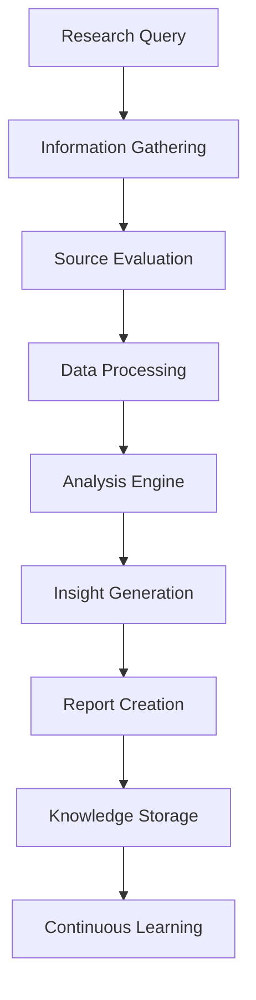

# Chapter 16: Research & Analysis
**AI-Powered Research, Data Analysis, and Knowledge Discovery**

---

## Overview

NEO's research and analysis capabilities combine advanced AI algorithms, natural language processing, and machine learning to conduct comprehensive research, analyze complex data, and generate actionable insights. This chapter covers research methodologies, data analysis techniques, and knowledge discovery processes.

## Research Architecture



## Information Gathering and Sources

### Multi-Source Research

```python
class ResearchEngine:
    def __init__(self):
        self.sources = {
            'academic': AcademicSourceManager(),
            'web': WebScrapingEngine(),
            'documents': DocumentAnalyzer(),
            'databases': DatabaseConnector(),
            'apis': APIManager(),
            'multimedia': MultimediaAnalyzer()
        }
        self.knowledge_base = KnowledgeBase()
        self.citation_manager = CitationManager()
    
    def conduct_research(self, research_query, scope='comprehensive'):
        """Conduct comprehensive research on a topic"""
        
        # Parse and understand the research query
        query_analysis = self.analyze_research_query(research_query)
        
        # Determine research strategy
        strategy = self.develop_research_strategy(query_analysis, scope)
        
        # Gather information from multiple sources
        gathered_data = {}
        for source_type in strategy['sources']:
            try:
                data = self.sources[source_type].search(query_analysis['keywords'])
                gathered_data[source_type] = data
            except Exception as e:
                self.log_source_error(source_type, e)
        
        # Process and analyze gathered information
        analysis_results = self.analyze_gathered_data(gathered_data, query_analysis)
        
        # Generate insights and conclusions
        insights = self.generate_insights(analysis_results, query_analysis)
        
        # Create comprehensive research report
        report = self.create_research_report(insights, gathered_data, query_analysis)
        
        return report
    
    def analyze_research_query(self, query):
        """Analyze and decompose research query"""
        return {
            'main_topic': self.extract_main_topic(query),
            'keywords': self.extract_keywords(query),
            'research_type': self.classify_research_type(query),
            'scope': self.determine_scope(query),
            'timeframe': self.extract_timeframe(query),
            'specific_questions': self.extract_questions(query)
        }

# Example research usage
research_engine = ResearchEngine()

research_result = research_engine.conduct_research(
    "Latest advances in quantum computing and their applications in cryptography",
    scope='comprehensive'
)
```

### Academic Research Integration

```python
class AcademicResearcher:
    def __init__(self):
        self.paper_databases = {
            'arxiv': ArxivConnector(),
            'pubmed': PubMedConnector(),
            'ieee': IEEEConnector(),
            'acm': ACMConnector(),
            'google_scholar': GoogleScholarConnector()
        }
        self.citation_analyzer = CitationAnalyzer()
        self.peer_review_tracker = PeerReviewTracker()
    
    def search_academic_papers(self, query, filters=None):
        """Search academic papers across multiple databases"""
        
        search_results = {}
        
        for db_name, connector in self.paper_databases.items():
            try:
                results = connector.search(
                    query=query,
                    filters=filters or {},
                    max_results=50
                )
                
                # Enhance results with metadata
                enhanced_results = []
                for paper in results:
                    enhanced_paper = self.enhance_paper_metadata(paper)
                    enhanced_results.append(enhanced_paper)
                
                search_results[db_name] = enhanced_results
                
            except Exception as e:
                self.log_database_error(db_name, e)
        
        # Rank and deduplicate results
        ranked_results = self.rank_papers(search_results)
        deduplicated_results = self.remove_duplicates(ranked_results)
        
        return deduplicated_results
    
    def analyze_research_trends(self, topic, timeframe='5_years'):
        """Analyze research trends in a specific field"""
        
        papers = self.search_academic_papers(
            query=topic,
            filters={'date_range': timeframe}
        )
        
        trend_analysis = {
            'publication_volume': self.analyze_publication_volume(papers),
            'key_researchers': self.identify_key_researchers(papers),
            'emerging_subtopics': self.identify_emerging_topics(papers),
            'citation_patterns': self.analyze_citation_patterns(papers),
            'collaboration_networks': self.analyze_collaborations(papers),
            'geographic_distribution': self.analyze_geographic_trends(papers)
        }
        
        return trend_analysis
    
    def generate_literature_review(self, topic, papers):
        """Generate comprehensive literature review"""
        
        # Organize papers by themes
        themes = self.identify_themes(papers)
        
        # Analyze each theme
        theme_analysis = {}
        for theme, theme_papers in themes.items():
            theme_analysis[theme] = {
                'key_findings': self.extract_key_findings(theme_papers),
                'methodologies': self.analyze_methodologies(theme_papers),
                'gaps': self.identify_research_gaps(theme_papers),
                'future_directions': self.suggest_future_research(theme_papers)
            }
        
        # Generate narrative review
        literature_review = self.synthesize_literature_review(theme_analysis, topic)
        
        return literature_review
```

## Data Analysis Capabilities

### Statistical Analysis Engine

```python
class StatisticalAnalyzer:
    def __init__(self):
        self.statistical_tests = StatisticalTestSuite()
        self.visualization_engine = VisualizationEngine()
        self.hypothesis_tester = HypothesisTester()
    
    def analyze_dataset(self, data, analysis_type='exploratory'):
        """Perform comprehensive statistical analysis"""
        
        # Data preprocessing
        cleaned_data = self.preprocess_data(data)
        
        # Exploratory data analysis
        eda_results = self.exploratory_analysis(cleaned_data)
        
        # Statistical testing based on analysis type
        if analysis_type == 'exploratory':
            results = self.exploratory_statistical_analysis(cleaned_data)
        elif analysis_type == 'confirmatory':
            results = self.confirmatory_analysis(cleaned_data)
        elif analysis_type == 'predictive':
            results = self.predictive_analysis(cleaned_data)
        
        # Generate insights
        insights = self.generate_statistical_insights(results, eda_results)
        
        return {
            'eda': eda_results,
            'statistical_tests': results,
            'insights': insights,
            'visualizations': self.create_visualizations(cleaned_data, results)
        }
    
    def exploratory_analysis(self, data):
        """Perform exploratory data analysis"""
        
        analysis = {
            'descriptive_stats': self.calculate_descriptive_statistics(data),
            'distribution_analysis': self.analyze_distributions(data),
            'correlation_analysis': self.analyze_correlations(data),
            'outlier_detection': self.detect_outliers(data),
            'missing_data_analysis': self.analyze_missing_data(data),
            'data_quality_assessment': self.assess_data_quality(data)
        }
        
        return analysis
    
    def hypothesis_testing(self, data, hypotheses):
        """Perform hypothesis testing"""
        
        test_results = {}
        
        for hypothesis in hypotheses:
            test_type = self.determine_appropriate_test(hypothesis, data)
            
            test_result = self.statistical_tests.run_test(
                test_type=test_type,
                data=data,
                hypothesis=hypothesis
            )
            
            test_results[hypothesis['name']] = {
                'test_type': test_type,
                'statistic': test_result['statistic'],
                'p_value': test_result['p_value'],
                'confidence_interval': test_result['confidence_interval'],
                'interpretation': self.interpret_test_result(test_result, hypothesis),
                'effect_size': test_result.get('effect_size'),
                'power_analysis': test_result.get('power_analysis')
            }
        
        return test_results

# Example statistical analysis
analyzer = StatisticalAnalyzer()

# Analyze sales data
sales_analysis = analyzer.analyze_dataset(
    data=sales_dataframe,
    analysis_type='exploratory'
)

# Test specific hypotheses
hypothesis_results = analyzer.hypothesis_testing(
    data=sales_dataframe,
    hypotheses=[
        {
            'name': 'seasonal_effect',
            'null_hypothesis': 'No seasonal effect on sales',
            'alternative_hypothesis': 'Seasonal effect exists',
            'variables': ['month', 'sales_amount']
        }
    ]
)
```

### Machine Learning Analysis

```python
class MLAnalysisEngine:
    def __init__(self):
        self.model_selector = AutoMLModelSelector()
        self.feature_engineer = FeatureEngineer()
        self.interpretability_engine = ModelInterpretabilityEngine()
    
    def automated_ml_analysis(self, data, target_variable, problem_type='auto'):
        """Perform automated machine learning analysis"""
        
        # Detect problem type if not specified
        if problem_type == 'auto':
            problem_type = self.detect_problem_type(data, target_variable)
        
        # Feature engineering
        engineered_features = self.feature_engineer.generate_features(data)
        
        # Model selection and training
        best_models = self.model_selector.find_best_models(
            features=engineered_features,
            target=data[target_variable],
            problem_type=problem_type,
            num_models=5
        )
        
        # Model evaluation
        evaluation_results = {}
        for model_name, model in best_models.items():
            evaluation = self.evaluate_model(model, engineered_features, data[target_variable])
            evaluation_results[model_name] = evaluation
        
        # Select best model
        best_model = self.select_best_model(evaluation_results)
        
        # Generate interpretability analysis
        interpretability = self.interpretability_engine.analyze_model(
            model=best_model['model'],
            features=engineered_features,
            target=data[target_variable]
        )
        
        return {
            'best_model': best_model,
            'all_models': evaluation_results,
            'feature_importance': interpretability['feature_importance'],
            'model_explanations': interpretability['explanations'],
            'predictions': best_model['predictions'],
            'confidence_intervals': best_model['confidence_intervals']
        }
    
    def time_series_analysis(self, data, time_column, value_column):
        """Perform comprehensive time series analysis"""
        
        # Prepare time series data
        ts_data = self.prepare_time_series(data, time_column, value_column)
        
        # Decomposition analysis
        decomposition = self.decompose_time_series(ts_data)
        
        # Trend analysis
        trend_analysis = self.analyze_trend(ts_data)
        
        # Seasonality analysis
        seasonality_analysis = self.analyze_seasonality(ts_data)
        
        # Forecasting
        forecast_models = self.build_forecast_models(ts_data)
        best_forecast_model = self.select_best_forecast_model(forecast_models)
        
        # Generate forecasts
        forecasts = self.generate_forecasts(best_forecast_model, periods=12)
        
        return {
            'decomposition': decomposition,
            'trend_analysis': trend_analysis,
            'seasonality_analysis': seasonality_analysis,
            'forecast_models': forecast_models,
            'best_model': best_forecast_model,
            'forecasts': forecasts,
            'confidence_intervals': forecasts['confidence_intervals']
        }
```

## Knowledge Discovery and Synthesis

### Pattern Recognition Engine

```python
class PatternDiscoveryEngine:
    def __init__(self):
        self.pattern_detectors = {
            'sequence': SequencePatternDetector(),
            'association': AssociationRuleEngine(),
            'anomaly': AnomalyDetector(),
            'clustering': ClusteringEngine(),
            'causal': CausalInferenceEngine()
        }
        self.knowledge_synthesizer = KnowledgeSynthesizer()
    
    def discover_patterns(self, data, pattern_types=['all']):
        """Discover patterns in data"""
        
        discovered_patterns = {}
        
        # Select pattern detectors
        if 'all' in pattern_types:
            detectors_to_use = self.pattern_detectors
        else:
            detectors_to_use = {k: v for k, v in self.pattern_detectors.items() 
                               if k in pattern_types}
        
        # Run pattern detection
        for pattern_type, detector in detectors_to_use.items():
            try:
                patterns = detector.detect_patterns(data)
                discovered_patterns[pattern_type] = patterns
            except Exception as e:
                self.log_pattern_detection_error(pattern_type, e)
        
        # Synthesize cross-pattern insights
        synthesized_insights = self.knowledge_synthesizer.synthesize_patterns(
            discovered_patterns
        )
        
        return {
            'patterns': discovered_patterns,
            'synthesized_insights': synthesized_insights,
            'pattern_confidence': self.calculate_pattern_confidence(discovered_patterns),
            'actionable_insights': self.extract_actionable_insights(synthesized_insights)
        }
    
    def causal_analysis(self, data, treatment_var, outcome_var, confounders=None):
        """Perform causal inference analysis"""
        
        causal_engine = self.pattern_detectors['causal']
        
        # Identify potential confounders if not provided
        if confounders is None:
            confounders = causal_engine.identify_confounders(
                data, treatment_var, outcome_var
            )
        
        # Estimate causal effects using multiple methods
        causal_estimates = {
            'matching': causal_engine.propensity_score_matching(
                data, treatment_var, outcome_var, confounders
            ),
            'instrumental_variables': causal_engine.instrumental_variables(
                data, treatment_var, outcome_var
            ),
            'regression_discontinuity': causal_engine.regression_discontinuity(
                data, treatment_var, outcome_var
            ),
            'difference_in_differences': causal_engine.difference_in_differences(
                data, treatment_var, outcome_var
            )
        }
        
        # Validate causal assumptions
        assumption_tests = causal_engine.test_causal_assumptions(
            data, treatment_var, outcome_var, confounders
        )
        
        # Synthesize causal conclusions
        causal_conclusion = causal_engine.synthesize_causal_evidence(
            causal_estimates, assumption_tests
        )
        
        return {
            'causal_estimates': causal_estimates,
            'assumption_tests': assumption_tests,
            'conclusion': causal_conclusion,
            'confidence_level': causal_conclusion['confidence'],
            'recommendations': causal_conclusion['recommendations']
        }
```

### Report Generation and Visualization

```python
class ResearchReportGenerator:
    def __init__(self):
        self.template_engine = ReportTemplateEngine()
        self.visualization_engine = AdvancedVisualizationEngine()
        self.narrative_generator = NarrativeGenerator()
    
    def generate_comprehensive_report(self, research_data, analysis_results, report_type='academic'):
        """Generate comprehensive research report"""
        
        # Select appropriate template
        template = self.template_engine.get_template(report_type)
        
        # Generate narrative sections
        narrative_sections = {
            'executive_summary': self.narrative_generator.generate_executive_summary(
                research_data, analysis_results
            ),
            'methodology': self.narrative_generator.generate_methodology_section(
                analysis_results['methods']
            ),
            'findings': self.narrative_generator.generate_findings_section(
                analysis_results['results']
            ),
            'discussion': self.narrative_generator.generate_discussion_section(
                analysis_results['insights']
            ),
            'conclusions': self.narrative_generator.generate_conclusions_section(
                analysis_results['conclusions']
            ),
            'recommendations': self.narrative_generator.generate_recommendations_section(
                analysis_results['actionable_insights']
            )
        }
        
        # Generate visualizations
        visualizations = self.visualization_engine.create_report_visualizations(
            data=research_data,
            analysis_results=analysis_results,
            chart_types=['statistical', 'trend', 'comparison', 'distribution']
        )
        
        # Compile report
        report = self.template_engine.compile_report(
            template=template,
            narrative_sections=narrative_sections,
            visualizations=visualizations,
            metadata={
                'generation_date': datetime.now(),
                'analysis_methods': analysis_results['methods'],
                'data_sources': research_data['sources'],
                'confidence_levels': analysis_results['confidence']
            }
        )
        
        return report
    
    def create_interactive_dashboard(self, analysis_results):
        """Create interactive analysis dashboard"""
        
        dashboard_components = {
            'overview_panel': self.create_overview_panel(analysis_results),
            'data_explorer': self.create_data_explorer(analysis_results['data']),
            'statistical_panel': self.create_statistical_panel(analysis_results['statistics']),
            'ml_panel': self.create_ml_panel(analysis_results['ml_results']),
            'insights_panel': self.create_insights_panel(analysis_results['insights'])
        }
        
        # Generate interactive dashboard
        dashboard = self.visualization_engine.create_interactive_dashboard(
            components=dashboard_components,
            layout='responsive',
            theme='professional'
        )
        
        return dashboard
```

## Research Commands and Usage

### Basic Research Commands

```bash
# General research
neo research --topic "artificial intelligence ethics" --scope comprehensive
neo research --question "What are the latest developments in quantum computing?"

# Academic research
neo research academic --query "machine learning in healthcare" \
  --databases "pubmed,arxiv,ieee" --years "2020-2024"

# Data analysis
neo analyze data --file dataset.csv --type exploratory
neo analyze data --file sales_data.csv --target revenue --ml-analysis

# Literature review
neo research literature-review --topic "blockchain security" \
  --timeframe "5_years" --output-format pdf
```

### Advanced Research Commands

```bash
# Multi-source research
neo research comprehensive --topic "climate change impacts" \
  --sources "academic,news,reports,datasets" \
  --languages "en,es,fr" \
  --export-citations

# Trend analysis
neo research trends --topic "artificial intelligence" \
  --timeframe "10_years" --geographic-analysis \
  --prediction-horizon "2_years"

# Competitive analysis
neo research competitive --industry "renewable_energy" \
  --companies "tesla,solarcity,sunpower" \
  --metrics "patents,publications,market_share"

# Custom analysis
neo analyze custom --data multiple_sources \
  --methods "statistical,ml,causal" \
  --hypothesis-testing --confidence-level 0.95
```

## Research Examples

### Example 1: Market Research Analysis

```bash
# Comprehensive market research
neo research market --industry "electric_vehicles" \
  --regions "north_america,europe,asia" \
  --timeframe "5_years" \
  --include-forecasts

# Analysis results include:
# - Market size and growth trends
# - Key players and market share
# - Technology developments
# - Regulatory landscape
# - Consumer behavior patterns
# - Investment flows
# - Competitive positioning
```

### Example 2: Scientific Literature Analysis

```bash
# Analyze research trends in a field
neo research scientific --field "quantum_computing" \
  --analysis-type "trend_analysis" \
  --collaboration-networks \
  --emerging-topics

# Results include:
# - Publication volume trends
# - Key researchers and institutions
# - Collaboration patterns
# - Emerging research areas
# - Citation impact analysis
# - Geographic distribution
```

### Example 3: Business Intelligence Research

```bash
# Business intelligence analysis
neo research business --company "tech_startup" \
  --competitors "list_of_competitors" \
  --market-analysis --swot-analysis \
  --financial-analysis

# Analysis includes:
# - Competitive landscape
# - Market positioning
# - SWOT analysis
# - Financial performance
# - Strategic recommendations
# - Risk assessment
```

## Knowledge Management

### Knowledge Base Integration

```python
class KnowledgeManager:
    def __init__(self):
        self.knowledge_base = GraphKnowledgeBase()
        self.entity_extractor = EntityExtractor()
        self.relationship_mapper = RelationshipMapper()
    
    def process_research_findings(self, research_results):
        """Process and integrate research findings into knowledge base"""
        
        # Extract entities and concepts
        entities = self.entity_extractor.extract_entities(research_results)
        
        # Map relationships
        relationships = self.relationship_mapper.map_relationships(
            entities, research_results
        )
        
        # Update knowledge base
        self.knowledge_base.add_entities(entities)
        self.knowledge_base.add_relationships(relationships)
        
        # Create knowledge summary
        knowledge_summary = self.create_knowledge_summary(entities, relationships)
        
        return knowledge_summary
    
    def query_knowledge_base(self, query):
        """Query the knowledge base for information"""
        
        # Parse query
        parsed_query = self.parse_knowledge_query(query)
        
        # Search knowledge base
        results = self.knowledge_base.search(parsed_query)
        
        # Generate response
        response = self.generate_knowledge_response(results, query)
        
        return response
```

### Continuous Learning Integration

```yaml
learning_integration:
  research_feedback:
    - user_corrections
    - expert_validation
    - peer_review_integration
    - citation_tracking
  
  model_updates:
    - research_methodology_refinement
    - source_reliability_scoring
    - analysis_accuracy_improvement
    - insight_quality_enhancement
  
  knowledge_evolution:
    - concept_relationship_updates
    - entity_disambiguation
    - knowledge_conflict_resolution
    - temporal_knowledge_tracking
```

## Best Practices

### Research Methodology

1. **Multi-Source Validation**: Always validate findings across multiple sources
2. **Bias Awareness**: Recognize and account for potential biases
3. **Methodological Rigor**: Apply appropriate analytical methods
4. **Transparency**: Document methodology and limitations
5. **Continuous Updates**: Keep research current with latest developments

### Analysis Quality Assurance

```yaml
quality_assurance:
  data_validation:
    - source_credibility_check
    - data_quality_assessment
    - sample_size_adequacy
    - bias_detection
  
  analytical_rigor:
    - appropriate_method_selection
    - assumption_validation
    - sensitivity_analysis
    - robustness_testing
  
  result_validation:
    - cross_validation
    - peer_review
    - reproducibility_testing
    - uncertainty_quantification
```

---

**Next Chapter**: [Data Analysis →](18-data-analysis.md)

**Previous Chapter**: [← Code Development](15-code-development.md)
