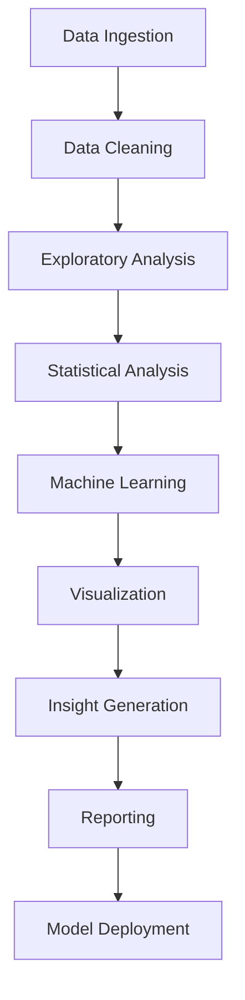

# Chapter 18: Data Analysis
**Advanced Data Processing, Statistical Analysis, and Predictive Modeling**

---

## Overview

NEO's data analysis capabilities provide comprehensive tools for data processing, statistical analysis, machine learning, and predictive modeling. This chapter covers data handling workflows, analytical techniques, visualization methods, and automated insights generation.

## Data Analysis Framework



## Data Processing and Preparation

### Data Ingestion Engine

```python
class DataIngestionEngine:
    def __init__(self):
        self.connectors = {
            'csv': CSVConnector(),
            'json': JSONConnector(),
            'database': DatabaseConnector(),
            'api': APIConnector(),
            'streaming': StreamingConnector(),
            'parquet': ParquetConnector(),
            'excel': ExcelConnector(),
            'xml': XMLConnector()
        }
        self.schema_detector = SchemaDetector()
        self.data_profiler = DataProfiler()
    
    def ingest_data(self, source_config):
        """Ingest data from various sources"""
        source_type = source_config['type']
        
        if source_type not in self.connectors:
            raise ValueError(f"Unsupported source type: {source_type}")
        
        connector = self.connectors[source_type]
        
        # Load data
        raw_data = connector.load(source_config)
        
        # Detect schema
        schema = self.schema_detector.detect_schema(raw_data)
        
        # Profile data
        profile = self.data_profiler.profile_data(raw_data)
        
        return {
            'data': raw_data,
            'schema': schema,
            'profile': profile,
            'metadata': {
                'source': source_config,
                'ingestion_time': datetime.now(),
                'record_count': len(raw_data),
                'column_count': len(raw_data.columns) if hasattr(raw_data, 'columns') else 0
            }
        }
    
    def batch_ingest(self, source_configs):
        """Ingest data from multiple sources"""
        ingested_datasets = {}
        
        for name, config in source_configs.items():
            try:
                dataset = self.ingest_data(config)
                ingested_datasets[name] = dataset
            except Exception as e:
                self.log_ingestion_error(name, config, e)
        
        return ingested_datasets

# Example data ingestion
ingestion_engine = DataIngestionEngine()

# Ingest from multiple sources
datasets = ingestion_engine.batch_ingest({
    'sales_data': {
        'type': 'csv',
        'path': '/data/sales.csv',
        'delimiter': ',',
        'encoding': 'utf-8'
    },
    'customer_data': {
        'type': 'database',
        'connection_string': 'postgresql://localhost/crm',
        'query': 'SELECT * FROM customers'
    },
    'web_analytics': {
        'type': 'api',
        'url': 'https://api.analytics.com/data',
        'auth': {'type': 'bearer_token', 'token': 'xxx'}
    }
})
```

### Data Cleaning and Transformation

```python
class DataCleaner:
    def __init__(self):
        self.anomaly_detector = AnomalyDetector()
        self.missing_value_handler = MissingValueHandler()
        self.outlier_detector = OutlierDetector()
        self.data_validator = DataValidator()
    
    def clean_dataset(self, data, cleaning_config=None):
        """Comprehensive data cleaning"""
        
        if cleaning_config is None:
            cleaning_config = self.generate_default_config(data)
        
        cleaned_data = data.copy()
        cleaning_report = {
            'operations': [],
            'issues_found': [],
            'quality_score': 0
        }
        
        # Handle missing values
        if cleaning_config.get('handle_missing', True):
            missing_result = self.missing_value_handler.handle_missing_values(
                cleaned_data, method=cleaning_config.get('missing_method', 'auto')
            )
            cleaned_data = missing_result['data']
            cleaning_report['operations'].append('missing_value_handling')
            cleaning_report['issues_found'].extend(missing_result['issues'])
        
        # Remove duplicates
        if cleaning_config.get('remove_duplicates', True):
            duplicate_result = self.remove_duplicates(cleaned_data)
            cleaned_data = duplicate_result['data']
            cleaning_report['operations'].append('duplicate_removal')
            cleaning_report['issues_found'].extend(duplicate_result['issues'])
        
        # Handle outliers
        if cleaning_config.get('handle_outliers', True):
            outlier_result = self.outlier_detector.handle_outliers(
                cleaned_data, method=cleaning_config.get('outlier_method', 'auto')
            )
            cleaned_data = outlier_result['data']
            cleaning_report['operations'].append('outlier_handling')
            cleaning_report['issues_found'].extend(outlier_result['issues'])
        
        # Standardize formats
        if cleaning_config.get('standardize_formats', True):
            format_result = self.standardize_formats(cleaned_data)
            cleaned_data = format_result['data']
            cleaning_report['operations'].append('format_standardization')
        
        # Validate data quality
        quality_assessment = self.data_validator.assess_quality(cleaned_data)
        cleaning_report['quality_score'] = quality_assessment['overall_score']
        
        return {
            'data': cleaned_data,
            'cleaning_report': cleaning_report,
            'quality_assessment': quality_assessment
        }
    
    def feature_engineering(self, data, target_column=None):
        """Automated feature engineering"""
        
        engineered_features = data.copy()
        feature_report = {
            'new_features': [],
            'transformations': [],
            'feature_importance': {}
        }
        
        # Date/time features
        date_columns = self.identify_date_columns(data)
        for col in date_columns:
            date_features = self.extract_date_features(data[col])
            for feature_name, feature_data in date_features.items():
                engineered_features[f"{col}_{feature_name}"] = feature_data
                feature_report['new_features'].append(f"{col}_{feature_name}")
        
        # Categorical encoding
        categorical_columns = self.identify_categorical_columns(data)
        for col in categorical_columns:
            encoded_features = self.encode_categorical(data[col])
            for feature_name, feature_data in encoded_features.items():
                engineered_features[feature_name] = feature_data
                feature_report['new_features'].append(feature_name)
        
        # Numerical transformations
        numerical_columns = self.identify_numerical_columns(data)
        for col in numerical_columns:
            transformations = self.apply_numerical_transformations(data[col])
            for transformation_name, transformed_data in transformations.items():
                feature_name = f"{col}_{transformation_name}"
                engineered_features[feature_name] = transformed_data
                feature_report['new_features'].append(feature_name)
        
        # Interaction features
        interaction_features = self.create_interaction_features(
            engineered_features, max_features=10
        )
        for feature_name, feature_data in interaction_features.items():
            engineered_features[feature_name] = feature_data
            feature_report['new_features'].append(feature_name)
        
        # Feature selection
        if target_column:
            selected_features = self.select_important_features(
                engineered_features, target_column, top_k=50
            )
            feature_report['feature_importance'] = selected_features['importance_scores']
            engineered_features = selected_features['selected_data']
        
        return {
            'data': engineered_features,
            'feature_report': feature_report
        }
```

## Statistical Analysis Engine

### Descriptive Statistics

```python
class DescriptiveAnalyzer:
    def __init__(self):
        self.distribution_analyzer = DistributionAnalyzer()
        self.correlation_analyzer = CorrelationAnalyzer()
        self.summary_generator = SummaryGenerator()
    
    def comprehensive_descriptive_analysis(self, data):
        """Perform comprehensive descriptive analysis"""
        
        analysis_result = {
            'univariate_analysis': {},
            'bivariate_analysis': {},
            'multivariate_analysis': {},
            'summary_insights': []
        }
        
        # Univariate analysis for each column
        for column in data.columns:
            column_analysis = self.analyze_single_variable(data[column])
            analysis_result['univariate_analysis'][column] = column_analysis
        
        # Bivariate analysis (correlations)
        numerical_columns = data.select_dtypes(include=[np.number]).columns
        if len(numerical_columns) > 1:
            correlation_matrix = self.correlation_analyzer.compute_correlations(
                data[numerical_columns]
            )
            analysis_result['bivariate_analysis']['correlations'] = correlation_matrix
        
        # Multivariate analysis
        if len(numerical_columns) > 2:
            multivariate_result = self.multivariate_analysis(data[numerical_columns])
            analysis_result['multivariate_analysis'] = multivariate_result
        
        # Generate insights
        insights = self.summary_generator.generate_insights(analysis_result)
        analysis_result['summary_insights'] = insights
        
        return analysis_result
    
    def analyze_single_variable(self, series):
        """Analyze a single variable"""
        
        if pd.api.types.is_numeric_dtype(series):
            return self.analyze_numerical_variable(series)
        else:
            return self.analyze_categorical_variable(series)
    
    def analyze_numerical_variable(self, series):
        """Analyze numerical variable"""
        
        # Remove missing values for analysis
        clean_series = series.dropna()
        
        # Basic statistics
        basic_stats = {
            'count': len(clean_series),
            'missing_count': len(series) - len(clean_series),
            'mean': clean_series.mean(),
            'median': clean_series.median(),
            'mode': clean_series.mode().iloc[0] if len(clean_series.mode()) > 0 else None,
            'std': clean_series.std(),
            'variance': clean_series.var(),
            'min': clean_series.min(),
            'max': clean_series.max(),
            'range': clean_series.max() - clean_series.min(),
            'q25': clean_series.quantile(0.25),
            'q75': clean_series.quantile(0.75),
            'iqr': clean_series.quantile(0.75) - clean_series.quantile(0.25),
            'skewness': clean_series.skew(),
            'kurtosis': clean_series.kurtosis()
        }
        
        # Distribution analysis
        distribution_info = self.distribution_analyzer.analyze_distribution(clean_series)
        
        # Outlier detection
        outliers = self.detect_outliers_iqr(clean_series)
        
        return {
            'type': 'numerical',
            'basic_statistics': basic_stats,
            'distribution': distribution_info,
            'outliers': outliers,
            'quality_flags': self.assess_variable_quality(basic_stats, outliers)
        }
    
    def analyze_categorical_variable(self, series):
        """Analyze categorical variable"""
        
        # Value counts
        value_counts = series.value_counts()
        
        # Basic statistics
        basic_stats = {
            'count': len(series),
            'missing_count': series.isnull().sum(),
            'unique_count': series.nunique(),
            'most_frequent': value_counts.index[0] if len(value_counts) > 0 else None,
            'most_frequent_count': value_counts.iloc[0] if len(value_counts) > 0 else 0,
            'least_frequent': value_counts.index[-1] if len(value_counts) > 0 else None,
            'least_frequent_count': value_counts.iloc[-1] if len(value_counts) > 0 else 0
        }
        
        # Distribution analysis
        distribution_info = {
            'frequency_table': value_counts.to_dict(),
            'proportion_table': (value_counts / len(series)).to_dict(),
            'entropy': self.calculate_entropy(value_counts),
            'concentration_ratio': self.calculate_concentration_ratio(value_counts)
        }
        
        return {
            'type': 'categorical',
            'basic_statistics': basic_stats,
            'distribution': distribution_info,
            'quality_flags': self.assess_categorical_quality(basic_stats, distribution_info)
        }
```

### Inferential Statistics

```python
class InferentialAnalyzer:
    def __init__(self):
        self.hypothesis_tester = HypothesisTester()
        self.confidence_interval_calculator = ConfidenceIntervalCalculator()
        self.effect_size_calculator = EffectSizeCalculator()
    
    def comparative_analysis(self, data, group_column, value_column, test_type='auto'):
        """Perform comparative analysis between groups"""
        
        # Group data
        groups = data.groupby(group_column)[value_column]
        group_data = [group.dropna().values for name, group in groups]
        group_names = [name for name, group in groups]
        
        # Determine appropriate test
        if test_type == 'auto':
            test_type = self.determine_appropriate_test(group_data)
        
        # Perform statistical test
        test_result = self.hypothesis_tester.run_test(test_type, group_data)
        
        # Calculate effect size
        effect_size = self.effect_size_calculator.calculate_effect_size(
            group_data, test_type
        )
        
        # Generate confidence intervals
        confidence_intervals = {}
        for i, (name, data_group) in enumerate(zip(group_names, group_data)):
            ci = self.confidence_interval_calculator.calculate_ci(
                data_group, confidence_level=0.95
            )
            confidence_intervals[name] = ci
        
        # Interpret results
        interpretation = self.interpret_test_result(
            test_result, effect_size, group_names
        )
        
        return {
            'test_type': test_type,
            'test_statistic': test_result['statistic'],
            'p_value': test_result['p_value'],
            'effect_size': effect_size,
            'confidence_intervals': confidence_intervals,
            'interpretation': interpretation,
            'group_statistics': self.calculate_group_statistics(groups),
            'assumptions_check': self.check_test_assumptions(group_data, test_type)
        }
    
    def regression_analysis(self, data, dependent_var, independent_vars, 
                          regression_type='linear'):
        """Perform regression analysis"""
        
        # Prepare data
        X = data[independent_vars].copy()
        y = data[dependent_var].copy()
        
        # Handle missing values
        complete_cases = (~X.isnull().any(axis=1)) & (~y.isnull())
        X_clean = X[complete_cases]
        y_clean = y[complete_cases]
        
        # Fit regression model
        if regression_type == 'linear':
            model = self.fit_linear_regression(X_clean, y_clean)
        elif regression_type == 'logistic':
            model = self.fit_logistic_regression(X_clean, y_clean)
        elif regression_type == 'polynomial':
            model = self.fit_polynomial_regression(X_clean, y_clean)
        
        # Model diagnostics
        diagnostics = self.run_regression_diagnostics(model, X_clean, y_clean)
        
        # Feature importance
        feature_importance = self.calculate_feature_importance(model, X_clean.columns)
        
        # Predictions and residuals
        predictions = model.predict(X_clean)
        residuals = y_clean - predictions
        
        return {
            'model': model,
            'model_summary': self.generate_model_summary(model),
            'diagnostics': diagnostics,
            'feature_importance': feature_importance,
            'predictions': predictions,
            'residuals': residuals,
            'performance_metrics': self.calculate_regression_metrics(y_clean, predictions),
            'assumptions_check': self.check_regression_assumptions(model, X_clean, y_clean)
        }
```

## Machine Learning Analytics

### Automated ML Pipeline

```python
class AutoMLAnalyzer:
    def __init__(self):
        self.model_registry = ModelRegistry()
        self.hyperparameter_tuner = HyperparameterTuner()
        self.model_evaluator = ModelEvaluator()
        self.feature_selector = FeatureSelector()
    
    def auto_ml_analysis(self, data, target_column, problem_type='auto'):
        """Automated machine learning analysis"""
        
        # Detect problem type
        if problem_type == 'auto':
            problem_type = self.detect_problem_type(data[target_column])
        
        # Prepare data
        X = data.drop(columns=[target_column])
        y = data[target_column]
        
        # Feature selection
        feature_selection_result = self.feature_selector.select_features(X, y, problem_type)
        X_selected = feature_selection_result['selected_features']
        
        # Split data
        X_train, X_test, y_train, y_test = train_test_split(
            X_selected, y, test_size=0.2, random_state=42, 
            stratify=y if problem_type == 'classification' else None
        )
        
        # Get candidate models
        candidate_models = self.model_registry.get_models(problem_type)
        
        # Train and evaluate models
        model_results = {}
        for model_name, model_class in candidate_models.items():
            # Hyperparameter tuning
            best_params = self.hyperparameter_tuner.tune_hyperparameters(
                model_class, X_train, y_train, problem_type
            )
            
            # Train final model
            model = model_class(**best_params)
            model.fit(X_train, y_train)
            
            # Evaluate model
            evaluation = self.model_evaluator.evaluate_model(
                model, X_train, X_test, y_train, y_test, problem_type
            )
            
            model_results[model_name] = {
                'model': model,
                'hyperparameters': best_params,
                'evaluation': evaluation
            }
        
        # Select best model
        best_model = self.select_best_model(model_results, problem_type)
        
        # Generate model insights
        insights = self.generate_model_insights(
            best_model['model'], X_selected, y, feature_selection_result
        )
        
        return {
            'best_model': best_model,
            'all_models': model_results,
            'feature_selection': feature_selection_result,
            'insights': insights,
            'recommendations': self.generate_recommendations(model_results, insights)
        }
    
    def time_series_analysis(self, data, date_column, value_column, forecast_periods=12):
        """Automated time series analysis and forecasting"""
        
        # Prepare time series data
        ts_data = self.prepare_time_series_data(data, date_column, value_column)
        
        # Time series decomposition
        decomposition = self.decompose_time_series(ts_data)
        
        # Stationarity testing
        stationarity_test = self.test_stationarity(ts_data)
        
        # Model selection and training
        ts_models = ['arima', 'exponential_smoothing', 'prophet', 'lstm']
        model_results = {}
        
        for model_name in ts_models:
            try:
                model_result = self.train_time_series_model(
                    model_name, ts_data, forecast_periods
                )
                model_results[model_name] = model_result
            except Exception as e:
                self.log_model_error(model_name, e)
        
        # Select best model
        best_ts_model = self.select_best_time_series_model(model_results)
        
        # Generate forecasts
        forecasts = self.generate_forecasts(best_ts_model, forecast_periods)
        
        return {
            'decomposition': decomposition,
            'stationarity_test': stationarity_test,
            'models': model_results,
            'best_model': best_ts_model,
            'forecasts': forecasts,
            'confidence_intervals': forecasts['confidence_intervals']
        }
```

## Data Visualization Engine

### Automated Visualization

```python
class VisualizationEngine:
    def __init__(self):
        self.chart_recommender = ChartRecommender()
        self.style_manager = StyleManager()
        self.interactive_engine = InteractiveVisualizationEngine()
    
    def auto_visualize(self, data, analysis_results=None):
        """Automatically generate appropriate visualizations"""
        
        visualizations = {}
        
        # Univariate visualizations
        for column in data.columns:
            chart_type = self.chart_recommender.recommend_univariate_chart(data[column])
            viz = self.create_visualization(data, column, chart_type)
            visualizations[f"{column}_{chart_type}"] = viz
        
        # Bivariate visualizations
        numerical_columns = data.select_dtypes(include=[np.number]).columns
        for i, col1 in enumerate(numerical_columns):
            for col2 in numerical_columns[i+1:]:
                chart_type = self.chart_recommender.recommend_bivariate_chart(
                    data[col1], data[col2]
                )
                viz = self.create_scatter_plot(data, col1, col2)
                visualizations[f"{col1}_vs_{col2}"] = viz
        
        # Analysis-specific visualizations
        if analysis_results:
            analysis_viz = self.create_analysis_visualizations(analysis_results)
            visualizations.update(analysis_viz)
        
        return visualizations
    
    def create_dashboard(self, data, analysis_results, dashboard_type='executive'):
        """Create comprehensive data dashboard"""
        
        if dashboard_type == 'executive':
            dashboard_components = self.create_executive_dashboard(data, analysis_results)
        elif dashboard_type == 'analytical':
            dashboard_components = self.create_analytical_dashboard(data, analysis_results)
        elif dashboard_type == 'operational':
            dashboard_components = self.create_operational_dashboard(data, analysis_results)
        
        # Generate interactive dashboard
        dashboard = self.interactive_engine.create_dashboard(
            components=dashboard_components,
            layout='responsive',
            theme='professional'
        )
        
        return dashboard
    
    def create_executive_dashboard(self, data, analysis_results):
        """Create executive-level dashboard"""
        
        components = {
            'kpi_cards': self.create_kpi_cards(analysis_results['key_metrics']),
            'trend_chart': self.create_trend_visualization(data),
            'distribution_chart': self.create_distribution_overview(data),
            'insights_panel': self.create_insights_panel(analysis_results['insights']),
            'alert_panel': self.create_alert_panel(analysis_results['alerts'])
        }
        
        return components
```

## Data Analysis Commands

### Basic Analysis Commands

```bash
# Data exploration
neo analyze explore --file data.csv --profile
neo analyze describe --data sales_data --statistics comprehensive

# Statistical analysis
neo analyze stats --file dataset.csv --target revenue --tests "t-test,anova"
neo analyze correlation --data customer_data --method pearson

# Machine learning
neo analyze ml --file training_data.csv --target outcome --auto-ml
neo analyze predict --model saved_model.pkl --data new_data.csv

# Time series
neo analyze timeseries --file stock_data.csv --date-column date --value-column price
```

### Advanced Analysis Commands

```bash
# Custom analysis pipeline
neo analyze pipeline --config analysis_config.yaml \
  --data multiple_sources --output comprehensive_report

# A/B testing analysis
neo analyze ab-test --treatment-group group_a --control-group group_b \
  --metric conversion_rate --confidence 0.95

# Cohort analysis
neo analyze cohort --user-column user_id --date-column signup_date \
  --value-column revenue --periods 12

# Market basket analysis
neo analyze market-basket --transactions transaction_data.csv \
  --min-support 0.01 --min-confidence 0.5
```

## Best Practices

### Data Analysis Workflow

1. **Data Quality First**: Always assess and clean data before analysis
2. **Exploratory Before Confirmatory**: Start with exploration, then test hypotheses
3. **Multiple Perspectives**: Use various analytical approaches
4. **Validate Assumptions**: Check statistical assumptions before applying tests
5. **Interpret Carefully**: Consider practical significance alongside statistical significance

### Analysis Quality Assurance

```yaml
quality_guidelines:
  data_preparation:
    - comprehensive_data_profiling
    - missing_value_assessment
    - outlier_detection_and_handling
    - data_type_validation
  
  statistical_analysis:
    - assumption_checking
    - appropriate_test_selection
    - effect_size_calculation
    - confidence_interval_reporting
  
  machine_learning:
    - proper_train_test_split
    - cross_validation
    - hyperparameter_tuning
    - model_interpretability
  
  reporting:
    - clear_methodology_documentation
    - limitation_acknowledgment
    - actionable_insights
    - uncertainty_quantification
```

---

**Next Chapter**: [Network Security →](19-network-security.md)

**Previous Chapter**: [← Mathematics & Science](17-math-science.md)
