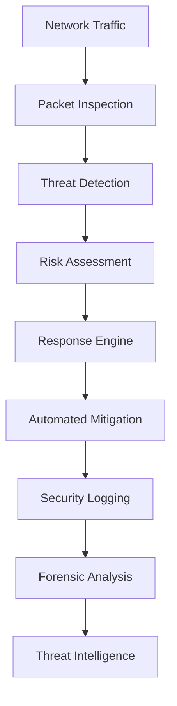

# Chapter 19: Network Security
**Advanced Network Protection, Threat Detection, and Security Monitoring**

---

## Overview

NEO's network security module provides comprehensive protection against cyber threats, advanced intrusion detection, automated response systems, and continuous security monitoring. This chapter covers network security architecture, threat detection methods, and defensive strategies.

## Network Security Architecture



## Intrusion Detection and Prevention

### Real-Time Network Monitoring

```python
class NetworkSecurityMonitor:
    def __init__(self):
        self.packet_analyzer = PacketAnalyzer()
        self.threat_detector = ThreatDetector()
        self.anomaly_detector = NetworkAnomalyDetector()
        self.firewall_manager = FirewallManager()
        self.incident_manager = IncidentManager()
    
    def start_network_monitoring(self, interfaces=['all']):
        """Start comprehensive network monitoring"""
        
        monitoring_config = {
            'interfaces': interfaces,
            'capture_mode': 'promiscuous',
            'analysis_depth': 'deep',
            'real_time_alerts': True,
            'threat_intelligence': True,
            'behavioral_analysis': True
        }
        
        # Initialize packet capture
        self.packet_analyzer.start_capture(monitoring_config)
        
        # Start threat detection engines
        self.threat_detector.activate_detection_rules()
        self.anomaly_detector.start_behavioral_analysis()
        
        # Begin monitoring loop
        self.monitoring_loop(monitoring_config)
    
    def analyze_network_packet(self, packet):
        """Analyze individual network packet for threats"""
        
        # Basic packet analysis
        packet_info = self.packet_analyzer.extract_packet_info(packet)
        
        # Threat signature matching
        signature_matches = self.threat_detector.check_signatures(packet)
        
        # Behavioral analysis
        behavioral_score = self.anomaly_detector.assess_packet_behavior(packet_info)
        
        # Geolocation analysis
        geo_info = self.analyze_packet_geolocation(packet_info)
        
        # Reputation checking
        reputation_score = self.check_ip_reputation(packet_info['src_ip'])
        
        # Calculate overall threat score
        threat_score = self.calculate_threat_score(
            signature_matches, behavioral_score, reputation_score
        )
        
        analysis_result = {
            'packet_info': packet_info,
            'signature_matches': signature_matches,
            'behavioral_score': behavioral_score,
            'geo_info': geo_info,
            'reputation_score': reputation_score,
            'threat_score': threat_score,
            'timestamp': time.time()
        }
        
        # Take action if threat detected
        if threat_score > 0.7:  # High threat threshold
            self.handle_threat_detection(analysis_result)
        
        return analysis_result
    
    def handle_threat_detection(self, threat_analysis):
        """Handle detected network threat"""
        
        threat_level = self.determine_threat_level(threat_analysis['threat_score'])
        
        # Immediate response actions
        response_actions = {
            'critical': ['block_ip', 'alert_admin', 'isolate_host', 'collect_forensics'],
            'high': ['block_ip', 'alert_admin', 'rate_limit'],
            'medium': ['alert_admin', 'log_incident'],
            'low': ['log_incident']
        }
        
        actions_to_take = response_actions.get(threat_level, ['log_incident'])
        
        for action in actions_to_take:
            try:
                self.execute_response_action(action, threat_analysis)
            except Exception as e:
                self.log_response_error(action, threat_analysis, e)
        
        # Create incident record
        incident = self.incident_manager.create_incident(threat_analysis, threat_level)
        
        return incident
```

### Advanced Threat Detection

```python
class AdvancedThreatDetector:
    def __init__(self):
        self.ml_detector = MLThreatDetector()
        self.signature_engine = SignatureEngine()
        self.behavioral_analyzer = BehavioralAnalyzer()
        self.threat_intelligence = ThreatIntelligenceEngine()
    
    def detect_advanced_persistent_threats(self, network_data, timeframe='24h'):
        """Detect Advanced Persistent Threats (APTs)"""
        
        # Collect network activity patterns
        activity_patterns = self.analyze_network_patterns(network_data, timeframe)
        
        # Look for APT indicators
        apt_indicators = {
            'command_and_control': self.detect_c2_communication(activity_patterns),
            'lateral_movement': self.detect_lateral_movement(activity_patterns),
            'data_exfiltration': self.detect_data_exfiltration(activity_patterns),
            'persistence_mechanisms': self.detect_persistence(activity_patterns),
            'reconnaissance': self.detect_reconnaissance(activity_patterns)
        }
        
        # Correlate indicators
        apt_correlation = self.correlate_apt_indicators(apt_indicators)
        
        # Generate APT assessment
        apt_assessment = {
            'threat_probability': apt_correlation['probability'],
            'attack_stage': apt_correlation['stage'],
            'indicators': apt_indicators,
            'timeline': apt_correlation['timeline'],
            'affected_assets': apt_correlation['assets'],
            'recommended_actions': self.generate_apt_response_plan(apt_correlation)
        }
        
        return apt_assessment
    
    def detect_ddos_attacks(self, traffic_data):
        """Detect Distributed Denial of Service attacks"""
        
        # Traffic volume analysis
        volume_analysis = self.analyze_traffic_volume(traffic_data)
        
        # Pattern analysis
        pattern_analysis = self.analyze_attack_patterns(traffic_data)
        
        # Source distribution analysis
        source_analysis = self.analyze_traffic_sources(traffic_data)
        
        # Protocol analysis
        protocol_analysis = self.analyze_protocol_distribution(traffic_data)
        
        # DDoS scoring
        ddos_score = self.calculate_ddos_score(
            volume_analysis, pattern_analysis, source_analysis, protocol_analysis
        )
        
        if ddos_score > 0.8:  # High probability of DDoS
            return {
                'attack_detected': True,
                'attack_type': self.classify_ddos_type(pattern_analysis),
                'severity': self.assess_ddos_severity(volume_analysis),
                'source_countries': source_analysis['country_distribution'],
                'attack_vectors': pattern_analysis['vectors'],
                'mitigation_plan': self.generate_ddos_mitigation_plan(ddos_score)
            }
        
        return {'attack_detected': False, 'score': ddos_score}
    
    def detect_malware_communication(self, network_flows):
        """Detect malware command and control communication"""
        
        # Domain generation algorithm (DGA) detection
        dga_analysis = self.detect_dga_domains(network_flows)
        
        # Suspicious DNS patterns
        dns_analysis = self.analyze_dns_patterns(network_flows)
        
        # Encrypted traffic analysis
        encrypted_analysis = self.analyze_encrypted_traffic(network_flows)
        
        # Beaconing detection
        beaconing_analysis = self.detect_beaconing_behavior(network_flows)
        
        # Fast flux detection
        fast_flux_analysis = self.detect_fast_flux(network_flows)
        
        malware_indicators = {
            'dga_domains': dga_analysis['suspicious_domains'],
            'dns_anomalies': dns_analysis['anomalies'],
            'encrypted_anomalies': encrypted_analysis['suspicious_flows'],
            'beaconing_patterns': beaconing_analysis['beacon_candidates'],
            'fast_flux_networks': fast_flux_analysis['networks']
        }
        
        # Calculate malware communication score
        malware_score = self.calculate_malware_communication_score(malware_indicators)
        
        return {
            'malware_detected': malware_score > 0.7,
            'confidence': malware_score,
            'indicators': malware_indicators,
            'affected_hosts': self.identify_affected_hosts(malware_indicators),
            'recommended_actions': self.generate_malware_response_plan(malware_indicators)
        }
```

## Firewall and Access Control

### Intelligent Firewall Management

```python
class IntelligentFirewall:
    def __init__(self):
        self.rule_engine = FirewallRuleEngine()
        self.policy_manager = SecurityPolicyManager()
        self.traffic_analyzer = TrafficAnalyzer()
        self.auto_blocker = AutoBlocker()
    
    def dynamic_rule_management(self):
        """Dynamically manage firewall rules based on threat intelligence"""
        
        # Analyze current traffic patterns
        traffic_analysis = self.traffic_analyzer.analyze_recent_traffic(hours=24)
        
        # Get threat intelligence updates
        threat_intel = self.get_latest_threat_intelligence()
        
        # Analyze existing rules effectiveness
        rule_effectiveness = self.analyze_rule_effectiveness()
        
        # Generate rule recommendations
        recommendations = self.generate_rule_recommendations(
            traffic_analysis, threat_intel, rule_effectiveness
        )
        
        # Apply approved recommendations
        applied_changes = []
        for recommendation in recommendations:
            if self.should_auto_apply(recommendation):
                result = self.apply_firewall_rule(recommendation)
                applied_changes.append(result)
        
        return {
            'traffic_analysis': traffic_analysis,
            'recommendations': recommendations,
            'applied_changes': applied_changes,
            'rule_count': self.rule_engine.get_rule_count()
        }
    
    def geo_blocking_management(self, threat_countries=None):
        """Manage geographical blocking rules"""
        
        if threat_countries is None:
            # Automatically identify high-risk countries
            threat_countries = self.identify_threat_countries()
        
        geo_rules = []
        
        for country in threat_countries:
            # Get country IP ranges
            ip_ranges = self.get_country_ip_ranges(country)
            
            # Create blocking rules
            for ip_range in ip_ranges:
                rule = {
                    'action': 'deny',
                    'source': ip_range,
                    'destination': 'any',
                    'protocol': 'any',
                    'description': f'Block traffic from {country}',
                    'priority': 100
                }
                geo_rules.append(rule)
        
        # Apply geo-blocking rules
        for rule in geo_rules:
            self.rule_engine.add_rule(rule)
        
        return {
            'blocked_countries': threat_countries,
            'rules_added': len(geo_rules),
            'affected_ip_ranges': sum(len(self.get_country_ip_ranges(c)) for c in threat_countries)
        }
    
    def application_level_filtering(self):
        """Implement application-level filtering"""
        
        # Identify applications in network traffic
        applications = self.traffic_analyzer.identify_applications()
        
        # Classify applications by risk level
        app_classifications = {}
        for app_name, app_traffic in applications.items():
            risk_score = self.assess_application_risk(app_name, app_traffic)
            app_classifications[app_name] = {
                'risk_level': self.categorize_risk(risk_score),
                'risk_score': risk_score,
                'traffic_volume': app_traffic['volume'],
                'users': app_traffic['users']
            }
        
        # Generate application filtering rules
        app_rules = []
        for app_name, classification in app_classifications.items():
            if classification['risk_level'] in ['high', 'critical']:
                rule = self.create_application_blocking_rule(app_name)
                app_rules.append(rule)
            elif classification['risk_level'] == 'medium':
                rule = self.create_application_limiting_rule(app_name)
                app_rules.append(rule)
        
        return {
            'application_analysis': app_classifications,
            'filtering_rules': app_rules,
            'blocked_applications': [r['application'] for r in app_rules if r['action'] == 'deny'],
            'limited_applications': [r['application'] for r in app_rules if r['action'] == 'limit']
        }
```

### Network Segmentation

```python
class NetworkSegmentation:
    def __init__(self):
        self.topology_analyzer = NetworkTopologyAnalyzer()
        self.vlan_manager = VLANManager()
        self.micro_segmentation = MicroSegmentation()
    
    def analyze_network_topology(self):
        """Analyze network topology for segmentation opportunities"""
        
        # Discover network topology
        topology = self.topology_analyzer.discover_topology()
        
        # Identify critical assets
        critical_assets = self.identify_critical_assets(topology)
        
        # Analyze traffic flows
        traffic_flows = self.analyze_traffic_flows(topology)
        
        # Identify segmentation opportunities
        segmentation_opportunities = self.identify_segmentation_opportunities(
            topology, critical_assets, traffic_flows
        )
        
        return {
            'topology': topology,
            'critical_assets': critical_assets,
            'traffic_flows': traffic_flows,
            'segmentation_opportunities': segmentation_opportunities
        }
    
    def implement_micro_segmentation(self, segmentation_plan):
        """Implement micro-segmentation strategy"""
        
        implementation_results = []
        
        for segment in segmentation_plan['segments']:
            # Create micro-segment
            micro_segment = self.micro_segmentation.create_segment(
                name=segment['name'],
                assets=segment['assets'],
                policies=segment['policies']
            )
            
            # Apply security policies
            policy_results = []
            for policy in segment['policies']:
                result = self.apply_segmentation_policy(micro_segment, policy)
                policy_results.append(result)
            
            implementation_results.append({
                'segment': micro_segment,
                'policies_applied': policy_results,
                'status': 'active'
            })
        
        return {
            'segments_created': len(implementation_results),
            'implementation_results': implementation_results,
            'overall_status': 'completed'
        }
```

## Security Monitoring and Analytics

### Security Information and Event Management (SIEM)

```python
class SIEMEngine:
    def __init__(self):
        self.log_collector = LogCollector()
        self.event_correlator = EventCorrelator()
        self.alert_manager = AlertManager()
        self.forensics_engine = ForensicsEngine()
    
    def collect_security_events(self, sources=['all']):
        """Collect security events from multiple sources"""
        
        event_sources = {
            'firewall': 'firewall_logs',
            'ids': 'intrusion_detection_logs',
            'antivirus': 'antivirus_logs',
            'system': 'system_logs',
            'application': 'application_logs',
            'network': 'network_flow_logs'
        }
        
        if 'all' in sources:
            sources_to_collect = event_sources.keys()
        else:
            sources_to_collect = sources
        
        collected_events = {}
        
        for source in sources_to_collect:
            try:
                events = self.log_collector.collect_events(
                    source_type=source,
                    time_range='last_hour'
                )
                
                # Normalize event format
                normalized_events = self.normalize_events(events, source)
                
                collected_events[source] = normalized_events
                
            except Exception as e:
                self.log_collection_error(source, e)
        
        return collected_events
    
    def correlate_security_events(self, events):
        """Correlate security events to identify potential incidents"""
        
        # Time-based correlation
        time_correlations = self.event_correlator.correlate_by_time(events)
        
        # Asset-based correlation
        asset_correlations = self.event_correlator.correlate_by_asset(events)
        
        # Attack pattern correlation
        pattern_correlations = self.event_correlator.correlate_by_attack_pattern(events)
        
        # User behavior correlation
        user_correlations = self.event_correlator.correlate_by_user_behavior(events)
        
        # Generate correlation results
        correlation_results = self.event_correlator.synthesize_correlations([
            time_correlations,
            asset_correlations,
            pattern_correlations,
            user_correlations
        ])
        
        # Identify potential incidents
        potential_incidents = []
        for correlation in correlation_results:
            if correlation['confidence'] > 0.7:
                incident = self.create_security_incident(correlation)
                potential_incidents.append(incident)
        
        return {
            'correlations': correlation_results,
            'potential_incidents': potential_incidents,
            'incident_count': len(potential_incidents)
        }
    
    def security_analytics_dashboard(self):
        """Generate security analytics dashboard"""
        
        # Collect recent security metrics
        security_metrics = self.collect_security_metrics(timeframe='24h')
        
        # Threat landscape analysis
        threat_landscape = self.analyze_threat_landscape(security_metrics)
        
        # Security posture assessment
        security_posture = self.assess_security_posture()
        
        # Top security alerts
        top_alerts = self.get_top_security_alerts(limit=10)
        
        # Incident trends
        incident_trends = self.analyze_incident_trends(timeframe='30d')
        
        dashboard_data = {
            'summary_metrics': {
                'total_events': security_metrics['total_events'],
                'critical_alerts': security_metrics['critical_alerts'],
                'blocked_threats': security_metrics['blocked_threats'],
                'incidents_resolved': security_metrics['incidents_resolved']
            },
            'threat_landscape': threat_landscape,
            'security_posture': security_posture,
            'top_alerts': top_alerts,
            'incident_trends': incident_trends,
            'real_time_threats': self.get_real_time_threats()
        }
        
        return dashboard_data
```

## Network Security Commands

### Basic Security Commands

```bash
# Network monitoring
neo security monitor --interfaces all --real-time
neo security scan --network 192.168.1.0/24 --vulnerability-check

# Firewall management
neo security firewall status
neo security firewall block --ip 192.168.1.100 --reason "suspicious_activity"
neo security firewall rules --list --verbose

# Threat detection
neo security threats --scan-active --auto-response
neo security incidents --last 24h --severity high
```

### Advanced Security Commands

```bash
# Comprehensive security assessment
neo security assess --full-scan --penetration-test --compliance-check

# Threat hunting
neo security hunt --iocs indicators.json --timeframe 7d
neo security hunt --apt-indicators --behavioral-analysis

# Incident response
neo security incident create --type "data_breach" --severity critical
neo security incident investigate --id INC-2024-001 --forensics
neo security incident response --playbook automated_response.yaml

# Security automation
neo security automate --rules security_rules.yaml --enable-auto-block
```

## Security Automation and Response

### Automated Incident Response

```python
class AutomatedIncidentResponse:
    def __init__(self):
        self.playbook_engine = PlaybookEngine()
        self.response_actions = ResponseActions()
        self.escalation_manager = EscalationManager()
    
    def execute_incident_response(self, incident):
        """Execute automated incident response"""
        
        # Determine appropriate playbook
        playbook = self.playbook_engine.select_playbook(incident)
        
        # Execute response steps
        response_results = []
        
        for step in playbook['steps']:
            try:
                # Execute response action
                result = self.response_actions.execute_action(
                    action_type=step['action'],
                    parameters=step['parameters'],
                    incident_context=incident
                )
                
                response_results.append({
                    'step': step['name'],
                    'action': step['action'],
                    'result': result,
                    'status': 'completed',
                    'timestamp': time.time()
                })
                
                # Check if escalation is needed
                if result.get('escalation_required', False):
                    self.escalation_manager.escalate_incident(incident, step)
                
            except Exception as e:
                response_results.append({
                    'step': step['name'],
                    'action': step['action'],
                    'error': str(e),
                    'status': 'failed',
                    'timestamp': time.time()
                })
        
        # Update incident with response results
        incident['response_actions'] = response_results
        incident['status'] = 'response_completed'
        
        return incident
```

## Best Practices

### Network Security Implementation

1. **Defense in Depth**: Implement multiple layers of security
2. **Zero Trust Architecture**: Verify everything, trust nothing
3. **Continuous Monitoring**: Monitor network traffic 24/7
4. **Threat Intelligence**: Leverage external threat intelligence
5. **Incident Preparedness**: Have response plans ready

### Security Configuration Guidelines

```yaml
security_best_practices:
  network_monitoring:
    - enable_full_packet_capture
    - implement_behavior_analysis
    - use_threat_intelligence_feeds
    - configure_automated_responses
  
  firewall_configuration:
    - default_deny_policy
    - regular_rule_review
    - geo_blocking_implementation
    - application_layer_filtering
  
  incident_response:
    - automated_initial_response
    - clear_escalation_procedures
    - regular_playbook_testing
    - comprehensive_logging
```

---

**Next Chapter**: [Development Tools →](20-development-tools.md)

**Previous Chapter**: [← Data Analysis](18-data-analysis.md)
