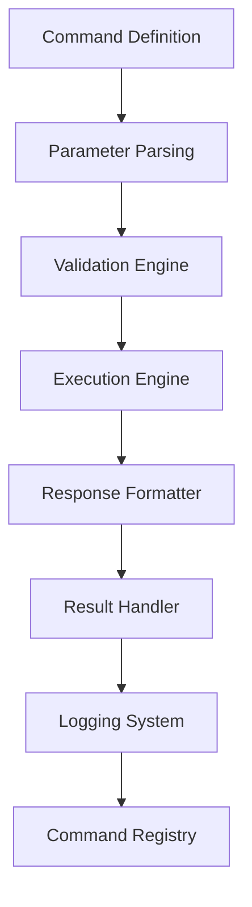

# Chapter 22: Custom Commands
**Creating, Managing, and Deploying Custom Command Extensions**

---

## Overview

NEO's custom command system allows users to extend functionality through personalized commands, scripts, and automation workflows. This chapter covers command creation, scripting interfaces, plugin development, and command management.

## Custom Command Architecture



## Command Creation Framework

### Basic Command Structure

```python
class CustomCommand:
    def __init__(self, name, description, parameters=None):
        self.name = name
        self.description = description
        self.parameters = parameters or {}
        self.aliases = []
        self.category = 'custom'
        self.version = '1.0.0'
        self.author = None
        self.permissions = []
    
    def define_command(self):
        """Define custom command structure"""
        
        command_definition = {
            'name': self.name,
            'description': self.description,
            'usage': self.generate_usage_string(),
            'parameters': self.define_parameters(),
            'examples': self.provide_examples(),
            'validation_rules': self.define_validation_rules(),
            'execution_handler': self.execute,
            'help_text': self.generate_help_text()
        }
        
        return command_definition
    
    def define_parameters(self):
        """Define command parameters"""
        
        parameters = {}
        
        for param_name, param_config in self.parameters.items():
            parameters[param_name] = {
                'type': param_config.get('type', 'string'),
                'required': param_config.get('required', False),
                'default': param_config.get('default'),
                'description': param_config.get('description', ''),
                'validation': param_config.get('validation', {}),
                'choices': param_config.get('choices', [])
            }
        
        return parameters
    
    def execute(self, params, context):
        """Execute the custom command"""
        
        # Validate parameters
        validation_result = self.validate_parameters(params)
        if not validation_result['valid']:
            return self.create_error_response(validation_result['errors'])
        
        # Pre-execution hooks
        pre_execution_result = self.pre_execute(params, context)
        if not pre_execution_result['continue']:
            return pre_execution_result['response']
        
        try:
            # Main execution logic
            result = self.main_execute(params, context)
            
            # Post-execution hooks
            post_execution_result = self.post_execute(result, params, context)
            
            return self.create_success_response(post_execution_result)
            
        except Exception as e:
            return self.create_error_response([str(e)])
    
    def main_execute(self, params, context):
        """Main execution logic - to be implemented by subclasses"""
        raise NotImplementedError("Subclasses must implement main_execute method")

# Example custom command implementation
class DeploymentCommand(CustomCommand):
    def __init__(self):
        super().__init__(
            name='deploy',
            description='Deploy application to specified environment',
            parameters={
                'environment': {
                    'type': 'string',
                    'required': True,
                    'choices': ['development', 'staging', 'production'],
                    'description': 'Target deployment environment'
                },
                'version': {
                    'type': 'string',
                    'required': False,
                    'default': 'latest',
                    'description': 'Version to deploy'
                },
                'force': {
                    'type': 'boolean',
                    'required': False,
                    'default': False,
                    'description': 'Force deployment even if validation fails'
                }
            }
        )
    
    def main_execute(self, params, context):
        """Execute deployment command"""
        
        environment = params['environment']
        version = params['version']
        force = params['force']
        
        # Pre-deployment validation
        if not force:
            validation_result = self.validate_deployment(environment, version)
            if not validation_result['valid']:
                return {'status': 'failed', 'errors': validation_result['errors']}
        
        # Execute deployment
        deployment_result = self.perform_deployment(environment, version)
        
        # Post-deployment verification
        verification_result = self.verify_deployment(environment, version)
        
        return {
            'status': 'success',
            'deployment_id': deployment_result['id'],
            'environment': environment,
            'version': version,
            'verification': verification_result,
            'timestamp': datetime.now().isoformat()
        }
```

### Advanced Command Features

```python
class AdvancedCommandFeatures:
    def __init__(self):
        self.command_pipeline = CommandPipeline()
        self.command_scheduler = CommandScheduler()
        self.command_dependencies = CommandDependencyManager()
    
    def create_command_pipeline(self, commands):
        """Create a pipeline of commands"""
        
        pipeline_definition = {
            'name': 'custom_pipeline',
            'description': 'Custom command pipeline',
            'commands': [],
            'error_handling': 'stop_on_error',
            'parallel_execution': False
        }
        
        for i, command in enumerate(commands):
            pipeline_step = {
                'step': i + 1,
                'command': command['name'],
                'parameters': command.get('parameters', {}),
                'depends_on': command.get('depends_on', []),
                'conditional': command.get('conditional', True),
                'retry_policy': command.get('retry_policy', {'max_retries': 0})
            }
            pipeline_definition['commands'].append(pipeline_step)
        
        return self.command_pipeline.create_pipeline(pipeline_definition)
    
    def schedule_command(self, command_name, schedule_config):
        """Schedule command execution"""
        
        schedule_definition = {
            'command': command_name,
            'schedule_type': schedule_config['type'],  # 'cron', 'interval', 'event'
            'schedule_value': schedule_config['value'],
            'parameters': schedule_config.get('parameters', {}),
            'enabled': schedule_config.get('enabled', True),
            'notifications': schedule_config.get('notifications', []),
            'error_handling': schedule_config.get('error_handling', 'log')
        }
        
        return self.command_scheduler.schedule_command(schedule_definition)
    
    def create_conditional_command(self, command_name, conditions, actions):
        """Create conditional command execution"""
        
        conditional_command = {
            'name': f"{command_name}_conditional",
            'base_command': command_name,
            'conditions': conditions,
            'actions': {
                'on_success': actions.get('on_success', []),
                'on_failure': actions.get('on_failure', []),
                'on_timeout': actions.get('on_timeout', [])
            },
            'timeout': actions.get('timeout', 300),  # 5 minutes default
            'retry_policy': actions.get('retry_policy', {'max_retries': 3})
        }
        
        return conditional_command
```

## Script Integration

### Script-Based Commands

```python
class ScriptCommand(CustomCommand):
    def __init__(self, script_path, script_type='python'):
        self.script_path = script_path
        self.script_type = script_type
        
        # Extract command metadata from script
        metadata = self.extract_script_metadata(script_path)
        
        super().__init__(
            name=metadata.get('name', 'script_command'),
            description=metadata.get('description', 'Custom script command'),
            parameters=metadata.get('parameters', {})
        )
    
    def extract_script_metadata(self, script_path):
        """Extract command metadata from script file"""
        
        metadata = {}
        
        with open(script_path, 'r') as file:
            content = file.read()
            
            # Look for metadata comments/docstrings
            if self.script_type == 'python':
                metadata = self.parse_python_metadata(content)
            elif self.script_type == 'bash':
                metadata = self.parse_bash_metadata(content)
            elif self.script_type == 'javascript':
                metadata = self.parse_javascript_metadata(content)
        
        return metadata
    
    def main_execute(self, params, context):
        """Execute script command"""
        
        # Prepare script environment
        script_env = self.prepare_script_environment(params, context)
        
        # Execute script based on type
        if self.script_type == 'python':
            result = self.execute_python_script(script_env)
        elif self.script_type == 'bash':
            result = self.execute_bash_script(script_env)
        elif self.script_type == 'javascript':
            result = self.execute_javascript_script(script_env)
        else:
            raise ValueError(f"Unsupported script type: {self.script_type}")
        
        return result
    
    def execute_python_script(self, script_env):
        """Execute Python script"""
        
        import subprocess
        import json
        
        # Prepare command
        cmd = [
            'python', 
            self.script_path,
            '--params', json.dumps(script_env['params']),
            '--context', json.dumps(script_env['context'])
        ]
        
        # Execute script
        try:
            result = subprocess.run(
                cmd,
                capture_output=True,
                text=True,
                timeout=300,  # 5 minute timeout
                env=script_env['environment']
            )
            
            if result.returncode == 0:
                # Parse JSON output if possible
                try:
                    output = json.loads(result.stdout)
                except json.JSONDecodeError:
                    output = {'output': result.stdout}
                
                return {
                    'status': 'success',
                    'result': output,
                    'stderr': result.stderr
                }
            else:
                return {
                    'status': 'error',
                    'error': result.stderr,
                    'stdout': result.stdout,
                    'return_code': result.returncode
                }
                
        except subprocess.TimeoutExpired:
            return {
                'status': 'error',
                'error': 'Script execution timed out'
            }
        except Exception as e:
            return {
                'status': 'error',
                'error': str(e)
            }

# Example script command registration
script_command = ScriptCommand(
    script_path='/custom_scripts/data_analysis.py',
    script_type='python'
)
```

### Command Templates

```python
class CommandTemplate:
    def __init__(self):
        self.templates = {
            'data_processing': self.data_processing_template(),
            'system_monitoring': self.system_monitoring_template(),
            'deployment': self.deployment_template(),
            'testing': self.testing_template(),
            'reporting': self.reporting_template()
        }
    
    def data_processing_template(self):
        """Template for data processing commands"""
        
        return {
            'name': 'process_data',
            'description': 'Process data with custom transformations',
            'parameters': {
                'input_file': {
                    'type': 'file_path',
                    'required': True,
                    'description': 'Input data file path'
                },
                'output_file': {
                    'type': 'file_path',
                    'required': True,
                    'description': 'Output file path'
                },
                'transformation': {
                    'type': 'string',
                    'required': True,
                    'choices': ['clean', 'transform', 'aggregate', 'analyze'],
                    'description': 'Type of data transformation'
                },
                'config': {
                    'type': 'json',
                    'required': False,
                    'description': 'Transformation configuration'
                }
            },
            'implementation_template': '''
def main_execute(self, params, context):
    input_file = params['input_file']
    output_file = params['output_file']
    transformation = params['transformation']
    config = params.get('config', {})
    
    # Load data
    data = self.load_data(input_file)
    
    # Apply transformation
    if transformation == 'clean':
        result = self.clean_data(data, config)
    elif transformation == 'transform':
        result = self.transform_data(data, config)
    elif transformation == 'aggregate':
        result = self.aggregate_data(data, config)
    elif transformation == 'analyze':
        result = self.analyze_data(data, config)
    
    # Save result
    self.save_data(result, output_file)
    
    return {
        'status': 'success',
        'records_processed': len(data),
        'output_file': output_file,
        'transformation_applied': transformation
    }
            '''
        }
    
    def generate_command_from_template(self, template_name, customizations):
        """Generate command from template"""
        
        if template_name not in self.templates:
            raise ValueError(f"Unknown template: {template_name}")
        
        template = self.templates[template_name].copy()
        
        # Apply customizations
        template['name'] = customizations.get('name', template['name'])
        template['description'] = customizations.get('description', template['description'])
        
        # Merge parameters
        if 'parameters' in customizations:
            template['parameters'].update(customizations['parameters'])
        
        # Apply custom implementation if provided
        if 'implementation' in customizations:
            template['implementation'] = customizations['implementation']
        
        return template
```

## Command Management

### Command Registry

```python
class CommandRegistry:
    def __init__(self):
        self.commands = {}
        self.command_groups = {}
        self.command_aliases = {}
        self.command_metadata = {}
    
    def register_command(self, command):
        """Register a custom command"""
        
        command_name = command.name
        
        # Validate command
        validation_result = self.validate_command(command)
        if not validation_result['valid']:
            raise ValueError(f"Invalid command: {validation_result['errors']}")
        
        # Check for conflicts
        if command_name in self.commands:
            raise ValueError(f"Command '{command_name}' already exists")
        
        # Register command
        self.commands[command_name] = command
        
        # Register aliases
        for alias in command.aliases:
            if alias in self.command_aliases:
                raise ValueError(f"Alias '{alias}' already exists")
            self.command_aliases[alias] = command_name
        
        # Store metadata
        self.command_metadata[command_name] = {
            'registration_time': datetime.now(),
            'author': getattr(command, 'author', None),
            'version': getattr(command, 'version', '1.0.0'),
            'category': getattr(command, 'category', 'custom'),
            'usage_count': 0,
            'last_used': None
        }
        
        return {
            'status': 'registered',
            'command_name': command_name,
            'aliases': command.aliases
        }
    
    def unregister_command(self, command_name):
        """Unregister a custom command"""
        
        if command_name not in self.commands:
            raise ValueError(f"Command '{command_name}' not found")
        
        command = self.commands[command_name]
        
        # Remove command
        del self.commands[command_name]
        
        # Remove aliases
        for alias in command.aliases:
            if alias in self.command_aliases:
                del self.command_aliases[alias]
        
        # Remove metadata
        if command_name in self.command_metadata:
            del self.command_metadata[command_name]
        
        return {
            'status': 'unregistered',
            'command_name': command_name
        }
    
    def list_commands(self, category=None, author=None):
        """List registered commands"""
        
        command_list = []
        
        for command_name, command in self.commands.items():
            metadata = self.command_metadata.get(command_name, {})
            
            # Apply filters
            if category and metadata.get('category') != category:
                continue
            if author and metadata.get('author') != author:
                continue
            
            command_info = {
                'name': command_name,
                'description': command.description,
                'category': metadata.get('category', 'custom'),
                'author': metadata.get('author'),
                'version': metadata.get('version', '1.0.0'),
                'usage_count': metadata.get('usage_count', 0),
                'aliases': command.aliases
            }
            
            command_list.append(command_info)
        
        return sorted(command_list, key=lambda x: x['name'])
    
    def execute_command(self, command_name, params, context):
        """Execute a registered command"""
        
        # Resolve alias
        if command_name in self.command_aliases:
            command_name = self.command_aliases[command_name]
        
        # Check if command exists
        if command_name not in self.commands:
            return {
                'status': 'error',
                'error': f"Command '{command_name}' not found"
            }
        
        command = self.commands[command_name]
        
        # Update usage statistics
        self.update_usage_statistics(command_name)
        
        # Execute command
        try:
            result = command.execute(params, context)
            return result
        except Exception as e:
            return {
                'status': 'error',
                'error': str(e),
                'command': command_name
            }
```

## Custom Command Examples

### Example 1: Database Backup Command

```python
class DatabaseBackupCommand(CustomCommand):
    def __init__(self):
        super().__init__(
            name='db_backup',
            description='Create database backup with custom options',
            parameters={
                'database': {
                    'type': 'string',
                    'required': True,
                    'description': 'Database name to backup'
                },
                'compression': {
                    'type': 'boolean',
                    'required': False,
                    'default': True,
                    'description': 'Enable backup compression'
                },
                'encryption': {
                    'type': 'boolean',
                    'required': False,
                    'default': False,
                    'description': 'Enable backup encryption'
                },
                'location': {
                    'type': 'string',
                    'required': False,
                    'default': '/backups',
                    'description': 'Backup storage location'
                }
            }
        )
    
    def main_execute(self, params, context):
        database = params['database']
        compression = params['compression']
        encryption = params['encryption']
        location = params['location']
        
        # Generate backup filename
        timestamp = datetime.now().strftime('%Y%m%d_%H%M%S')
        backup_filename = f"{database}_backup_{timestamp}.sql"
        
        if compression:
            backup_filename += '.gz'
        
        backup_path = os.path.join(location, backup_filename)
        
        # Create backup command
        backup_cmd = self.build_backup_command(
            database, backup_path, compression, encryption
        )
        
        # Execute backup
        result = subprocess.run(backup_cmd, capture_output=True, text=True)
        
        if result.returncode == 0:
            # Verify backup
            backup_size = os.path.getsize(backup_path)
            
            return {
                'status': 'success',
                'backup_file': backup_path,
                'backup_size': backup_size,
                'compression_enabled': compression,
                'encryption_enabled': encryption,
                'duration': self.calculate_duration(context['start_time'])
            }
        else:
            return {
                'status': 'error',
                'error': result.stderr,
                'command': ' '.join(backup_cmd)
            }
```

## Command Management Commands

### Basic Command Management

```bash
# Register custom command
neo command register --file my_command.py --name "analyze_logs"
neo command register --script backup.sh --type bash

# List commands
neo command list --category custom
neo command list --author "john_doe"

# Execute custom command
neo analyze_logs --file /var/log/app.log --pattern "ERROR"
neo backup --database myapp --compression true

# Command help
neo command help analyze_logs
neo command describe backup --verbose
```

### Advanced Command Management

```bash
# Create command from template
neo command create --template data_processing \
  --name "process_sales_data" \
  --description "Process daily sales data"

# Command pipeline
neo command pipeline create --name "daily_workflow" \
  --commands "backup,analyze,report" \
  --schedule "0 6 * * *"

# Command testing
neo command test --name analyze_logs --test-data test_input.json
neo command validate --all --fix-issues

# Command deployment
neo command deploy --name analyze_logs --environment production
neo command rollback --name analyze_logs --version 1.2
```

## Best Practices

### Command Development Guidelines

1. **Clear Documentation**: Provide comprehensive parameter documentation
2. **Error Handling**: Implement robust error handling and validation
3. **Testing**: Create test cases for command functionality
4. **Security**: Validate inputs and implement appropriate permissions
5. **Performance**: Optimize command execution time

### Command Design Patterns

```yaml
command_best_practices:
  design:
    - single_responsibility_principle
    - clear_parameter_definitions
    - comprehensive_error_handling
    - consistent_return_formats
  
  implementation:
    - input_validation
    - timeout_handling
    - logging_integration
    - progress_reporting
  
  deployment:
    - version_control
    - testing_procedures
    - rollback_capabilities
    - documentation_requirements
```

---

**Next Chapter**: [Automation Scripts →](23-automation-scripts.md)

**Previous Chapter**: [← Personalization](21-personalization.md)
